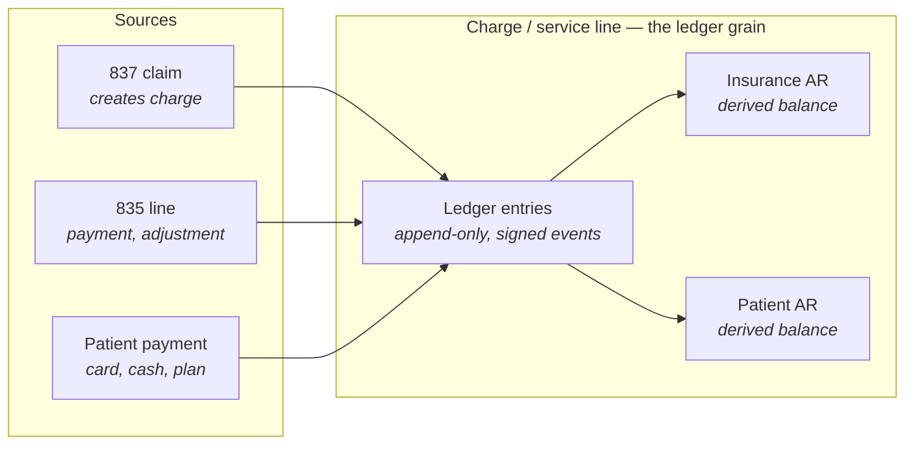
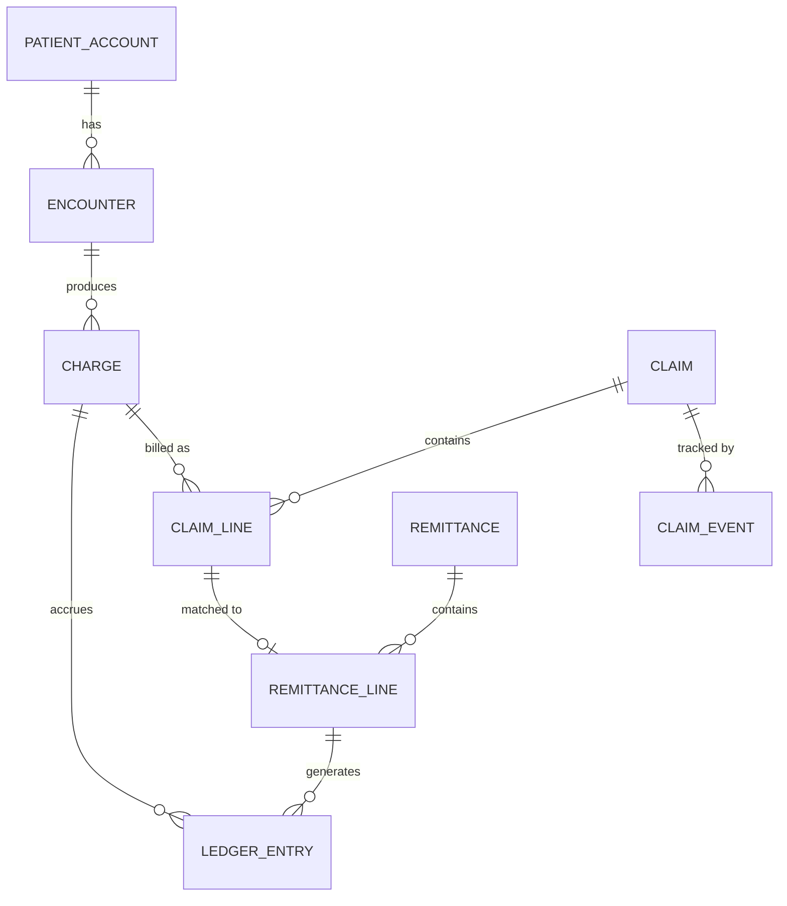
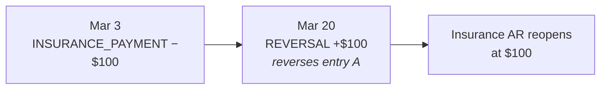
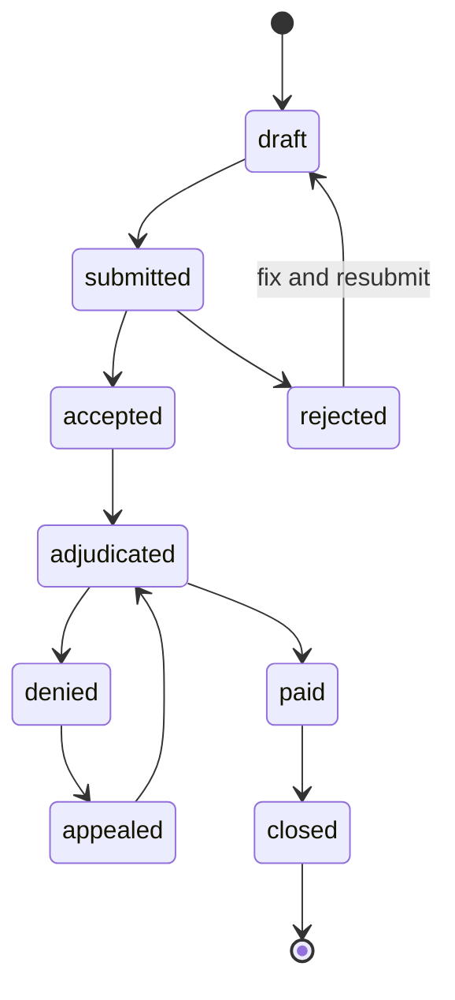
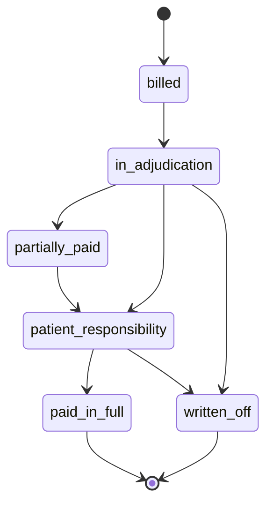
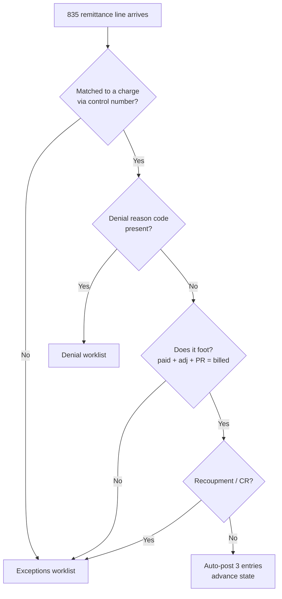

# Financial Data Design for the Classroom Clinic EMR

### How to model, post, and reconcile money in the RCM subsystem

_Purpose: a shareable reference for how the EMR should track charges, payments, adjustments, and balances once claims flow through Stedi. This covers the design and the reasoning behind it, not the implementation._

---

## 1. The governing principle

**Treat the money layer as an immutable, append-only ledger, and never store a balance as a mutable field.**

Balances (what insurance owes, what the patient owes, what has been collected) are always _derived_ by summing ledger entries. They are never edited in place.

The reason is specific to healthcare rather than general good taste. You will constantly need to answer "why is this balance what it is?" for appeals, audits, refunds, and payer recoupments. An append-only ledger answers that for free. Corrections happen by posting reversing entries, never by mutating or deleting rows.

This is the one decision that is genuinely hard to reverse later, once real money has flowed through the system. A mutable-balance design cannot survive resubmissions, secondary payers, recoupments, and audits without a schema rewrite.

---

## 2. The core model

The **service line is the grain of the ledger**. Every money event points at one, and its two balances are computed by summing entries.

`InsuranceAR = sum(entries where bucket = insurance)` `PatientAR = sum(entries where bucket = patient)`

Those two sums are the entire reason no balance field exists: the ledger is the truth, balances are a query.

---

## 3. The ledger entry

The one table that matters most. Every money event is a row you only ever insert.

Each row carries:

- **grain**: the charge / service line it applies to
- **type**: what kind of event it is
- **amount**: signed, stored as **integer cents** (never floats; rounding on money will bite you)
- **bucket**: insurance or patient
- **source**: the remittance line, claim, or payment that produced it
- **actor and timestamp**: who posted it and when
- **reverses**: a pointer to the entry this one reverses, if it is a correction

### Entry types

|Entry type|Bucket|Sign|Triggered by|
|---|---|---|---|
|`CHARGE`|Insurance AR|+|Claim built from the note|
|`INSURANCE_PAYMENT`|Insurance AR|−|835 payment (CLP/SVC)|
|`CONTRACTUAL_ADJUSTMENT`|Insurance AR|−|835 group code CO|
|`PATIENT_RESP_TRANSFER`|Insurance AR − / Patient AR +||835 group code PR|
|`PATIENT_PAYMENT`|Patient AR|−|Card, cash, payment plan|
|`WRITE_OFF`|either|−|Manual, small-balance, bad debt|
|`REVERSAL`|mirrors original|∓|Recoupment or correction|

### What a clean line looks like

A cleanly adjudicated service line produces **three entries at once**, and its insurance bucket nets to zero afterward:

|Bucket|Example|Ledger action|
|---|---|---|
|Billed charge|$200|Already posted at submission (`CHARGE`)|
|Allowed amount|$120|Per your payer contract (not an entry, context)|
|Payer paid|$100|`INSURANCE_PAYMENT` −$100|
|Contractual adjustment|$80|`CONTRACTUAL_ADJUSTMENT` −$80|
|Patient responsibility|$20|`PATIENT_RESP_TRANSFER` −$20 insurance / +$20 patient|

Insurance AR: $200 − $100 − $80 − $20 = **$0**. Patient AR: **$20**.

---

## 4. Surrounding entities

|Entity|Purpose|
|---|---|
|`patient_account`|The guarantor and the patient balance owner|
|`encounter`|The clinical note being billed|
|`charge`|The service line: CPT, modifiers, units, diagnosis pointers, billed amount|
|`claim`|A specific submission (a charge can be resubmitted, producing a new claim version)|
|`claim_line`|A charge as billed on a specific claim|
|`claim_event`|Each Stedi interaction: submission, 277CA, status check, carrying the Stedi transaction ID|
|`remittance`|The 835 header: payer, check/EFT trace number, total paid, raw payload|
|`remittance_line`|The per-service-line adjudication that generates ledger entries|

**Keep the raw 835 JSON verbatim** in a column even after you parse it. You will need to re-derive something you did not model on day one.

---

## 5. The matching problem

The hard part of auto-posting is tying an incoming 835 line back to the exact charge it pays. **Do not fuzzy-match on patient name and amount.**

Instead, put your own control numbers on the claim when you submit the 837 through Stedi:

- a **claim control number** at the claim level
- a **line item control number** per service line

Payers echo these back on the 835, which lets you join remittance line to charge deterministically. Stedi returns all of this in structured JSON, so you are joining on IDs, not parsing text.

Reference: [claim submission](https://www.stedi.com/docs/healthcare/intro-to-claim-submission) and [ERA docs](https://www.stedi.com/docs/healthcare/receive-claim-responses).

---

## 6. Idempotency and recoupments

The two things that corrupt ledgers. ERAs can arrive more than once, out of order, or reference a claim another system submitted.

**Idempotent ingestion.** Key 835 ingestion on the Stedi transaction ID plus payer claim control number, so replaying the same webhook posts nothing new. Configure [webhooks / event destinations](https://www.stedi.com/docs/healthcare/configure-webhooks) and dedupe on receipt.

**Recoupments.** A later 835 can claw back money the payer previously paid. You never edit the original entry. You post a `REVERSAL` that points at it:

The history reads "paid $100 on the 3rd, recouped $100 on the 20th" and the balance reopens correctly. This is exactly why append-only wins.

---

## 7. Two explicit state machines

Store state as data with a transition log, rather than inferring it from balances at read time.

**Claim status** (driven by the 277CA and 276/277):

**Financial state of a charge** (driven by the 835):

When the two disagree (accepted at 277CA but no remittance in the expected window), that is your trigger to fire a 276 [claim status check](https://www.stedi.com/docs/healthcare/check-claim-status).

---

## 8. The auto-posting engine

This is where the ROI is, and it is a small **deterministic rules layer, not AI**.

The rule: **auto-post the clean majority, route only the exceptions to a human.** Anything that fails a check goes to a worklist instead of posting. Never guess.

The branch that decides everything is the **CAS group code**, not the reason code:

|Group code|Name|Ledger action|
|---|---|---|
|**CO**|Contractual Obligation|Write off. You agreed to this in your contract and cannot bill the patient|
|**PR**|Patient Responsibility|Transfer to the patient balance (copay, deductible, coinsurance)|
|**OA**|Other Adjustment|Route to review|
|**PI**|Payer Initiated Reduction|Generally not billable to the patient. Route to review or appeal|
|**CR**|Correction and Reversal|Triggers a `REVERSAL` entry|

Stedi surfaces the denial reason codes (CARC/RARC) in the 835 JSON, so your engine reads codes, not prose. Branch on the group code first; use the CARC for reporting and denial categorization second, since the same CARC can carry a different group code depending on payer and context.

---

## 9. Read models for reporting

Keep operational money in the normalized ledger, but derive a **separate reporting layer** for the metrics the RCM team actually watches:

- Days in AR
- Clean-claim rate
- Denial rate by payer and reason
- Net collection rate

Recompute these from ledger entries on a schedule or incrementally. **Do not make the transactional tables serve both jobs.**

Stedi's [claims view](https://www.stedi.com/docs/healthcare/claims-view) is a fine operational backstop, but it is per-claim and operational, not analytical. These KPIs are yours to build.

---

## 10. The one-sentence version

> Model money as an append-only, signed, service-line-grained ledger with idempotent 835 ingestion matched on your own control numbers, derive every balance and every report from it, and correct by reversing rather than editing.

That structure absorbs resubmissions, secondary payers, recoupments, and audits without ever needing a schema rewrite.

---

## 11. Design checklist

- [ ] Ledger entries are insert-only. No `UPDATE`, no `DELETE`.
- [ ] Money is stored as integer cents. No floats anywhere in the money path.
- [ ] No balance is stored as a mutable field. Every balance is a sum or a cached read model.
- [ ] Every entry carries source, actor, and timestamp.
- [ ] Corrections post a `REVERSAL` pointing at the original entry.
- [ ] Control numbers are assigned at claim and line level on every 837.
- [ ] 835 ingestion is idempotent, keyed on Stedi transaction ID plus payer claim control number.
- [ ] Raw 835 payloads are retained verbatim.
- [ ] Claim state and financial state are stored explicitly, with transition logs.
- [ ] Auto-posting branches on CAS group code first, CARC second.
- [ ] Anything that fails a check routes to a worklist rather than posting.
- [ ] Reporting reads from a derived layer, not the transactional tables.

---

## 12. Reference links

- [Stedi claim submission intro](https://www.stedi.com/docs/healthcare/intro-to-claim-submission)
- [Receiving claim responses and ERAs](https://www.stedi.com/docs/healthcare/receive-claim-responses)
- [Check claim status (276/277)](https://www.stedi.com/docs/healthcare/check-claim-status)
- [Configure webhooks / event destinations](https://www.stedi.com/docs/healthcare/configure-webhooks)
- [Claims view](https://www.stedi.com/docs/healthcare/claims-view)
- [Claims processing workflows overview](https://www.stedi.com/docs/healthcare/claims-processing-workflows-overview)