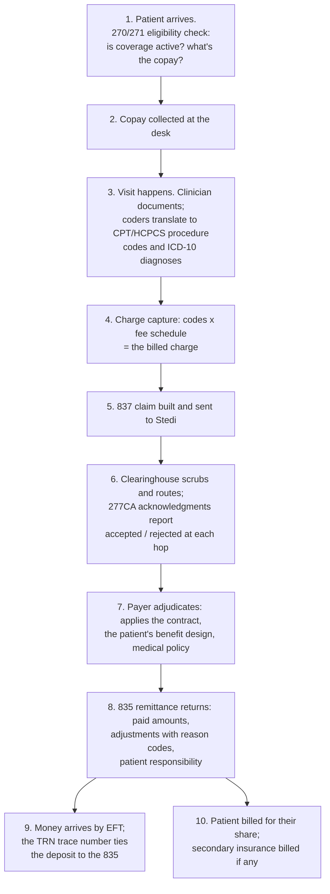
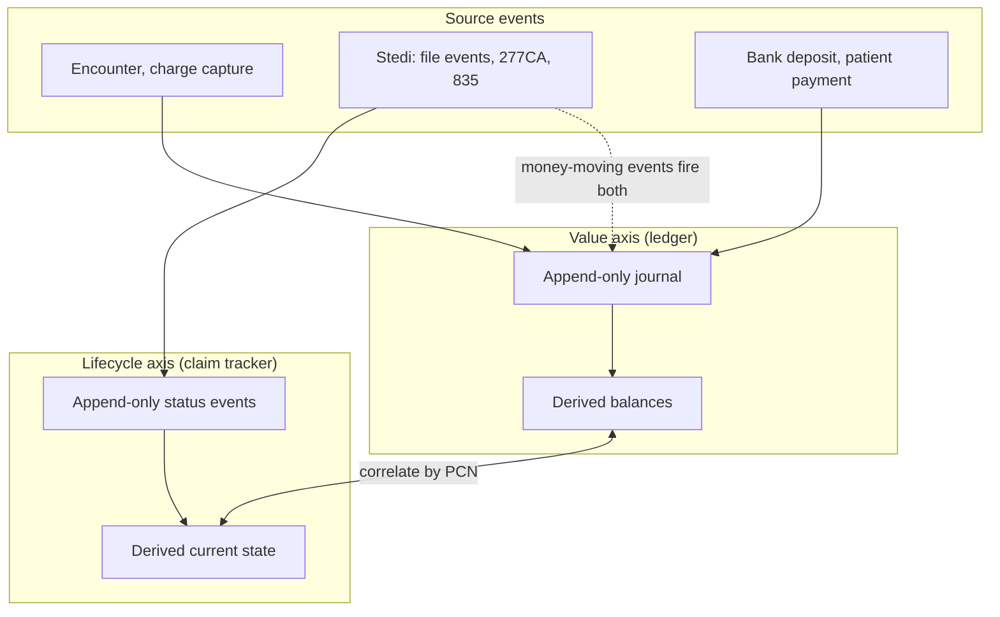
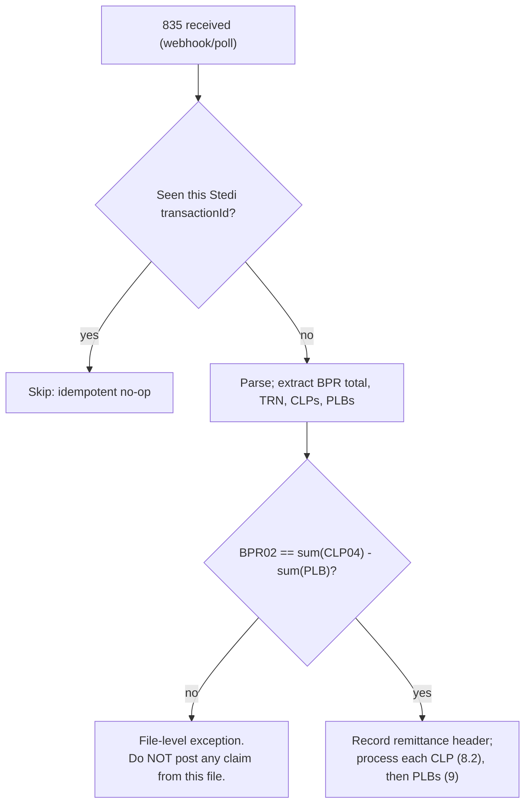
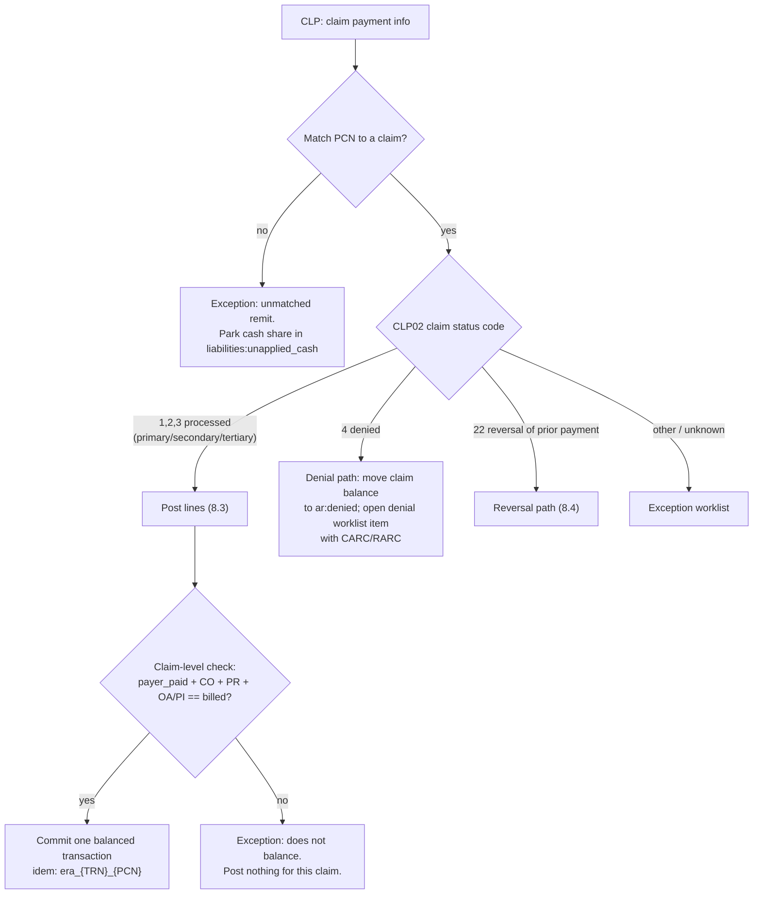
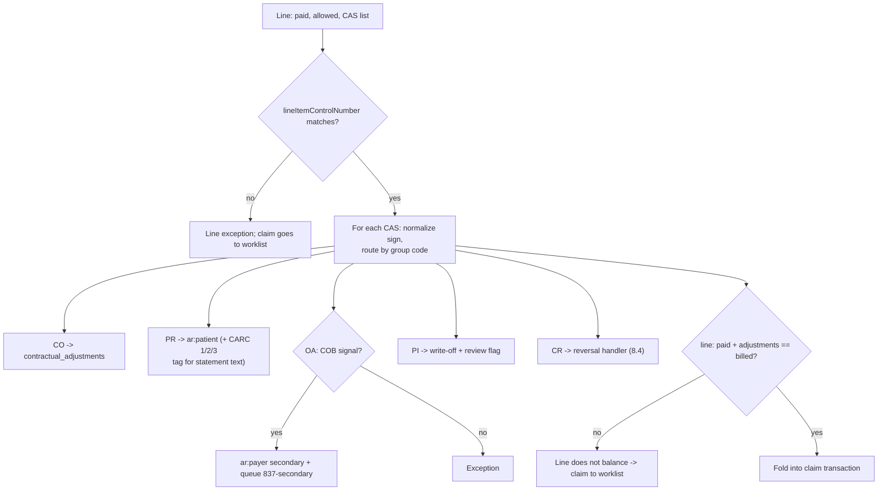
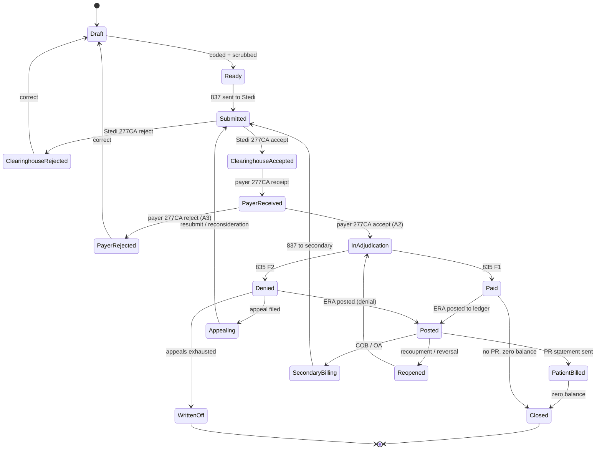
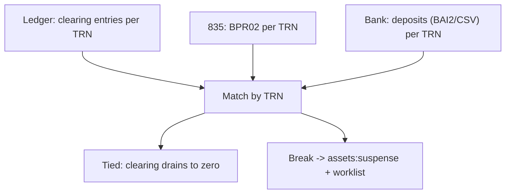

# The RCM Ledger: A Learning and Design Reference

How and why to build the ledger, accounts, claim-state tracking, and posting engine for an EMR that bills payers through Stedi and collects the remainder from patients.

This document is written **top-down as a learning document**. It starts with the domain (how a medical claim becomes money), defines the vocabulary, builds the accounting concepts, walks the design decisions with their reasoning, and only then presents the design itself and its PostgreSQL representation. Someone who reads it front to back should come away understanding not just _what_ to build but _why each piece is shaped the way it is_, and where the judgment calls live.

Supersedes the earlier RCM documents; the general-purpose ledger foundations remain in `ledgers-in-financial-software.md`.

**How to read it:**

- **Part I (sections 1 and 2)** is the domain: the revenue cycle narrative and the terminology. If X12, adjudication, or contra-revenue are fuzzy, start here; everything later assumes it.
- **Part II (sections 3 and 4)** is the conceptual core: the accounting ideas the design rests on, then every design decision with its alternatives and reasoning. This is the "understand" part.
- **Part III (sections 5 through 17)** is the design: accounts, transactions, the posting engine, the claim tracker, reconciliation, controls, the Postgres schema, patient billing and eligibility, testing, and PHI handling. This is the "build" part, and it constantly refers back to Part II for its justifications.

---

## 0. The destination, in one page

So you know where this is heading before the learning begins, the design that Parts I and II justify:

1. **One immutable double-entry ledger** in Postgres. Append-only transactions of 2+ entries summing to zero. Signed integer cents. No updates, no deletes; corrections by reversal.
2. **A small chart of accounts** (about 15 account families, section 5), not an account per claim. Claim, line, payer, and code context ride as **dimensions on each entry**, making per-claim balances, aging, and denial analytics queries rather than schema.
3. **Open-item AR.** Every payment and adjustment applies to a specific claim and service line, never to a rolled-up balance, because payers adjudicate line by line.
4. **Gross-with-contra revenue.** Book the full billed charge, write down to allowed via contra-revenue when the 835 arrives. GAAP estimation stays in the GL layer.
5. **Two event-sourced projections, one event stream.** The ledger tracks _value_ (where money sits); a separate claim tracker tracks _lifecycle_ (where the claim sits in the payer pipeline). Correlated by Patient Control Number. Acknowledgment events move lifecycle only; the 835 and payments move both.
6. **An 835 auto-posting engine** built on the CAS group-code decision tree (section 8) and the PLB balancing rules (section 9), idempotent, with everything ambiguous routed to an exception worklist instead of guessed at.
7. **Three-way reconciliation** (posted ledger vs 835 totals vs bank deposit, tied by TRN) as a daily job, with breaks landing in a suspense account that generates work.
8. **Accounting hygiene from day one:** dual timestamps with period-close enforcement, gross AR operationally with valuation allowances in the GL layer, write-offs gated behind human approval.

One orienting fact about the industry: auto-posting _clean_ 835s is table stakes; every serious platform does it. A system's real quality is determined by how it handles exceptions: denials, partial payments, recoupments, splits, reconciliation breaks. That is where most of this document lives, and it is why the exception paths get more pages than the happy path.

---

# PART I: THE DOMAIN

## 1. How a medical claim becomes money

Before any accounting, understand the physical process. Healthcare billing in the US is a conversation between a **provider** (the clinic) and a **payer** (the insurance company), conducted in standardized electronic documents defined by the **X12** standards body and mandated by HIPAA, usually routed through a **clearinghouse** (Stedi, in our case) that handles connectivity, format validation, and payer-specific quirks.

The lifecycle of one visit:



Five realities of this process shape everything in the design:

**The billed charge is a fiction.** The provider bills CPT codes times its own fee schedule, say $200. The payer's contract says the **allowed amount** for that code is $120. The $80 difference is a **contractual adjustment**: not a discount, not a loss in the colloquial sense, but a write-down baked into the contract that both sides knew about from the start. Of the $120 allowed, the payer pays its share ($80, say) and assigns the rest ($40) as **patient responsibility**: copay, deductible, and coinsurance per the patient's benefit design. So the honest arithmetic of every claim is: _billed = payer paid + contractual write-down + patient responsibility + everything else_, and "everything else" had better be zero or explained.

**Adjudication is line by line.** A claim has service lines, one per procedure. The payer decides each line independently: line one hits the deductible, line two pays at 80%, line three is denied for missing authorization. Any accounting model that only sees claim totals throws away the resolution at which decisions actually happen.

**Everything is asynchronous and out of order.** The 837 goes out today; acknowledgments trickle in over hours to days from both the clearinghouse and the payer; adjudication takes days to weeks; the 835 may arrive before or after the money; a payer can reopen a claim months later and take the money back out of a future check. The system must treat every inbound document as an event to fold into state, never as a synchronous response.

**Rejection and denial are different words for different things.** A **rejection** (reported on a 277CA) means the claim had correctable errors and never reached adjudication: fix and resubmit. A **denial** happens _during_ adjudication and arrives on the 835: appeal or write off. They route to different workflows and have different financial meanings, and conflating them is the most common vocabulary error in the domain ([Stedi's claim responses overview](https://www.stedi.com/docs/healthcare/claim-responses-overview)).

**The payer can reach back in time.** Overpayment recoupments, claim reversals, and forward balances mean the money in this week's deposit can be reduced by corrections to claims from months ago, reported in a part of the 835 (the PLB segment) that many systems ignore. Section 9 exists because of this.

### 1.1 Where Stedi sits

Stedi is the clearinghouse: it accepts claims as JSON or raw X12, validates against payer-specific edit databases, routes to thousands of payers, and returns 277CAs and 835s via webhooks, polling, or SFTP ([intro to claims processing](https://www.stedi.com/docs/healthcare/intro-to-claims-processing)). The division of labor this document assumes: **Stedi owns the pipes** (connectivity, format, enrollment, edits); **the EMR owns the money and the workflow** (the ledger, the poster, the worklists, patient billing). Nothing financial is delegated to the clearinghouse; everything transport-related is.

---

## 2. Terminology

Definitions for every term the rest of the document uses. Skim now, return as needed. Grouped by domain.

### 2.1 Actors and business objects

|Term|Definition|
|---|---|
|**Provider**|The entity rendering care and keeping these books: the clinic. All ledger signs are from the provider's point of view.|
|**Payer**|An insurance company or government program (Medicare, Medicaid, commercial plans) that adjudicates and pays claims.|
|**Clearinghouse**|An intermediary that validates, translates, and routes claims and remittances between providers and payers. Stedi, here.|
|**Subscriber**|The person who holds the insurance policy.|
|**Patient / Guarantor**|The patient receives care; the **guarantor** is the person financially responsible for the patient's share (often the same person, or a parent). Patient balances are tracked per guarantor.|
|**Encounter**|One clinical visit or service event in the EMR. The clinical anchor every financial event ties back to.|
|**Claim**|The formal request for payment for one encounter's services, sent to a payer as an 837.|
|**Service line**|One procedure within a claim: a CPT/HCPCS code, units, and a charge. Adjudication happens at this level.|
|**Fee schedule**|The provider's own price list per procedure code. Produces the billed charge.|
|**Billed charge**|Fee schedule price times units. The starting number of every claim, and almost never what is collected.|
|**Allowed amount**|What the payer's contract says the service is worth. The real economic value of the service under that contract.|
|**Adjudication**|The payer's process of deciding a claim: applying the contract, the benefit design, and medical policy to produce paid, adjusted, and patient-responsibility amounts per line.|
|**Contractual adjustment**|Billed minus allowed. A write-down required by the provider-payer contract; never billable to anyone.|
|**Patient responsibility**|The portion of the allowed amount the patient owes: **copay** (flat fee per visit), **deductible** (patient pays until an annual threshold), **coinsurance** (percentage split after deductible).|
|**Remittance / ERA / EOB**|The payer's explanation of what it paid and why. The **ERA** (Electronic Remittance Advice) is the provider-side electronic document, transmitted as an X12 **835**; the **EOB** (Explanation of Benefits) is the patient's parallel copy. "The ERA" and "the 835" are used interchangeably.|
|**EFT**|Electronic funds transfer: the actual money movement (usually ACH) that corresponds to an 835.|
|**Coordination of benefits (COB)**|The rules deciding order of payment when a patient has multiple insurances. The **primary** payer adjudicates first; residuals go to the **secondary**.|
|**Recoupment / takeback**|The payer reclaiming previously paid money, usually by deducting it from a future check.|
|**Denial**|An adjudication decision not to pay, reported on the 835 with reason codes. Appealable.|
|**Rejection**|A pre-adjudication refusal (clearinghouse or payer front end) due to correctable errors, reported on a 277CA. Fix and resubmit.|
|**Appeal**|The formal process of contesting a denial.|
|**Charity care / financial assistance**|Policy-driven forgiveness of patient balances based on need. A determination, not a collection failure.|
|**Revenue cycle management (RCM)**|The whole discipline: eligibility, charge capture, claim submission, posting, denial management, patient billing, reporting.|

### 2.2 X12 transactions, segments, and codes

|Term|Definition|
|---|---|
|**X12**|The EDI standards body whose transaction sets HIPAA mandates for healthcare ([x12.org](https://x12.org/)).|
|**837P / 837I / 837D**|The claim transaction: Professional (physician/clinic, the electronic CMS-1500), Institutional (facility, UB-04), Dental.|
|**270 / 271**|Eligibility inquiry and response. The 271 tells you coverage status, copay, deductible remaining. Drives point-of-service collection.|
|**276 / 277**|Claim status inquiry and response. Used proactively when a claim goes silent.|
|**277CA**|Claim Acknowledgment: an unsolicited 277 reporting accepted/rejected as the claim moves through the clearinghouse and payer front end. Multiple arrive per claim. Reports _receipt and acceptance_, never payment.|
|**835**|Health Care Claim Payment/Advice: the remittance. The financial document this whole design revolves around ([Stedi's 835 overview](https://www.stedi.com/edi/x12/transaction-set/835)).|
|**275**|Claim attachments (documents supporting a claim).|
|**TA1 / 999**|Transport-level interchange and functional acknowledgments. Deliberately excluded from claim state in this design; Stedi's file events cover the need.|
|**BPR**|The 835 header segment carrying payment method and the **total check amount (BPR02)**.|
|**TRN**|Trace number: the identifier present in both the 835 and the EFT, existing precisely so remittances can be matched to bank deposits.|
|**CLP**|Claim Payment segment: one per claim in an 835. **CLP02** is the claim status code (1/2/3 processed as primary/secondary/tertiary, 4 denied, 22 reversal of prior payment); **CLP03** billed; **CLP04** paid.|
|**SVC**|Service line payment detail within a CLP.|
|**CAS**|Claim/line Adjustment Segment: an adjustment with a group code, a reason code, and an amount. Sign convention: positive decreases the payment, negative increases it.|
|**Group codes (CO/PR/OA/PI/CR)**|Who bears a CAS adjustment: **CO** Contractual Obligation (provider write-down), **PR** Patient Responsibility (billable to patient), **OA** Other Adjustment (often COB), **PI** Payer Initiated (payer's own reduction), **CR** Correction/Reversal. The single most important routing signal in posting.|
|**CARC**|Claim Adjustment Reason Code: _why_ an adjustment happened. CARC 1 = deductible, 2 = coinsurance, 3 = copay, 45 = charge exceeds fee schedule, 197 = no authorization, etc.|
|**RARC**|Remittance Advice Remark Code: supplementary narrative detail on an adjustment.|
|**PLB**|Provider Level Balance segment: adjustments at the _check_ level, not tied to any claim in the current file. Where recoupments, forward balances, and interest live. Sign convention: positive reduces the check, negative increases it.|
|**PLB codes (WO/FB/L6/72/CS)**|**WO** overpayment recovery (recoupment), **FB** forward balance (a carry to/from another remittance), **L6** interest, **72** authorized return (acknowledges your refund check), **CS** adjustment (often the payer writing off an uncollected FB).|
|**PCN**|Patient Control Number: the identifier _you_ assign per claim (837 CLM01 / `patientControlNumber`). The payer echoes it in the 277CA and 835. The correlation spine of the whole system. Stedi requires it unique and hard to guess ([PCN best practices](https://www.stedi.com/docs/healthcare/submit-institutional-claims)).|
|**PCCN**|Payer Claim Control Number: the payer's own identifier for the claim, learned from the 277CA (`tradingPartnerClaimNumber`). Needed for status checks, appeals, and matching reversals.|
|**Line item control number**|Your per-service-line identifier (837 `providerControlNumber`), echoed as `lineItemControlNumber` in the 835. Enables line-level posting.|
|**Claim status category codes**|The vocabulary of 277 status: **A1** acknowledged/received, **A2** accepted into adjudication, **A3** returned as unprocessable (rejected), **P*** pending, **F1** finalized/paid, **F2** finalized/denied.|

### 2.3 Accounting

|Term|Definition|
|---|---|
|**Ledger**|An append-only record of movements of value between accounts, from which balances are _derived_, never stored and mutated.|
|**Account**|A named container of value. Real (a bank account) or abstract (`income:contractual_adjustments`). Every account has a **type**: asset, liability, equity, income, or expense.|
|**Transaction / journal entry**|An atomic set of two or more entries that sum to zero, applied together. The unit of change.|
|**Entry / posting**|One signed amount applied to one account within a transaction. ("Posting" is also the verb: applying a remittance to the books.)|
|**Double-entry**|The discipline that every transaction balances to zero: value never appears or vanishes without a counterparty. Adopted here not for tradition but because it creates a **machine-checkable global invariant**.|
|**Debit / credit**|Traditional accounting's dual-column notation, where meaning depends on account type ("normal balance"). This design stores **signed amounts** instead and renders debit/credit only when exporting to finance, per the [Beancount convention](https://beancount.github.io/docs/the_double_entry_counting_method/#types-of-accounts). In signed terms: assets and expenses normally positive; liabilities, equity, and income normally negative.|
|**Point of view**|Every sign is from the perspective of the entity keeping the books. A patient's wallet credit is _negative_ on the provider's books because the provider _owes_ it. The most common source of confusion for engineers meeting a ledger.|
|**Contra account**|An account that offsets another of the same type. **Contra-revenue** (contractual adjustments, denial write-offs, charity) reduces gross revenue to net; a **contra-asset allowance** reduces gross AR to net realizable value.|
|**Accounts receivable (AR)**|Money owed to you. Here split by who owes it: payer AR, patient AR, denied AR.|
|**Open-item vs balance-forward**|Two AR disciplines. **Balance-forward** treats each account as a pool; payments relieve the oldest debt with no invoice linkage. **Open-item** applies every payment to a specific item until it closes at zero. Medical AR must be open-item because adjudication is per line (section 4.1).|
|**Accrual accounting**|Recognizing revenue when earned and receivables when owed, not when cash moves. The charge posts at service; cash posts at deposit; they are different events.|
|**Revenue recognition / ASC 606**|The GAAP standard governing _when and how much_ revenue to report: the amount you _expect to collect_, net of contractual adjustments and implicit price concessions. A controller's judgment, kept out of the operational ledger.|
|**Gross-with-contra**|Booking revenue and AR at full billed charges, then recording write-downs in contra-revenue as adjudication reveals them. This design's choice (section 4.4).|
|**Net realizable value**|What AR is actually worth: gross AR minus expected write-downs. Operationally we carry gross; the GL carries **allowances** to state net.|
|**Allowance**|A contra-asset estimate (from historical ratios) of the portion of gross AR that will not be collected. Lives in the GL, not the operational ledger, because it is a mutable estimate.|
|**Write-off**|Removing a receivable from the books: contractual (automatic, contract-driven), denial (after appeals exhaust), bad debt (collection failure), charity (policy determination). Different write-offs go to different accounts because they mean different things.|
|**Bad debt vs price concession**|Under ASC 606, a patient balance that was doubtful _from the outset_ is a contra-revenue price concession, not bad-debt expense. The classification changes reported revenue and belongs to the controller.|
|**Clearing account**|A transit account for value between two confirmed states. `clearing:payer_remittance` holds "the 835 says it was paid" until "the bank says it arrived." Its drain-to-zero behavior _is_ the reconciliation.|
|**Suspense account**|Where unexplained amounts park pending investigation. A suspense balance is a to-do list, never a resting place; a growing one is an incident.|
|**Unapplied cash**|Real money received that cannot yet be matched to a claim or guarantor. A liability (you hold money you cannot yet attribute).|
|**Reversal**|The only correction mechanism in an immutable ledger: a new transaction that exactly negates a prior one, referencing it. History is never edited.|
|**Idempotency**|The property that processing the same event twice has the same effect as once. Achieved with business-derived keys under unique constraints. In a ledger, non-idempotent posting is a money-printing bug.|
|**Effective date vs posted date**|_When it happened economically_ vs _when the ledger recorded it_. Both are required because remittances routinely arrive for prior periods.|
|**Period close**|Freezing a month: no further entries with effective dates inside it. Late events post to the open period as **adjusting entries**. The contract between engineering and finance.|
|**Trial balance**|The check that all account balances sum to zero (in signed terms). Cheap, continuous, catches a large class of corruption.|
|**General ledger (GL)**|Finance's system of record (QuickBooks, NetSuite): chart of accounts, close, financial statements, audit. The operational ledger _summarizes into_ it daily; it is never rebuilt inside the EMR.|
|**Three-way match**|The daily control reconciling three totals per TRN: what the ledger posted, what the 835 said (BPR02), and what the bank deposited.|
|**Aging**|Bucketing open receivables by how long they have been open (0-30, 31-60, ...). The primary follow-up prioritization tool.|
|**Days in A/R, net collection rate, denial rate**|The headline RCM health metrics: how fast receivables convert to cash; collected vs collectable; share of claims denied. The ledger's dimensions exist partly so these are honest queries.|

### 2.4 System-design terms used here

|Term|Definition|
|---|---|
|**Event sourcing**|Storing an append-only log of events and _deriving_ current state by folding them. Both the ledger and the claim tracker are event-sourced; one is typed with dollars, one is not.|
|**Projection**|A derived, rebuildable view over the event log: account balances, a claim's current state.|
|**Dimension**|Structured context on an entry (claim, line, payer, CARC...) that makes analytics queries instead of schema. The alternative to exploding accounts.|
|**Exception worklist**|The queue of items the automated poster refuses to guess about. The deliberate design stance: route ambiguity to humans, never resolve it silently.|
|**All-or-nothing posting**|Per claim, either one balanced transaction commits or nothing does and the claim goes to the worklist. No partial states.|

---

# PART II: THE CONCEPTS AND THE DECISIONS

## 3. The conceptual core

Four ideas carry the entire design. Everything in Part III is these four ideas applied.

### 3.1 Balances are derived, and every change balances to zero

The foundational move (argued at length in the base document, and in [Kleppmann's Accounting for Computer Scientists](https://martin.kleppmann.com/2011/03/07/accounting-for-computer-scientists.html)): do not store balances and mutate them; store _movements_ and derive balances. Then require every movement to sum to zero across its entries.

Why this is worth its ceremony: it converts correctness from a hope into a **checkable invariant**. `SELECT SUM(amount) FROM entries` must return zero, always, per currency. A retry, a race, or a missing else-branch cannot create or destroy a cent without breaking a constraint the database enforces. Every balance decomposes into the exact transactions that produced it, which in healthcare has a very concrete payoff: when a payer disputes or recoups months later, every posted amount traces to a specific 835 segment ([Behave Health on the audit-trail value](https://behavehealth.com/glossary/electronic-remittance-advice)). Square reached the same conclusion for payments infrastructure ([Books](https://developer.squareup.com/blog/books-an-immutable-double-entry-accounting-database-service/)).

Immutability follows: the ledger is evidence, and evidence you can edit is not evidence. Corrections are reversing transactions. Combined with idempotency keys on every write path, the three properties (balanced, immutable, idempotent) are the whole trust story.

### 3.2 The five account types, signed

Assets (what you have) and expenses (what you consumed) are normally positive; liabilities (what you owe), income (what you earned), and equity are normally negative, all from the provider's point of view. This design skips traditional debit/credit dual columns in the core, storing signed integers plus an account type, and renders debit/credit only at the GL export boundary. Beancount makes the case that dual columns are unnecessary complexity for a computational system, and Square independently landed on the same simplification.

The point-of-view rule deserves its own sentence because it is where every team stumbles once: a copay collected before adjudication is **negative** on your books (`liabilities:patient_unapplied`) because until the 835 tells you the actual patient responsibility, that money is _held_, not _earned_. Budget the afternoon the team will spend arguing about this; it is a rite of passage.

### 3.3 Two axes of state, one test

The word "state" means two different things in RCM, and separating them is the central structural decision:

- **Value state**: _where does the money sit?_ Payer AR, patient AR, denied AR, clearing, cash. Moving between value states is a balanced ledger transaction conserving a dollar amount. This is the "states as accounts" pattern.
- **Lifecycle state**: _where is the claim in the payer pipeline?_ Draft, submitted, clearinghouse-accepted, payer-received, in adjudication. Crossing these moves **no money at all**.

The test: **does a dollar move?**

|Milestone|Dollar moves?|Lives as|
|---|---|---|
|Draft / ready to submit|No|claim entity (lifecycle)|
|Submitted to Stedi|No|claim entity|
|Clearinghouse accepted / rejected (277CA)|No|claim entity|
|Payer received / in adjudication (277CA)|No|claim entity|
|Charge captured|**Yes**|ledger|
|835 posted (payment / CO / PR)|**Yes**|ledger **and** claim entity|
|Denied|**Yes**|ledger **and** claim entity|
|Deposit reconciled, patient payment|**Yes**|ledger|

Why acknowledgment states cannot be ledger accounts: they carry no amount (zero-value entries would break the zero-sum invariant), they churn (many 277CAs per claim, webhook retries), and they loop (reject, correct, resubmit; money "bouncing" between accounts to represent a resubmission is nonsense). They also carry metadata accounting should not hold: status category codes, CARC narratives, the PCCN, follow-up timers.

The unifying idea that resolves any felt tension: **both are event-sourced projections over the same inbound event stream.** The ledger is an append-only journal with derived balances; the claim tracker is an append-only status log with a derived current state. Same pattern, one typed with dollars, one not, cross-referenced by PCN.



### 3.4 Time has two dimensions, and money is integers

Every transaction carries **`effective_at`** (when it happened economically: date of service for charges, remittance date for 835 postings, deposit date for cash) and **`posted_at`** (when the ledger recorded it, monotonic and immutable). Backdated arrival is the norm in RCM: an 835 for a June service routinely lands in July. Without `effective_at`, "what was AR on June 30" is unanswerable, and that is the question finance asks every month. Period-close mechanics are in 12.3.

Money is signed integer cents behind types that make raw floats structurally impossible. USD only for this product, but currency travels with every amount anyway; the constraint costs nothing and forecloses a bug class.

---

## 4. Design decisions: alternatives and reasoning

This section is the "understand why" core. First the six architectural forks (4.1 through 4.6), each with the rejected alternative and the reason. Then the register of smaller decisions embedded in the design (4.7), because a solution stated without its reasoning is not transferable, and changing most of these later means a data migration.

### 4.1 Open-item vs balance-forward AR

**Balance-forward** treats each account as a pool: payments reduce the total and implicitly relieve the oldest debt, with no link between a payment and a specific invoice. **Open-item** allocates every payment and adjustment to a specific open item until that item closes at zero. The general trade-off is well documented: balance-forward is simpler to operate but makes disputes and aging unreliable; open-item preserves the outstanding population item by item ([Oracle's comparison](https://docs.oracle.com/en/industries/energy-water/rate-cloud/22c/rcs-user-guides/RCS_22c/C1_03Finan_Open_Item_Versus_Balance_Forward_.html), [Inomial's developer framing](https://docs.inomial.com/smileguides/devguide/developerguide/listeningfortxns/openitemaccs)).

**For medical AR the choice is forced**, and understanding why teaches the domain: payers adjudicate per claim and per service line: one line hits deductible, the next pays at 80%, a third is denied. A balance-forward patient account literally cannot represent an 835. Practice-management systems are open-item for exactly this reason ([Delphi's explanation](http://www.delphipbs.com/help/html/openitemaccounting.htm)).

**Chosen: open-item, implemented as dimensioned entries.** Every entry carries claim and line identity; an "open item" is simply a claim or line whose dimensioned balance is nonzero. Open-item semantics with no item tables bolted beside the ledger.

### 4.2 Double-entry journal vs single-entry balance columns

Many legacy PM systems store a mutable `balance` column per claim and adjust it as postings occur. Simpler, until it drifts, and it drifts silently: nothing in a balance column can tell you it is wrong. The double-entry journal gives the checkable invariant, provenance, and immutability of 3.1. **Chosen: double-entry.** The extra insert per transaction is cheap; the invariant is priceless.

### 4.3 Per-claim accounts vs a small chart with dimensions

Modeling each claim as its own ledger account gives per-claim balances "for free" but explodes the account table into the millions, creates migration pain, and puts account creation on the hot write path. **Chosen: a small stable chart with claim/line/payer dimensions on entries.** Per-claim balance is `SUM(amount) WHERE claim_id = X`, indexable and fast at clinic scale. (The same argument recurs one level up in the Postgres design, 14.1: payer and guarantor sub-accounts are also dimensions, not account rows.)

### 4.4 Gross-with-contra vs net revenue booking

Booking only the expected allowed amount ("net") keeps revenue closer to GAAP from day one, but requires a reliable expected-allowed engine (contract modeling per payer per CPT) _before you can post a single charge_, and it erases gross-charge analytics. **Gross-with-contra** books what you actually know at each moment: the fee schedule at charge time, the adjudicated write-down when the 835 reveals it. Industry posting guidance describes exactly this flow: post the paid amount as indicated, then allocate the remainder to contractual adjustment, patient responsibility, or denial per the payer's instructions ([MBW RCM's exceptions guide](https://www.mbwrcm.com/the-revenue-cycle-blog/payment-posting-exceptions-guide)). It also preserves the analytics healthcare finance always wants: gross charges, contractual allowance rate, net collection rate, denial rate.

**Chosen: gross-with-contra.** Expected-allowed comparison arrives later as an _analytics_ layer (underpayment detection), never as the booking basis. GAAP's expected-collection estimation stays in the GL summarization (12.2), where the controller's judgment lives.

### 4.5 Build vs buy the posting layer

Every serious RCM platform (Waystar, Change Healthcare/Optum, athenahealth, and the rest) auto-posts clean ERAs; the capability is commodity, and the field differentiates on exception handling and reconciliation ([Honey Health's 2026 survey](https://www.honeyhealth.ai/articles/10-best-payment-posting-software-2026)). Buying one of those platforms means buying their entire PM system, contradicting the premise of RCM inside your own EMR; buying "just a posting engine" is not a real product category because posting is inseparable from your claim and ledger data model.

**Chosen: build the ledger and poster; buy the pipes.** Stedi is the bought pipe. Purpose-built ledger databases (TigerBeetle) are unnecessary at clinic volume; Postgres with constraints is the simple, reliable choice.

### 4.6 Where claim lifecycle state lives

Alternatives: (a) a status column mutated in place, (b) lifecycle states as ledger accounts, (c) an event-sourced status log with derived current state. Option (a) loses history exactly where payers argue with you; (b) fails for the reasons in 3.3; (c) mirrors the ledger's own discipline for one more append-only table. **Chosen: (c)**, detailed in section 10.

### 4.7 The decision register: choices embedded in the design

Beyond the architectural forks, the design embeds a dozen smaller decisions that are easy to miss because later sections just state an answer. Each entry: the question, what pushes each way, and what would make you revisit. These are the conversations to have before implementation.

**D1. When does the charge hit the ledger?** Options: at coding/charge capture (chosen), at 837 submission, or at payer acceptance (277CA A2). Earlier booking gives gross revenue and AR the day service is rendered, matching accrual intuition and a same-month revenue picture; the cost is phantom AR for claims never submitted or abandoned, which is why 7.5's void transaction and the terminal-state/zero-balance assertion exist. Booking at payer acceptance eliminates phantom AR but delays revenue days to weeks and makes it depend on payer plumbing, which finance will hate. Revisit if the abandonment rate between coding and submission proves high; the fix is booking at submission, a trigger change, not a schema change.

**D2. Claim-level vs line-level entry granularity.** The design posts per service line (each line's CO, PR, and payment as its own entry with `line_control_number`). The alternative, one entry per claim per bucket, is fewer rows and simpler. Line-level costs roughly 3 to 10 times the entries per claim but is what makes line-level denial analytics, partial-line appeals, and CPT-level yield analysis _queries_ instead of re-parsing stored 835s. Payers adjudicate at the line; a claim-level ledger throws that resolution away at write time and you cannot get it back. Revisit only if entry volume ever matters, which at clinic scale it will not.

**D3. `effective_at` for 835 postings: remit date (chosen) vs service date.** Remit date puts each month's adjustments and payments in the month adjudicated, keeping the close simple and the clearing reconciliation aligned with bank activity. Service date matches adjustments to the revenue month, more theoretically correct matching, but forces constant posting into closed periods, exactly what 12.3 forbids. The chosen compromise is the standard industry resolution: `effective_at` = remit date, service date preserved as a dimension, and the GL allowance mechanism (12.2) handles period matching statistically. Do not relitigate without a controller in the room.

**D4. Copay handling: unapplied liability (chosen) vs direct patient-AR credit vs straight to revenue.** Posting intake copays to `patient_unapplied` and applying at 835 time is more steps, but it is the only representation _correct before adjudication_: until the 835, actual PR is unknown, and the copay can exceed it (refund case), be exact, or fall short. Crediting `ar:patient` before that AR exists creates negative AR that pollutes aging; booking to revenue double-counts against the grossed charge. The liability also gives a clean report of "money held for unadjudicated encounters," which auditors ask about. No realistic revisit trigger.

**D5. All-or-nothing claim posting vs partial posting of clean lines.** The design rejects a whole claim to the worklist if any line fails to match or balance (8.2). Partial posting would keep cash moving on clean lines but leaves the claim's dimensioned balance meaningless mid-work, complicates the clearing-to-BPR tie, and strips the worklist item of full-claim context. The cost is that one bad line delays its siblings by the worklist latency. If posting-lag metrics ever show that cost is real, the safe relaxation is _automatic re-posting_ after the human fixes the one line, never partial posting.

**D6. WO recoupment routing priority: liability-first (chosen) vs reference-first.** When a PLB WO arrives, the engine clears `refunds_due_payer` if a balance exists, else re-opens `ar:payer` if the reference resolves, else suspense (9.2). Liability-first assumes an existing liability for this payer relates to this recoupment, usually true but not guaranteed: a payer can recoup claim A while you carry an agreed liability for claim B, and at payer-level liability tracking those commingle silently. If your payer mix generates concurrent overpayment cases per payer, upgrade to per-reference liability tracking (the `fb_trace` dimension exists to support it) and switch to reference-first. The register entry most likely to actually fire.

**D7. Denials: reclass to `ar:denied` (chosen) vs dimension-only vs immediate write-off-and-rebill.** A dedicated account makes denied AR a first-class balance on every report without a filter, and makes the write-off an explicit, authorized transaction. A dimension on `ar:payer` is leaner but denied dollars then inflate ordinary payer aging and hide inside follow-up metrics. Immediate write-off with rebill-on-appeal makes AR "cleaner" but understates the real position and buries the denial workload. The account costs nothing; keep it.

**D8. Idempotency granularity: per claim within a file (chosen) vs per file.** `era_{TRN}_{PCN}` means a redelivered or partially reprocessed 835 skips exactly the claims already posted and picks up the rest, which is what you want when a file excepts halfway or Stedi redelivers after a handler timeout. Per-file idempotency is simpler but turns any partial failure into manual surgery. Subtle consequence: `remittances.posted_at` becomes a derived milestone (all CLPs and PLBs posted or excepted), not a write-once flag, and the assertion jobs (14.7) treat it that way.

**D9. Statement timing: bill the patient when PR posts (chosen for primary-only) vs after secondary adjudication.** If a secondary payer exists, a statement on the primary's PR is wrong: the secondary may cover it, and clawing back a patient statement destroys trust. The state machine encodes the rule: `PatientBilled` only when no `SecondaryBilling` path is open. Small decision, disproportionate patient-experience impact.

**D10. Tolerance and auto-post thresholds.** The design auto-posts everything that balances and matches, routes everything else, with **zero dollar tolerances**. Many shops add tolerances ("auto-adjust variances under $1"), which cuts worklist noise at the cost of a policy that silently writes off money and hides systematic penny-level payer behavior. Recommendation: start at zero; when worklist volume reveals a genuine noise class (it will be specific payers with specific rounding), add a _named, logged, per-payer_ tolerance rule posting the variance to a dedicated contra account. The distinction between "tolerance write-off, visible in its own account" and "auto-fixed, invisible" is the entire game.

**D11. Multi-entity books.** If the EMR ever serves more than one billing provider (distinct TIN/NPI, distinct bank accounts), those are **separate sets of books**: separate zero-sum invariants, separate closes, separate GL exports, no commingled cash. Cheap insurance now: a `billing_entity_id` column on transactions and entries, included in every invariant query's GROUP BY, even with exactly one entity. Retrofitting entity separation into a live commingled ledger is the most painful migration in this document's blast radius.

**D12. Where the balance check lives: DB, application, or both (chosen).** The deferred database trigger (14.3) is the last line of defense; the in-process `assertBalanced` in the poster fails fast in tests without a database. Both is mild duplication and worth it: the app check gives good errors during development, the DB check catches every writer including ones not yet written. Trusting either alone recreates the failure mode the other exists to catch.

---

# PART III: THE DESIGN

Everything below applies Part II. Where a choice looks arbitrary, the register entry (4.7) or fork (4.1-4.6) behind it is cross-referenced.

## 5. Chart of accounts

The `:` hierarchy is the structure; `{payerId}` / `{guarantorId}` denote logical sub-accounting, implemented as dimensions (14.1), because aging and follow-up are always sliced by payer.

### Assets

|Account|Purpose|
|---|---|
|`assets:cash:operating`|The real bank account where deposits land|
|`assets:ar:payer:{payerId}`|Expected from insurance, at billed charges, until the ERA resolves it|
|`assets:ar:patient:{guarantorId}`|Patient responsibility after adjudication|
|`assets:ar:denied:{payerId}`|Denied claims being worked or appealed, not yet written off (D7)|
|`assets:clearing:payer_remittance`|835 posted, cash not yet matched to a deposit. The reconciliation pivot|
|`assets:suspense`|Unmatched or unexplained amounts, pending investigation|

### Liabilities

|Account|Purpose|
|---|---|
|`liabilities:patient_unapplied:{guarantorId}`|Point-of-service copay collected before adjudication (D4)|
|`liabilities:patient_credits:{guarantorId}`|Patient overpayment, refund owed|
|`liabilities:refunds_due_payer:{payerId}`|Payer overpayment to be returned or recouped. PLB forward balances (FB) tracked here with an `fb` dimension, not a separate account (9.3)|
|`liabilities:unapplied_cash`|Receipts not yet matched to a claim or guarantor|

### Income (revenue and contra-revenue)

|Account|Purpose|
|---|---|
|`income:patient_service_revenue`|Gross clinical revenue at billed charges (4.4)|
|`income:contractual_adjustments`|Contra. CO write-downs, billed minus allowed|
|`income:denial_writeoffs`|Contra. Abandoned after appeals exhausted|
|`income:charity_care`|Contra. Financial-assistance determinations|
|`income:interest`|Payer-paid interest (PLB L6)|

### Expenses

|Account|Purpose|
|---|---|
|`expense:bad_debt`|Patient balances uncollectible (12.2 for the ASC 606 nuance)|
|`expense:clearinghouse_fees`|Stedi fees. An operating cost, never threaded through claim AR|

The clearinghouse fee deserves its sentence: Stedi charges per transaction, and that is an operating expense on its own stream, booked when incurred. It is not part of any claim's receivable lifecycle.

### Entry dimensions

Every entry carries structured context; these make per-claim balances, payer aging, and denial analytics queries instead of schema (4.3):

`claim_id`/PCN, `line_control_number`, `payer_id`, `guarantor_id`, `encounter_id`, `cpt_hcpcs`, `cas_group_code`, `carc`, `rarc`, `remittance_trace` (TRN), `plb_code` where applicable.

The PCN is the correlation spine: unique per claim, echoed by the payer in the 277CA and 835 ([Stedi PCN practices](https://www.stedi.com/docs/healthcare/submit-institutional-claims)). Line-level correlation uses the 837 `providerControlNumber`, echoed as `lineItemControlNumber` in the 835 ([professional claims](https://www.stedi.com/docs/healthcare/submit-professional-claims)).

---

## 6. The happy-path lifecycle

One 837P claim end to end, with the numbers spelled out so the balancing is visible. Copay is known at eligibility (271) and collected at intake; coinsurance is known only after adjudication.

```
Billed charge:                        $200.00
Copay (271, collected at intake):      $20.00
Allowed (from 835):                   $120.00  -> CO contractual = $80.00
Payer pays:                            $80.00
PR total:                              $40.00  ($20 copay CARC 3 + $20 coinsurance CARC 2)
Check: 80 + 80 + 40 = 200 billed  OK
```

```
T0  2026-07-08  "Copay, encounter E900"          idem: copay_E900
      assets:cash:operating                +20.00
      liabilities:patient_unapplied:G12    -20.00

T1  2026-07-08  "Charge, claim PCN-4711"         idem: charge_PCN4711
      assets:ar:payer:BCBS                +200.00
      income:patient_service_revenue      -200.00

    (837 submission and all 277CAs: lifecycle events only, no ledger entries)

T2  2026-07-15  "835 posting, PCN-4711"          idem: era_{TRN}_PCN4711
      assets:clearing:payer_remittance     +80.00   # paid, in transit
      income:contractual_adjustments       +80.00   # CO write-down
      assets:ar:patient:G12                +40.00   # PR reclassified
      assets:ar:payer:BCBS                -200.00   # receivable cleared

T3  2026-07-15  "Apply copay, PCN-4711"          idem: applycopay_PCN4711
      liabilities:patient_unapplied:G12    +20.00
      assets:ar:patient:G12                -20.00

T4  2026-07-17  "Deposit, TRN {trace}"           idem: deposit_{TRN}
      assets:cash:operating                +80.00
      assets:clearing:payer_remittance     -80.00

T5  2026-07-25  "Patient payment, PCN-4711"      idem: ppay_{ref}
      assets:cash:operating                +20.00
      assets:ar:patient:G12                -20.00
```

Every transaction balances; the claim's dimensioned balance ends at zero; the global invariant `SUM(entries) = 0` holds throughout.

Three decisions are quietly load-bearing in that sequence, argued in the register (4.7): the charge posts at coding rather than at submission or acceptance (**D1**, which is why the void path in 7.5 must exist), 835 postings carry the remit date as `effective_at` with service date as a dimension (**D3**), and the copay routes through an unapplied liability rather than crediting patient AR that does not exist yet (**D4**).

---

## 7. Exception transactions

The happy path is perhaps 60% of volume. Auto-posting's real job is turning the rest into worklists rather than mysteries; done well, posting changes the billing team's job from data entry to exception management ([Behave Health](https://behavehealth.com/glossary/electronic-remittance-advice)).

### 7.1 Denial (worked, not written off)

Per D7, a denial reclasses to a visible, worked account:

```
2026-07-15  "Denial, PCN-4712 (CARC 197)"     idem: era_{TRN}_PCN4712
  assets:ar:denied:BCBS               +200.00
  assets:ar:payer:BCBS                -200.00
```

Appeal succeeds: reverse back to `ar:payer`, resubmit, let a normal 835 post. Appeal abandoned:

```
2026-08-30  "Write off denied PCN-4712"
  income:denial_writeoffs             +200.00
  assets:ar:denied:BCBS               -200.00
```

### 7.2 Patient overpayment and refund

```
2026-07-25  "Patient payment, PCN-4711"          # $50 against a $20 balance
  assets:cash:operating                +50.00
  assets:ar:patient:G12                -20.00
  liabilities:patient_credits:G12      -30.00

2026-08-05  "Refund credit to G12"
  liabilities:patient_credits:G12      +30.00
  assets:cash:operating                -30.00
```

### 7.3 Coordination of benefits (secondary)

Primary 835 signals another payer (typically OA adjustments). Reclassify and generate the secondary 837:

```
2026-07-15  "COB to secondary, PCN-4713"
  assets:ar:payer:MEDICARE_SEC         +40.00
  assets:ar:payer:BCBS                 -40.00
```

Per D9, no patient statement goes out while a secondary path is open.

### 7.4 Small-balance and bad-debt write-off (patient)

```
2026-09-01  "Write off small balance, G12"
  expense:bad_debt                      +5.00
  assets:ar:patient:G12                 -5.00
```

See 12.2 before deciding whether this is an expense or a contra-revenue price concession; the classification is the controller's.

### 7.5 Charge void and correction (pre-adjudication)

The T1 charge posts before adjudication (D1), so two non-835 events must be able to unwind or amend it, or abandoned claims leave phantom AR forever:

**Void.** The encounter is voided, or a rejection will not be corrected and resubmitted (claim abandoned). Reverse in full:

```
2026-07-10  "Void charge, PCN-4711"           idem: voidcharge_PCN4711
  income:patient_service_revenue      +200.00     reverses: charge_PCN4711
  assets:ar:payer:BCBS                -200.00
```

**Correction.** Coding review changes the billed amount before (re)submission. Never edit; reverse and rebook:

```
2026-07-10  "Reverse charge, PCN-4711"        idem: revcharge_PCN4711
  income:patient_service_revenue      +200.00     reverses: charge_PCN4711
  assets:ar:payer:BCBS                -200.00

2026-07-10  "Charge (corrected), PCN-4711"    idem: charge_PCN4711_v2
  assets:ar:payer:BCBS                +250.00
  income:patient_service_revenue      -250.00
```

A rejected claim sitting in Draft for correction keeps its original charge; only abandonment or amount changes touch the ledger. Hygiene assertion: any claim terminal-without-adjudication for more than a day must have zero dimensioned balance.

### 7.6 Charity care and financial assistance

A determination-driven write-down, contra-revenue at the moment of determination, against whichever AR bucket holds the balance:

```
2026-08-10  "Charity care, policy FA-12, G12"
  income:charity_care                  +20.00
  assets:ar:patient:G12                -20.00
```

Charity care (a policy determination) and bad debt (a collection failure) mean different things; separate contra accounts preserve the distinction finance and cost reports need.

### 7.7 Recoupments and payer refunds

PLB-driven, and the most common way remittance reconciliation breaks. They get section 9.

---

## 8. The 835 auto-posting decision tree

The heart of the engine. Input: one parsed 835 (via Stedi's [835 ERA Report](https://www.stedi.com/docs/healthcare/api-reference/get-healthcare-reports-835)). Output: balanced ledger transactions, lifecycle updates, and exception worklist items. The design stance throughout: **nothing ambiguous is guessed at; it is routed.**

### 8.0 Sign conventions, stated once

Two independent sign systems live in the 835, and conflating them is the classic posting bug:

- **CAS adjustment amounts** (claim/line level): a **positive** amount _decreases_ the payment, a **negative** amount _increases_ it ([Stedi 835 ERA Report](https://www.stedi.com/docs/healthcare/api-reference/get-healthcare-reports-835)).
- **PLB adjustment amounts** (provider level): a **positive** amount _reduces the check_, a **negative** amount _increases the check_ ([BCBSIL PLB guide](https://www.bcbsil.com/docs/provider/il/claims/payment/plb-segment-on-era-government-programs.pdf)).

The poster normalizes both into signed ledger amounts at the parse boundary and never lets raw X12 signs into posting logic.

### 8.1 File level



The balancing identity `BPR02 = sum(CLP04) - sum(PLB)` comes straight from the X12 835 specification; payers themselves publish it as the reconciliation formula ([BCBSTX](https://www.bcbstx.com/docs/provider/tx/claims/electronic-commerce/plb-segment-835-era.pdf)). Validating it _before_ posting anything catches malformed files, partial payer batches, and multi-provider-group ERAs where the BPR covers more payees than your CLPs ([Medi's ERA-posting documentation](https://medibilling.app/docs/posting-eras)). File-integrity-first is standard practice ([Dastify](https://www.dastifysolutions.com/blog/era-835-electronic-remittance-advice-era-edi-835-in-medical-billing/)).

### 8.2 Claim level (each CLP)



Two embedded rules that matter:

- **All-or-nothing per claim** (D5): one balanced transaction or nothing, with the whole claim to the worklist.
- **Unmatched cash is still cash.** If the PCN cannot be matched (payer typo, name mismatch, legacy claim), the money is real and belongs in `liabilities:unapplied_cash` with the raw CLP attached, mirroring the review-queue pattern production systems use ([Avea's posting docs](https://aveaoffice.zendesk.com/hc/en-us/articles/16459840755355-Automatic-Payment-Posting)).

### 8.3 Line level (each SVC and its CAS segments)

For each service line, match `lineItemControlNumber` to your line, then fold each CAS adjustment through the group-code table. This mapping is the heart of the engine, and understanding _why each group routes where it does_ is understanding the domain:

|Group|Meaning|Ledger destination|Why|
|---|---|---|---|
|**CO** Contractual Obligation|Contract write-down|`income:contractual_adjustments`|Contractually agreed; never anyone's debt; contra-revenue by definition|
|**PR** Patient Responsibility|Deductible (CARC 1), coinsurance (2), copay (3)|`assets:ar:patient:{g}`|The one and only adjustment class billable to the patient|
|**OA** Other Adjustment|Usually COB / informational|Secondary `assets:ar:payer` if COB identified, else exception|Another payer's turn, not a write-down and not the patient's debt|
|**PI** Payer Initiated|Payer's own reduction|Contra-revenue write-off, flag for review|Not contractual, not patient-billable; often worth contesting, hence the flag|
|**CR** Correction/Reversal|Reverses prior adjustment|Reversing entry against the original|A bookkeeping negation, not a new economic event|



Tolerance rules, per D10: none at first. When real payer noise emerges, a named per-payer tolerance posting to a dedicated visible account, never a silent fix. Underpayment detection (paid differs from _your contract's_ expected allowed) is analytics layered on top of correct posting, requires a maintained fee schedule per contract, and is never a reason to hold cash ([Medi on this pitfall](https://medibilling.app/docs/posting-eras)).

### 8.4 Reversals and corrections (CLP02 = 22, and CR)

The payer's revision method is to **reverse the entire claim and resend modified data** ([BCBSTX](https://www.bcbstx.com/docs/provider/tx/claims/electronic-commerce/plb-segment-835-era.pdf)): a correction arrives as two CLPs, often in the same 835, a status-22 CLP negating the prior adjudication and a fresh CLP with the corrected result.

Posting rule: the reversal CLP generates a **reversing transaction against your original 835 posting** (matched by PCN + PCCN), restoring `ar:payer` to the pre-adjudication position; the corrected CLP then posts through 8.2 as if new. Never net the two into one entry: keeping them separate is what lets the audit trail answer "what changed and when." A reversal with no matching original posting routes to the worklist with the raw CLP.

### 8.5 What the poster never does

- Never posts a file failing BPR balancing.
- Never partially posts a claim.
- Never guesses a match: PCN-first, then PCCN; patient+date heuristics are manual-worklist-only.
- Never invents an expected allowed amount.
- Never mutates a prior posting. All corrections are reversals.

---

## 9. PLB: recoupments, forward balances, interest, and netting

The PLB segment carries provider-level adjustments tied to the _check_, not to any claim in the current file. It is the most-ignored part of the 835, and ignoring it guarantees reconciliation mismatches ([835 pitfalls list](https://irp.cdn-website.com/a6244a3c/files/uploaded/835+Data+Dictionary_2026.pdf), [Claim.MD's recoupment docs](https://docs.claim.md/docs/recoupments-on-era-plb-segment)). Recall the identity: the check equals claim payments minus PLB adjustments, so every PLB _must_ post or reconciliation cannot tie.

### 9.1 The codes you will actually see

From payer companion guides ([UnitedHealthcare](https://www.uhcprovider.com/content/dam/provider/docs/public/resources/edi/EDI-835-Provider-Level-Adjustments.pdf), [BCBSIL](https://www.bcbsil.com/docs/provider/il/claims/payment/plb-segment-on-era-government-programs.pdf), [Nebraska Blue](https://www.nebraskablue.com/-/media/Files/NebraskaBlueDotCom/Providers/Newsletters/Happening-Now/Provider_Level_Adjustments_60093.ashx?la=en&hash=FC15D202791BA688B28B53107C66DAAFE03D16F6)):

|PLB code|Meaning|Posting|
|---|---|---|
|**WO** Overpayment Recovery|Recouping a prior overpayment out of this check|Clear `refunds_due_payer` or re-open the receivable (9.2)|
|**FB** Forward Balance|Negative balance carried to a future remittance|Dimension on `refunds_due_payer` (9.3)|
|**L6** Interest|Payer-paid interest|`income:interest`|
|**72** Authorized Return|Acknowledges your refund check|Recognize the WO+72 pair, post nothing (9.4)|
|**CS** Adjustment|Often the payer writing off an uncollected FB|Human-confirmed clear of the liability (9.3)|

### 9.2 Recoupment (WO): the netting problem worked out

One physical ACH covers many claims **and** a takeback. Example: today's 835 has two claims paying $100 and $80, plus `PLB WO +$50` recouping an overpayment on old claim PCN-4700. The check (BPR02) is $130.

Post each piece as its own balanced transaction; the clearing account nets to the deposit automatically:

```
"835 posting, PCN-4801"                       idem: era_{TRN}_PCN4801
  assets:clearing:payer_remittance    +100.00
  assets:ar:payer:BCBS                -100.00     # (CO/PR omitted for brevity)

"835 posting, PCN-4802"                       idem: era_{TRN}_PCN4802
  assets:clearing:payer_remittance     +80.00
  assets:ar:payer:BCBS                 -80.00

"PLB WO recoup, ref PCN-4700"                 idem: plb_{TRN}_WO_{ref}
  assets:ar:payer:BCBS                 +50.00     # receivable re-opened on the old claim
  assets:clearing:payer_remittance     -50.00     # this remittance is $50 lighter
```

Clearing balance for this TRN: 100 + 80 - 50 = **$130 = the deposit.** Reconciliation ties with zero special-casing. That is the payoff of routing every PLB through the ledger.

Two real-world wrinkles:

- **The WO reference may not identify the original claim.** PLB03-2 carries a reference, but payers are inconsistent, and assuming it always resolves is a known bad assumption ([Medi](https://medibilling.app/docs/posting-eras)). If unresolvable: post the WO against `assets:suspense` instead of a claim's payer AR, and open a worklist item to identify the claim (often requiring payer contact). Never leave a PLB unposted; the deposit will not tie.
    
- **The overpayment notice usually precedes the recoupment.** Payers often flag an overpayment first (some auto-recoup after 60 to 90 days if you do not refund, per the BCBS guides). This creates two paths, and which one applies is a per-case decision recorded on the worklist item:
    
    **Agree path.** You concur the claim was overpaid, meaning the original posting under-recorded the contractual adjustment. Book the liability with the offset to the misstated account:
    
    ```
    "Overpayment agreed, PCN-4700"              idem: overpay_{ref}_PCN4700
      income:contractual_adjustments       +50.00   # allowed was lower than posted
      liabilities:refunds_due_payer:BCBS   -50.00
    ```
    
    The eventual PLB WO (or your refund check) clears the liability:
    
    ```
    "PLB WO recoup, PCN-4700"                   idem: plb_{TRN}_WO_{ref}
      liabilities:refunds_due_payer:BCBS   +50.00
      assets:clearing:payer_remittance     -50.00
    ```
    
    **Dispute path.** You believe the recoupment is wrong and will rebill or appeal. The WO re-opens the receivable (the entry shown above), the claim moves to Reopened, and the dispute is worked as AR. Do not book a liability you dispute; the receivable representation matches your actual position.
    
    How the poster chooses between paths automatically, and the payer-level vs per-reference liability tracking underneath that choice, is decision **D6** (4.7): the register entry most likely to need revisiting once real payer behavior arrives.
    

### 9.3 Forward balance (FB)

When the payer cannot recoup the full overpayment from the current check, the residual rides forward as an FB: a **negative** PLB amount in the current 835 (establishing the carry) and a **positive** FB on the future 835 where it is applied ([BCBSTX FB mechanics](https://www.bcbstxcommunications.com/newsletters/br/2018/november/pdf/TX_Govt_Programs_Interpreting_PLB_Segment_835_ERA_Legal_Final.pdf)). FB operates at the transaction level, not the claim level, and FB segments do not reference the overpaid claim's control number.

Posting: an FB is not a new economic event; it is the payer's _collection mechanics_ for a liability the ledger should already carry in `refunds_due_payer` (via the agree path). So do not create a separate account. Tag the liability entries with an `fb_trace` dimension as FBs establish and apply, so your liability balance reconciles against what the payer says it is carrying, without a second liability dual-counting the same debt. If an FB appears with no prior overpayment on the books, that _is_ the notice: run the 9.2 decision from the worklist.

Terminal cases: the FB is fully applied by later WOs (the liability drains through 9.2's entries), or the payer writes off an uncollected FB via `PLB CS` ([UHC](https://www.uhcprovider.com/content/dam/provider/docs/public/resources/edi/EDI-835-Provider-Level-Adjustments.pdf)). The CS forgives your debt: `Dr liabilities:refunds_due_payer / Cr income:contractual_adjustments` (restoring the agree-path write-down), routed through the worklist for a human to confirm rather than auto-posted.

### 9.4 Refund acknowledgment (WO + 72 pair)

When you mail a refund check, the payer's 835 later acknowledges it with a paired positive WO and negative 72 that **net to zero impact on the current payment**; if the account was already adjusted when the refund was issued, the pair should be recognized and skipped, not posted again ([BCBSIL](https://www.bcbsil.com/docs/provider/il/claims/payment/plb-segment-on-era-government-programs.pdf)). Poster rule: detect the offsetting pair, verify a matching refund transaction exists in the ledger, record the acknowledgment on the claim timeline, post nothing. If no matching refund exists, exception.

### 9.5 Interest (L6)

```
"PLB L6 interest"                              idem: plb_{TRN}_L6
  assets:clearing:payer_remittance     +12.40
  income:interest                      -12.40
```

Medicare and some states mandate late-payment interest; it arrives at provider level. Keep it out of claim AR so per-claim balances stay clean; the `plb_code=L6` dimension preserves traceability.

---

## 10. The claim lifecycle tracker

The second projection of 3.3: lifecycle state lives on the claim entity, moves no money, and drives workflow: worklists, follow-up timers, resubmission, appeals.

### 10.1 State machine



**Rejection is not denial** (section 1's distinction, operationalized): a rejection routes back to Draft with no ledger movement; a denial routes to appeal-or-write-off with value in `ar:denied`.

**Expect many 277CAs per claim.** Stedi sends its own within about 30 minutes, more as it routes onward; the payer typically sends one for receipt and another with accept/reject detail; a COB forward can produce yet another. Once accepted into the payer's system, the 277CA usually carries the **PCCN** in `tradingPartnerClaimNumber`; store it, since status checks, appeals, and reversal matching all use it ([claim responses overview](https://www.stedi.com/docs/healthcare/claim-responses-overview)).

**Payer splits.** Payers sometimes split one submitted claim into multiple during processing, generating multiple 277CAs (and potentially multiple 835 CLPs) for one PCN ([same Stedi doc](https://www.stedi.com/docs/healthcare/claim-responses-overview)). Model as **child claim records under the parent PCN**: current state becomes a rollup ("all children terminal" closes the parent); the ledger side is naturally fine because entries are dimensioned by PCN plus payer claim number, so partial adjudications post independently and the parent's balance still nets to zero when everything resolves. Create children lazily when a second payer claim number appears for one PCN; do not pre-build split UI.

### 10.2 Feeding it from Stedi

Discovery is webhooks (`transaction.processed.v2`) or polling; the event carries a `transactionId` reference, not the body; type comes from `x12.transactionSetIdentifier` (277 or 835), then fetch via the 277CA Report or 835 ERA Report endpoints ([receive claim responses](https://www.stedi.com/docs/healthcare/receive-claim-responses), [configure webhooks](https://www.stedi.com/docs/healthcare/configure-webhooks)). Stedi's `file delivered` event means Stedi handed the claim to its payer connection, **not** payer receipt; a transmission milestone only. Webhooks retry (5-second timeout, up to 5 retries) and can duplicate; the unique constraint on `stedi_transaction_id` makes ingestion idempotent, mirroring the ledger's idempotency rule exactly.

### 10.3 Data model

Append-only status events, derived current state; the ledger's own discipline applied to workflow:

```sql
CREATE TABLE claims (
    pcn             text PRIMARY KEY,
    parent_pcn      text REFERENCES claims(pcn),   -- payer splits
    pccn            text,                          -- payer claim control number
    payer_id        text NOT NULL,
    guarantor_id    text NOT NULL,
    encounter_id    text NOT NULL,
    billed_minor    bigint NOT NULL,
    current_state   text NOT NULL,
    state_reason    text,
    submitted_at    timestamptz,
    state_updated_at timestamptz NOT NULL
);

CREATE TABLE claim_status_events (
    id                    uuid PRIMARY KEY,
    pcn                   text NOT NULL REFERENCES claims(pcn),
    source                text NOT NULL,        -- internal | stedi_277ca | stedi_835 | stedi_file | status_check | manual
    event_type            text NOT NULL,
    stedi_transaction_id  text UNIQUE,          -- idempotency for ingested events
    status_category_code  text,                 -- A1/A2/A3/P*/F1/F2...
    status_code           text,
    carc                  text, rarc            text,
    occurred_at           timestamptz NOT NULL,
    recorded_at           timestamptz NOT NULL DEFAULT now(),
    raw                   jsonb NOT NULL
);
```

`current_state` is a projection, rebuildable by folding events in `occurred_at` order.

### 10.4 Monitoring loops

- **Silence timer.** No payer 277CA or 835 in the expected window: fire a 276/277 real-time status check. Stedi's cadence guidance: wait 2 to 3 days post-submission (or until the payer 277CA), then check around 21 days and again at 1 month if no ERA ([check claim status](https://www.stedi.com/docs/healthcare/check-claim-status)). Some payers never send a 277CA at all, which is exactly why the timer exists.
- **Missing-ERA alarm.** EFT arrives with no matching 835 (or vice versa): follow up immediately; a named failure mode in posting practice ([Dastify](https://www.dastifysolutions.com/blog/era-835-electronic-remittance-advice-era-edi-835-in-medical-billing/)).
- **Worklists as queries** over current state: rejected (fix/resubmit), stalled in adjudication > 21 days, denied not yet appealed, posted with patient AR > 0, secondary billing pending, appeals in flight.

---

## 11. Where the two axes touch

Most events touch one axis. A few money-moving events fire **both**: one source event advances lifecycle state _and_ posts a ledger transaction, in one handler. The join table between the value and lifecycle halves of the design:

|Source event|Lifecycle transition|Ledger transaction|
|---|---|---|
|Encounter coded|Draft -> Ready|T1 charge|
|Copay collected at intake|none|T0|
|837 submitted|Ready -> Submitted|none|
|Stedi file delivered|(transmission milestone)|none|
|277CA accept/reject (Stedi or payer)|acknowledgment states|none|
|**835 payment (F1)**|InAdjudication -> Paid -> Posted|**T2 + PLBs (8, 9)**|
|**835 denial (F2)**|InAdjudication -> Denied -> Posted|**7.1**|
|**835 reversal (CLP 22)**|Posted -> Reopened|**8.4 reversing entries**|
|PR on posted 835|Posted -> PatientBilled|T3 + statement (D9 gate)|
|OA / COB|Posted -> SecondaryBilling|7.3|
|**PLB WO recoupment**|Posted -> Reopened (referenced claim)|**9.2**|
|Bank deposit|none|T4|
|Patient pays|-> Closed at zero balance|T5|
|Appeal exhausted|Denied -> WrittenOff|7.1 write-off|

Rule of thumb: **acknowledgment events move lifecycle only; the 835, PLBs, and payments move both.** Build the two projections independently, correlate by PCN, and let the money-moving events update both atomically (same DB transaction, or transactional outbox).

---

## 12. Reconciliation, the general ledger, close, and controls

### 12.1 Three-way match, daily

The control the industry treats as non-negotiable: posted ledger activity vs the 835's stated totals vs the bank deposit, tied by the **TRN**, which HIPAA operating rules put in both the 835 and the EFT precisely to enable this ([Accountable's 835 compliance guide](https://www.accountablehq.com/post/hipaa-compliance-for-healthcare-remittance-advice-835-era-requirements-and-best-practices), [EZ MED on the three-way match](https://ezmedpro.com/the-role-of-payment-posting-in-rcm-accuracy-the-keystone-of-revenue-integrity/)).



Because sections 8 and 9 posted every CLP and every PLB, the clearing balance per TRN _is_ BPR02 before the deposit and zero after; the match is mechanical. Breaks go to suspense and generate work; they are never force-adjusted away. A growing suspense balance is an incident.

Second reconciliation: **two-axis claim closure.** A claim is done when its dimensioned ledger balance is zero **and** its lifecycle state is terminal. A Closed claim with a nonzero balance, or a zero-balance claim stuck InAdjudication, is a break.

Third, continuous: `SELECT SUM(amount_minor) FROM entries` = 0. Always.

### 12.2 GL summarization, ASC 606, and allowances

A daily job aggregates operational activity into a handful of journal entries per GL account code; the mapping is a config file finance owns:

```
Dr  Cash                          (deposits)
Dr  Contractual Allowances        (CO adjustments)
Dr  Bad Debt / Price Concessions  (write-offs)
Cr  Patient Service Revenue       (gross charges)
Cr  Interest Income               (PLB L6)
Dr/Cr AR accounts                 (net change)
```

Two GAAP judgments stay in this layer, never in the poster: **ASC 606** expected-collection estimation (implicit price concessions), and the **bad debt vs price concession** classification of uncollectible patient balances, which changes reported revenue and is the controller's call. Model both accounts operationally; let summarization decide ([FASB](https://www.fasb.org/)).

**AR valuation allowances live here too.** The operational ledger deliberately carries AR at gross billed charges until each claim adjudicates, so unadjudicated `ar:payer` and worked `ar:denied` overstate net realizable value at any snapshot; a $200 denied claim on appeal is not worth $200. Standard healthcare accounting resolves this with **contra-asset allowance accounts in the GL** (allowance for contractual adjustments on unadjudicated AR, from historical allowed-to-billed ratios per payer; allowance for uncollectible patient balances and denials, from recovery-rate history), so GL-reported net AR approximates expected collections. Do not push allowances into the operational ledger: they are estimates that get trued up, exactly the mutable-judgment content the immutable claim-level journal should not hold. The operational ledger's job is to supply the _inputs_ (gross AR by bucket, payer, and age; realized CO and denial rates) that make the controller's estimate defensible.

### 12.3 Time and period close

Every transaction carries `effective_at` and `posted_at` (3.4). Period close is then a contract between engineering and finance:

- A closed period is frozen: no transaction may post with `effective_at` inside it. Enforce with a check against a `closed_periods` table at write time.
- Late-arriving events (the July 835 adjudicating a June service) post with `posted_at` = now, `effective_at` = the remittance date in the _open_ period, dimensions carrying the service date. The open period's GL summary picks them up; nothing restates the closed period.
- Reversals of closed-period transactions post in the open period: standard adjusting-entry discipline.
- Reports come in two flavors and should say which: **as-of by effective date** (what June looked like economically, including late arrivals tagged to June service dates) and **as-posted** (what the ledger knew on June 30, which is what ties to the June close). Auditors ask for the second; operators usually want the first.
- Who can close and reopen a period, and the audit trail for reopening, is a named policy, not a code path someone finds later.

### 12.4 Financial controls

Immutability is necessary but not sufficient; the classic control set still applies, scaled to a small team:

- **Write-off authorization.** Denial write-offs, bad debt, and charity determinations require an approver distinct from the initiator above a threshold. The approval identity and worklist reference ride as transaction metadata; the auto-poster can never originate a write-off, only humans clearing worklist items can.
- **Manual journal entries are the exception path,** restricted to a short user list, always carrying a reason and a reference, reviewed on a periodic report. In a healthy system nearly every transaction is machine-posted from a source document; a rising manual-entry count is itself a signal.
- **Segregation of duties, minimal version.** The person who initiates refunds is not the person who approves them; whoever reconciles the bank is not the only person who can post to cash.
- **Immutability enforced at the database,** not by convention: `REVOKE UPDATE, DELETE` on entries and transactions from the application role.
- **Retention:** the journal, source 835s/277CAs (keep your own copies of what you posted from), and worklist decisions kept for the regulatory horizon (HIPAA's six years is the floor; Medicare look-backs argue for seven to ten).

---

## 13. Build / skip

**Build**

- The chart in section 5, dimensioned entries, Postgres, single currency.
- The posting engine per sections 8 and 9: BPR validation first, all-or-nothing claims, CAS routing, PLB handling including WO netting and FB tracking, reversal pairing, exception worklists for everything ambiguous.
- The claim tracker per section 10, with the silence timer and lazy payer-split children.
- The three-way match per 12.1 with suspense-driven break management.
- Idempotency everywhere: `era_{TRN}_{PCN}` for postings, `stedi_transaction_id` for ingestion.

**Skip**

- Per-claim ledger accounts; a mutable balance column anywhere; floats.
- Lifecycle states as accounts; TA1/999 transport acks as claim states (Stedi's file events plus the first 277CA cover it).
- Expected-allowed contract modeling as a posting prerequisite (later, as underpayment analytics).
- A chart-of-accounts UI, trial balance reports, GAAP estimation in the poster: the GL system and the controller own those.
- Multi-currency, TigerBeetle-class throughput engineering, full bitemporal modeling.
- Buying a posting platform: the pipes are bought (Stedi); the ledger and poster are the product.

**Standing question:** if the product ever _holds_ funds beyond ordinary receivables (stored-value patient wallets, escrow), revisit the money-transmission analysis in the base document before building it.

---

## 14. PostgreSQL representation

How the design lands in actual DDL. Guiding choices: enforce every invariant the database _can_ enforce in the database (uniqueness, balance, currency, immutability, closed periods), keep hot dimensions as typed columns rather than JSONB so indexes work, and prefer boring Postgres features over cleverness.

### 14.1 One implementation decision first: account families + dimensions

The chart (section 5) writes sub-accounts like `assets:ar:payer:{payerId}`. In Postgres, do **not** create an account row per payer or guarantor. Store the roughly 15 **account families** as rows, and let `payer_id` / `guarantor_id` dimension columns on entries provide the sub-accounting. A "logical account" is family + dimensions; payer aging is a `GROUP BY payer_id`, not ten thousand account rows. The 4.3 argument, applied one level up: small, stable, migration-free when a new payer appears.

### 14.2 Core ledger

```sql
CREATE TABLE accounts (
    id          smallint PRIMARY KEY,
    name        text NOT NULL UNIQUE,        -- 'assets:ar:payer', 'income:contractual_adjustments', ...
    type        text NOT NULL CHECK (type IN ('asset','liability','equity','income','expense')),
    currency    char(3) NOT NULL DEFAULT 'USD',
    closed_at   timestamptz,
    UNIQUE (id, currency)                    -- target for the composite FK below
);

CREATE TABLE transactions (
    id              uuid PRIMARY KEY DEFAULT gen_random_uuid(),
    billing_entity_id smallint NOT NULL DEFAULT 1,  -- D11: separate books per TIN/NPI, cheap now, brutal later
    idempotency_key text NOT NULL UNIQUE,    -- 'era_{TRN}_{PCN}', 'charge_{PCN}', 'deposit_{TRN}', ...
    effective_at    date NOT NULL,           -- economic date (remit date, service date, deposit date)
    posted_at       timestamptz NOT NULL DEFAULT now(),
    description     text NOT NULL,
    source_type     text NOT NULL,           -- 'era' | 'charge' | 'bank' | 'patient_payment' | 'manual' | ...
    source_ref      text,                    -- stedi transactionId, bank file line, worklist item id
    reverses_id     uuid REFERENCES transactions(id),
    actor           text NOT NULL,           -- service identity or user; approver in metadata for write-offs
    metadata        jsonb NOT NULL DEFAULT '{}'
);

CREATE TABLE entries (
    id              bigint GENERATED ALWAYS AS IDENTITY PRIMARY KEY,
    transaction_id  uuid NOT NULL REFERENCES transactions(id),
    account_id      smallint NOT NULL,
    amount_minor    bigint NOT NULL CHECK (amount_minor <> 0),
    currency        char(3) NOT NULL DEFAULT 'USD',
    effective_at    date NOT NULL,           -- denormalized from transactions (14.4)
    -- hot dimensions: typed columns, indexable
    claim_pcn       text,
    line_control_number text,
    payer_id        text,
    guarantor_id    text,
    encounter_id    text,
    cas_group_code  text CHECK (cas_group_code IN ('CO','PR','OA','PI','CR') OR cas_group_code IS NULL),
    carc            text,
    remittance_trn  text,
    plb_code        text,
    extra           jsonb NOT NULL DEFAULT '{}',   -- rarc, cpt, statement refs, cold dimensions
    FOREIGN KEY (account_id, currency) REFERENCES accounts(id, currency)
);
```

The composite FK on `(account_id, currency)` makes "an entry's currency equals its account's currency" a declarative constraint rather than trigger logic. Single-currency today; the constraint costs nothing and forecloses the bug class.

### 14.3 Invariants the database enforces

**Balance, per transaction, per currency, with at least two entries.** A deferred constraint trigger checks at commit, so multi-row inserts assemble freely and cannot commit unbalanced (D12: the DB half of the dual check):

```sql
CREATE OR REPLACE FUNCTION assert_transaction_balanced() RETURNS trigger AS $$
BEGIN
    IF EXISTS (
        SELECT 1 FROM entries WHERE transaction_id = NEW.transaction_id
        GROUP BY currency HAVING SUM(amount_minor) <> 0
    ) THEN
        RAISE EXCEPTION 'transaction % does not balance', NEW.transaction_id;
    END IF;
    IF (SELECT COUNT(*) FROM entries WHERE transaction_id = NEW.transaction_id) < 2 THEN
        RAISE EXCEPTION 'transaction % has fewer than two entries', NEW.transaction_id;
    END IF;
    RETURN NULL;
END $$ LANGUAGE plpgsql;

CREATE CONSTRAINT TRIGGER trg_balanced
    AFTER INSERT ON entries
    DEFERRABLE INITIALLY DEFERRED
    FOR EACH ROW EXECUTE FUNCTION assert_transaction_balanced();
```

**Immutability, belt and suspenders.** Revoke at the role level _and_ trigger-block, so neither an application bug nor a hurried operator with the app role can rewrite history:

```sql
REVOKE UPDATE, DELETE ON entries, transactions FROM app_rw;

CREATE OR REPLACE FUNCTION forbid_mutation() RETURNS trigger AS $$
BEGIN RAISE EXCEPTION 'ledger rows are immutable; post a reversal'; END
$$ LANGUAGE plpgsql;

CREATE TRIGGER trg_entries_frozen BEFORE UPDATE OR DELETE ON entries
    FOR EACH ROW EXECUTE FUNCTION forbid_mutation();
CREATE TRIGGER trg_txn_frozen BEFORE UPDATE OR DELETE ON transactions
    FOR EACH ROW EXECUTE FUNCTION forbid_mutation();
```

**Closed periods (12.3).**

```sql
CREATE TABLE closed_periods (
    month      date PRIMARY KEY CHECK (month = date_trunc('month', month)),
    closed_at  timestamptz NOT NULL DEFAULT now(),
    closed_by  text NOT NULL
);

CREATE OR REPLACE FUNCTION assert_period_open() RETURNS trigger AS $$
BEGIN
    IF EXISTS (SELECT 1 FROM closed_periods
               WHERE month = date_trunc('month', NEW.effective_at)) THEN
        RAISE EXCEPTION 'period % is closed', date_trunc('month', NEW.effective_at);
    END IF;
    RETURN NEW;
END $$ LANGUAGE plpgsql;

CREATE TRIGGER trg_period_open BEFORE INSERT ON transactions
    FOR EACH ROW EXECUTE FUNCTION assert_period_open();
```

Reopening a period is `DELETE FROM closed_periods` under a privileged role: possible, logged, and not available to the application role, which is the 12.3 policy made physical.

### 14.4 Denormalized `effective_at` and indexes

Balance-as-of and aging queries live on entries; forcing a join to transactions for the date makes every hot query pay. Copy `effective_at` onto entries at insert (set by posting code, verified by a trigger against the parent transaction), then index for the query shapes that dominate:

```sql
CREATE INDEX idx_entries_claim   ON entries (claim_pcn) WHERE claim_pcn IS NOT NULL;
CREATE INDEX idx_entries_acct    ON entries (account_id, effective_at);
CREATE INDEX idx_entries_aging   ON entries (account_id, payer_id, effective_at);
CREATE INDEX idx_entries_guarantor ON entries (guarantor_id) WHERE guarantor_id IS NOT NULL;
CREATE INDEX idx_entries_trn     ON entries (remittance_trn) WHERE remittance_trn IS NOT NULL;
```

Partial indexes keep the claim/guarantor/TRN indexes small, since revenue and cash entries often carry no claim dimension.

### 14.5 Derived balances as views

At clinic volume, plain aggregate views are simple, reliable, and fast enough; reach for materialized views or snapshot tables only when measurement says so.

```sql
CREATE VIEW account_balances AS
SELECT account_id, currency, SUM(amount_minor) AS balance_minor
FROM entries GROUP BY account_id, currency;

CREATE VIEW claim_balances AS
SELECT claim_pcn, SUM(amount_minor) AS balance_minor,
       SUM(amount_minor) FILTER (WHERE account_id = /* ar:payer */ 2)   AS payer_ar,
       SUM(amount_minor) FILTER (WHERE account_id = /* ar:patient */ 3) AS patient_ar,
       SUM(amount_minor) FILTER (WHERE account_id = /* ar:denied */ 4)  AS denied_ar
FROM entries WHERE claim_pcn IS NOT NULL GROUP BY claim_pcn;

CREATE VIEW payer_aging AS
SELECT payer_id,
       width_bucket(current_date - min(effective_at), ARRAY[30,60,90,120]) AS bucket,
       SUM(amount_minor) AS balance_minor
FROM entries
WHERE account_id IN (2,4) AND claim_pcn IS NOT NULL     -- ar:payer, ar:denied
GROUP BY payer_id, claim_pcn HAVING SUM(amount_minor) <> 0;
```

(Realistic aging ages each _open claim_ from its charge date; the view sketches the shape, the real one wraps the per-claim aggregate. The `/* ar:payer */ 2` comments are placeholders; in real code account IDs come from a constants module generated off the accounts table.)

### 14.6 Reconciliation and workflow tables

The claim tracker DDL is in 10.3. Around it:

```sql
CREATE TABLE remittances (                       -- one row per 835, header level
    trn                  text PRIMARY KEY,
    payer_id             text NOT NULL,
    bpr_total_minor      bigint NOT NULL,
    stedi_transaction_id text NOT NULL UNIQUE,   -- ingestion idempotency
    received_at          timestamptz NOT NULL,
    posted_at            timestamptz,            -- null until all CLPs/PLBs posted or excepted (D8)
    raw                  jsonb NOT NULL
);

CREATE TABLE bank_deposits (
    id            bigint GENERATED ALWAYS AS IDENTITY PRIMARY KEY,
    bank_ref      text NOT NULL UNIQUE,
    amount_minor  bigint NOT NULL,
    deposited_at  date NOT NULL,
    trn           text REFERENCES remittances(trn)   -- null until matched
);

CREATE TABLE worklist_items (
    id           bigint GENERATED ALWAYS AS IDENTITY PRIMARY KEY,
    kind         text NOT NULL,       -- 'unmatched_remit','claim_unbalanced','denial','plb_wo_unref',
                                      -- 'underpayment','recon_break','overpayment_decision', ...
    claim_pcn    text,
    trn          text,
    status       text NOT NULL DEFAULT 'open',   -- open | in_progress | resolved
    detail       jsonb NOT NULL,
    created_at   timestamptz NOT NULL DEFAULT now(),
    resolved_at  timestamptz,
    resolved_by  text,
    resolution   text                 -- feeds transaction metadata when resolution posts entries
);
```

The three-way match (12.1) is one query: per TRN, compare `remittances.bpr_total_minor`, the clearing-account entry sum, and the matched deposit amount; any inequality inserts a `recon_break` worklist item, with the difference in `assets:suspense` until resolved.

GL summarization needs only a mapping table (`gl_account_map(account_id, dimension_filter, gl_code)`) and a daily aggregate grouped by `gl_code` over the open period; finance owns the mapping rows.

### 14.7 Continuous assertions as SQL

Appendix D's invariants become a scheduled job (pg_cron or an app scheduler) of plain queries that must return zero rows; page on anything else:

```sql
-- 1. Global zero-sum, per currency (and per billing_entity_id, D11)
SELECT currency, SUM(amount_minor) FROM entries GROUP BY currency HAVING SUM(amount_minor) <> 0;

-- 2. Clearing ties to BPR per TRN: pre-deposit the clearing sum equals BPR02,
--    post-deposit it drains to zero; anything else is a break
SELECT r.trn FROM remittances r
JOIN LATERAL (SELECT COALESCE(SUM(amount_minor),0) s FROM entries
              WHERE remittance_trn = r.trn AND account_id = /* clearing */ 5) e ON true
LEFT JOIN bank_deposits d ON d.trn = r.trn
WHERE r.posted_at IS NOT NULL
  AND e.s <> CASE WHEN d.trn IS NULL THEN r.bpr_total_minor ELSE 0 END;

-- 3. Terminal lifecycle state implies zero claim balance
SELECT c.pcn FROM claims c JOIN claim_balances b USING (pcn)
WHERE c.current_state IN ('Closed','WrittenOff') AND b.balance_minor <> 0;

-- 4. Suspense and unapplied cash are zero or covered by open worklist items
-- 5. No orphan dimensions (claim_pcn on an entry with no claims row), etc.
```

Cheap, seconds at clinic scale, and they turn "the ledger is correct" from a belief into a monitored property.

### 14.8 What deliberately stays out of Postgres

- **Application-level posting logic** (the section 8/9 decision trees, and the TypeScript poster skeleton). The DB enforces that whatever posts is balanced, immutable, in an open period, and currency-consistent; _which_ entries to post is the poster's job, in code, under tests.
- **Row-level security theatrics.** Role separation (app role, privileged close/reopen role, read-only reporting role) covers the actual threat model; RLS adds complexity without a tenant boundary to protect.
- **Partitioning and custom storage.** At clinic volume a single well-indexed entries table serves for years. Revisit when `entries` passes tens of millions of rows, not before.

---

## 15. Patient billing and eligibility

The design so far has treated the patient side thinly: a copay collected at intake (T0), patient responsibility reclassified from the 835 (T2), a statement, a payment (T5). Three parts of that deserve their own treatment, because they are where the _patient_ experiences your system and where a surprising amount of collectible revenue leaks.

### 15.1 Eligibility (270/271) drives point-of-service collection

The copay in T0 is not a guess; it comes from a **270 eligibility inquiry** sent before or at the visit, and the **271 response** stating active coverage, the copay, and remaining deductible. Stedi provides real-time 270/271 ([send eligibility checks](https://www.stedi.com/docs/healthcare/send-eligibility-checks)), and the copay itself appears as a `benefitsInformation` object with `code = B` and a `benefitAmount` in the 271 ([what you can reliably get from a 271](https://www.stedi.com/blog/what-you-can-reliably-get-from-a-271-eligibility-response)). Two reasons this belongs in the design and not just the front desk:

- **It is the only patient money you can collect with certainty before adjudication.** The copay is fixed and known from the 271; coinsurance and deductible are only knowable after the 835. So T0 collects the 271 copay, and everything else waits. Collecting more at intake risks an immediate refund (7.2), which is worse for trust than a later statement.
- **A failed or stale eligibility check is a denial predictor.** If the 271 says coverage is inactive or the patient is not found, the claim will almost certainly reject or deny. Surfacing that at intake (reschedule, update insurance, collect self-pay) prevents the whole downstream cycle. This is a workflow signal, not a ledger event; it lives on the encounter, feeding the claim tracker's Draft state.

Eligibility responses are PHI and are not ledger data; store them against the encounter, reference them from T0's transaction metadata (which 271 justified this copay), and let 15.3's retention and access rules cover them.

### 15.2 Patient statements and payment channels

Patient AR (`ar:patient`) becomes real money only when the patient pays, and patients pay across more surfaces than payers do: card at the desk, patient portal, mailed check, phone, a third-party financing plan. Three design points:

- **Every channel posts the same T5 shape** (`cash` up, `ar:patient` down), differing only in `source_type` and `source_ref`. Do not let the payment channel leak into the accounting; a portal payment and a desk swipe are the same ledger event with different provenance. The one exception is fees: card-processing fees are an operating expense on their own stream (like the clearinghouse fee), never netted into patient AR.
- **Statements are driven off the ledger, not a separate balance.** A statement is a _query_: open `ar:patient` for a guarantor, aged, with the claim and service context the dimensions already carry. This is the open-item payoff (4.1) on the patient side; the patient can see exactly which visit each line is for, which cuts the "what is this bill?" call volume that dominates patient-billing support.
- **The D9 gate is a hard rule here.** No statement goes out while a `SecondaryBilling` path is open. Statementing a balance the secondary will cover, then clawing it back, is the single most trust-destroying patient-billing error, and it is entirely preventable by reading the claim's lifecycle state before generating the statement run.

Unpaid patient AR ages like any receivable and eventually hits the write-off decisions (7.4 bad debt, 7.6 charity), which are authorized, not automatic (12.4).

### 15.3 What this design does not do for patients

Deliberately out of scope, to keep the build tractable: payment-plan amortization schedules, dunning-sequence automation, collections-agency handoff, and price-estimate/good-faith-estimate generation (a real regulatory obligation under the No Surprises Act, but a separate subsystem driven by the fee schedule and 271, not the ledger). Each is a legitimate later addition; none changes the ledger's shape, because each ultimately resolves to a T5-style payment, a write-off, or an adjustment already modeled.

---

## 16. Testing the posting engine

The posting engine (sections 8, 9) is the highest-risk code in the system: it moves money automatically from machine-parsed payer data. The invariants in Appendix D are not just runtime assertions; they are the test oracle. A test strategy that earns trust:

- **Property tests over generated 835s.** Generate random but _internally balanced_ remittances (claims whose paid + adjustments = billed, PLBs whose signs net to the BPR), feed them through the poster, and assert the universal properties: every emitted transaction balances (`assertBalanced`), the clearing balance per TRN equals BPR02, no entry is ever mutated, and the same input twice produces one set of postings (idempotency). These properties must hold for _all_ inputs, which is exactly what property-based testing checks and example tests miss. The `sum(allocate(...)) == total` discipline from the money layer gets the same treatment.
- **Golden-file tests over real (de-identified) 835s.** Property tests prove the poster is internally consistent; golden files prove it is _correct_ against payer reality. Collect real 835s across your actual payer mix, de-identify them (section 17 is where PHI handling and testing meet: test fixtures must be scrubbed), record the expected postings and worklist items once by hand, and assert the poster reproduces them. This is where payer-specific PLB sign quirks and CAS oddities get pinned down, the quirks no synthetic generator will invent. Buyers are explicitly advised to demand a live demo against a real 835, not a sanitized sample ([Medi](https://medibilling.app/docs/posting-eras)); hold your own poster to the same bar.
- **Exception-path coverage is the point.** Since the happy path is maybe 60% of volume and the design's value is exception handling, the test suite should be _majority_ exception cases: unmatched PCN, unbalanced claim, denial, reversal-without-original, WO with unresolvable reference, WO+72 refund pair, FB establish-and-apply, payer split. Each maps to a specific worklist `kind`; assert both the ledger effect (often none, plus a worklist item) and the lifecycle transition.
- **Reconciliation is testable end to end.** Post a synthetic remittance, post the matching synthetic deposit, and assert the 14.7 clearing-ties-to-BPR query returns zero rows; then perturb one amount and assert it returns the break. The continuous assertions double as integration-test oracles.
- **Migration and replay safety.** Because balances and claim state are projections, a periodic test should rebuild them from the log and assert they match the live projections. This proves the event log is the true source of record and that no out-of-band mutation has crept in.

---

## 17. PHI, security, and access

This is a healthcare financial system: nearly every table touches Protected Health Information, and the `raw` JSONB columns on `claim_status_events` and `remittances` contain full 835/277CA payloads with patient identifiers, diagnoses implied by procedure codes, and coverage detail. HIPAA's Security Rule applies to all of it. This document is not a compliance plan, but the data model makes several choices that either help or hurt, and they are worth stating so they are decided rather than defaulted.

- **The ledger itself is minimized PHI.** Entries carry identifiers (PCN, guarantor, encounter) and amounts, not clinical narrative. That is deliberate: the money layer should hold the least PHI that still lets you reconcile and bill. Rich clinical and payer detail stays in the `raw` payloads and the EMR, referenced by ID, so the hot financial tables have a smaller exposure surface.
- **`raw` payloads are the sensitive store.** Treat `remittances.raw` and `claim_status_events.raw` as the high-sensitivity tier: encrypted at rest (Postgres TDE or column/application-level encryption), access-logged, and covered by the retention horizon (12.4). You keep them because the audit trail and dispute defense need the exact bytes you posted from, but they are the first thing an access review should scrutinize.
- **Access is role-scoped, and the roles already exist.** The DB roles from 14.8 (app read-write, privileged close/reopen, read-only reporting) are also the PHI access boundary. Reporting and analytics run as the read-only role against the minimized ledger and derived views, not against `raw`; only the poster and explicit review workflows touch `raw`. Break-glass access to `raw` is logged and reviewed.
- **De-identification is a first-class pipeline, not an afterthought.** Test fixtures (section 16), analytics exports, and anything leaving the production boundary go through a scrubbing step that strips direct identifiers. Because the ledger is already ID-referenced rather than narrative, de-identifying it is mostly tokenizing the ID columns; the `raw` payloads need real scrubbing.
- **Business Associate Agreements bound the perimeter.** Stedi is a business associate handling PHI on your behalf; the BAA, and equivalent agreements with any hosting, analytics, or storage vendor in the path, are the legal frame the technical controls sit inside ([Accountable on BAAs and 835 handling](https://www.accountablehq.com/post/hipaa-compliance-for-healthcare-remittance-advice-835-era-requirements-and-best-practices)). This is a legal-and-engineering joint responsibility, flagged here so it is owned, not assumed.

None of this changes the ledger's shape. It changes who can read which tables, how `raw` is stored, and what leaves the boundary, and those decisions are cheaper made now than retrofitted.

---

## 18. References

**Stedi**

- Claims, status, ERAs overview: https://www.stedi.com/claims
- Intro to claims processing: https://www.stedi.com/docs/healthcare/intro-to-claims-processing
- Claim responses overview (rejection vs denial, multiple 277CAs, splits, PCCN): https://www.stedi.com/docs/healthcare/claim-responses-overview
- Receive claim responses (webhooks vs polling): https://www.stedi.com/docs/healthcare/receive-claim-responses
- Configure webhooks (event types, retries): https://www.stedi.com/docs/healthcare/configure-webhooks
- Submit professional claims (line control numbers): https://www.stedi.com/docs/healthcare/submit-professional-claims
- Submit institutional claims (PCN best practices): https://www.stedi.com/docs/healthcare/submit-institutional-claims
- Send eligibility checks (270/271): https://www.stedi.com/docs/healthcare/send-eligibility-checks
- What you can reliably get from a 271 response (copay/coinsurance/deductible fields): https://www.stedi.com/blog/what-you-can-reliably-get-from-a-271-eligibility-response
- 835 ERA Report API (CAS sign semantics): https://www.stedi.com/docs/healthcare/api-reference/get-healthcare-reports-835
- 277CA Report API: https://www.stedi.com/docs/healthcare/api-reference/get-healthcare-reports-277
- Check claim status (276/277 cadence): https://www.stedi.com/docs/healthcare/check-claim-status
- Claims code lists (CAS groups, CARC/RARC): https://www.stedi.com/docs/healthcare/claims-code-lists
- 835 transaction set overview: https://www.stedi.com/edi/x12/transaction-set/835

**PLB and payer companion guides**

- UnitedHealthcare, 835 Provider-Level Adjustments: https://www.uhcprovider.com/content/dam/provider/docs/public/resources/edi/EDI-835-Provider-Level-Adjustments.pdf
- BCBSIL, Interpreting the PLB Segment: https://www.bcbsil.com/docs/provider/il/claims/payment/plb-segment-on-era-government-programs.pdf
- BCBSTX, PLB Segment (commercial): https://www.bcbstx.com/docs/provider/tx/claims/electronic-commerce/plb-segment-835-era.pdf
- BCBSTX, PLB / Forward Balance detail: https://www.bcbstxcommunications.com/newsletters/br/2018/november/pdf/TX_Govt_Programs_Interpreting_PLB_Segment_835_ERA_Legal_Final.pdf
- Nebraska Blue, PLB glossary: https://www.nebraskablue.com/-/media/Files/NebraskaBlueDotCom/Providers/Newsletters/Happening-Now/Provider_Level_Adjustments_60093.ashx?la=en&hash=FC15D202791BA688B28B53107C66DAAFE03D16F6
- Claim.MD, Recoupments on ERA (PLB): https://docs.claim.md/docs/recoupments-on-era-plb-segment
- CMS, recoupment reporting on the RA: https://www.cms.gov/regulations-and-guidance/guidance/transmittals/downloads/r812otn.pdf

**RCM posting practice and industry comparison**

- Behave Health, ERA glossary (exception-management framing, audit trail): https://behavehealth.com/glossary/electronic-remittance-advice
- Accountable, HIPAA 835 requirements and best practices (TRN/EFT reconciliation): https://www.accountablehq.com/post/hipaa-compliance-for-healthcare-remittance-advice-835-era-requirements-and-best-practices
- Medi, Posting ERAs (BPR validation, PLB pitfalls, multi-payee ERAs): https://medibilling.app/docs/posting-eras
- Avea, Automatic Payment Posting (unmatched-payment review queues): https://aveaoffice.zendesk.com/hc/en-us/articles/16459840755355-Automatic-Payment-Posting
- MBW RCM, payment posting exceptions guide: https://www.mbwrcm.com/the-revenue-cycle-blog/payment-posting-exceptions-guide
- Dastify, ERA/835 processing guide (file integrity, EFT-vs-835 alerting): https://www.dastifysolutions.com/blog/era-835-electronic-remittance-advice-era-edi-835-in-medical-billing/
- EZ MED, payment posting and the three-way match: https://ezmedpro.com/the-role-of-payment-posting-in-rcm-accuracy-the-keystone-of-revenue-integrity/
- Honey Health, payment posting software survey 2026 (buy-side landscape): https://www.honeyhealth.ai/articles/10-best-payment-posting-software-2026

**Open-item vs balance-forward**

- Oracle, Open-Item vs Balance-Forward Accounting: https://docs.oracle.com/en/industries/energy-water/rate-cloud/22c/rcs-user-guides/RCS_22c/C1_03Finan_Open_Item_Versus_Balance_Forward_.html
- Inomial, open item accounts (developer framing): https://docs.inomial.com/smileguides/devguide/developerguide/listeningfortxns/openitemaccs
- Delphi PBS, open-item accounting in practice management: http://www.delphipbs.com/help/html/openitemaccounting.htm

**Ledger foundations**

- Beancount, The Double-Entry Counting Method: https://beancount.github.io/docs/the_double_entry_counting_method/
- Square, Books: https://developer.squareup.com/blog/books-an-immutable-double-entry-accounting-database-service/
- Martin Kleppmann, Accounting for Computer Scientists: https://martin.kleppmann.com/2011/03/07/accounting-for-computer-scientists.html
- Martin Fowler, Money pattern (integer minor units, allocation): https://martinfowler.com/eaaCatalog/money.html
- X12: https://x12.org | FASB: https://www.fasb.org

**Companion documents (in this project)**

- `ledgers-in-financial-software.md`: the general-purpose ledger foundations this document builds on (double-entry as invariant, immutability, money representation, reconciliation, the money-transmission analysis referenced in section 13).
- `posting-engine.ts`: the TypeScript posting-engine skeleton implementing the sections 8 and 9 decision trees and the Appendix D invariants.

---

## Appendix A: accounts

```
assets:cash:operating
assets:ar:payer:{payerId}
assets:ar:patient:{guarantorId}
assets:ar:denied:{payerId}
assets:clearing:payer_remittance
assets:suspense
liabilities:patient_unapplied:{guarantorId}
liabilities:patient_credits:{guarantorId}
liabilities:refunds_due_payer:{payerId}    (FB tracked via dimension)
liabilities:unapplied_cash
income:patient_service_revenue
income:contractual_adjustments   (contra)
income:denial_writeoffs          (contra)
income:charity_care              (contra)
income:interest
expense:bad_debt
expense:clearinghouse_fees
```

## Appendix B: transactions

|Event|Debit (+)|Credit (-)|Trigger|
|---|---|---|---|
|Copay at intake|cash|patient_unapplied|271 + collection|
|Charge capture|ar:payer|patient_service_revenue|encounter coded|
|Charge void / correction|patient_service_revenue|ar:payer|encounter voided, claim abandoned, or amount amended (reverse + rebook)|
|835 payment|clearing|ar:payer|835 CLP paid|
|835 contractual|contractual_adjustments|ar:payer|CAS CO|
|835 patient resp.|ar:patient|ar:payer|CAS PR|
|Apply copay|patient_unapplied|ar:patient|835 posting|
|Deposit|cash|clearing|bank file, by TRN|
|Patient payment|cash|ar:patient|statement paid|
|Denial (worked)|ar:denied|ar:payer|835 CLP 4|
|Denial write-off|denial_writeoffs|ar:denied|appeal exhausted|
|Claim reversal|(reverse original T2)||835 CLP 22 / CAS CR|
|PLB WO recoup (dispute path)|ar:payer|clearing|PLB WO, rebilling/appealing|
|PLB WO recoup (agreed path)|refunds_due_payer|clearing|PLB WO clearing a booked liability|
|PLB WO recoup, claim unknown|suspense|clearing|PLB WO, unresolved ref|
|Payer overpayment agreed|contractual_adjustments|refunds_due_payer|notice / FB / review; allowed was lower than posted|
|PLB FB establish/apply|(dimension on refunds_due_payer)||PLB FB, reconciled against payer's carry|
|PLB CS forgives FB|refunds_due_payer|contractual_adjustments|PLB CS, human-confirmed|
|PLB L6 interest|clearing|income:interest|PLB L6|
|PLB WO+72 refund ack|post nothing; verify + log||offsetting pair|
|Charity care|income:charity_care|ar:patient (or ar bucket holding balance)|financial-assistance determination|
|Patient refund|patient_credits|cash|overpayment|
|COB to secondary|ar:payer (2nd)|ar:payer (1st)|CAS OA / COB|
|Bad-debt write-off|bad_debt|ar:patient|uncollectible|

Signs shown as debit(+)/credit(-) from the provider's point of view. Store as signed integers; render debit/credit only at the GL boundary.

## Appendix C: claim states

|State|Phase|Entered by|Money moves?|
|---|---|---|---|
|Draft / Ready|Preparation|internal|no (charge posts at Ready)|
|Submitted|Submission|837 to Stedi|no|
|ClearinghouseAccepted / Rejected|Submission|Stedi 277CA|no|
|PayerReceived / PayerRejected|Submission|payer 277CA|no|
|InAdjudication|Adjudication|277CA A2 / 276-277|no|
|Paid / Denied|Adjudication|835 F1 / F2|**yes**|
|Posted|Resolution|ERA posted|**yes**|
|PatientBilled|Resolution|PR statement|statement only|
|SecondaryBilling|Resolution|OA / COB|**yes**|
|Appealing|Resolution|appeal filed|no|
|Reopened|Resolution|recoupment / reversal|**yes**|
|Closed / WrittenOff|terminal|zero balance / exhausted|no / **yes**|

Correlate to the ledger by PCN. The "yes" rows are the events in Appendix B and section 11.

## Appendix D: posting engine invariants

1. No claim posts from a file failing `BPR02 = sum(CLP04) - sum(PLB)`.
2. Per claim: one balanced transaction or nothing (worklist).
3. Per line: `paid + adjustments = billed`, or the claim goes to the worklist.
4. Every PLB posts (or is the recognized WO+72 no-op); the clearing balance per TRN equals BPR02 pre-deposit and zero post-deposit.
5. All matching is PCN-first, then PCCN; heuristics are manual-worklist-only.
6. Corrections are reversals; nothing is mutated.
7. `SUM(entries.amount_minor) = 0`, globally, per currency, per billing entity, always, checked continuously.
8. Suspense and unapplied-cash balances are zero or have open worklist items.
9. No transaction posts with `effective_at` inside a closed period.
10. Write-offs originate only from human-cleared worklist items with recorded approval; the auto-poster cannot create them.
11. A claim whose lifecycle state is terminal has a zero dimensioned balance (and vice versa: zero balance + non-terminal state past its follow-up window is a break).
12. `refunds_due_payer` per payer reconciles against the payer's stated FB carry.