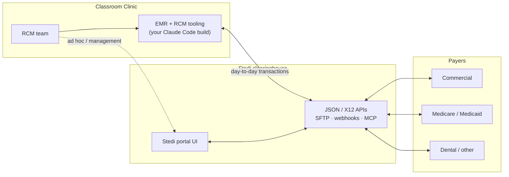
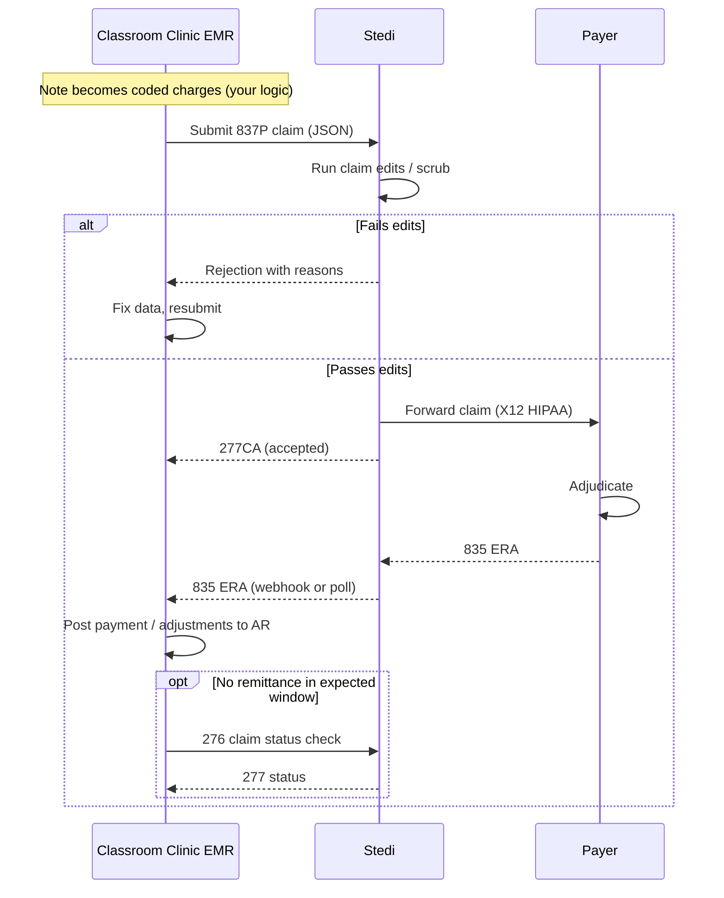

# Stedi for Revenue Cycle Management

Site: [stedi.com](https://stedi.com) 
### A top-down overview for the Classroom Clinic RCM group

_Purpose: This document explains what Stedi actually is, where it sits in the revenue cycle, which parts of our RCM operation it can cover, which parts it cannot, and how that maps onto our plan to extend the EMR while keeping some management work in the Stedi portal._

---

## 1. Executive Summary

Stedi is a modern, API-first **healthcare clearinghouse**. It is the pipe between your practice and your payers: you send it eligibility checks and claims, it routes them to the right payer, and it returns the payer's responses (acknowledgments, claim status, and remittance) in clean JSON. It is not a billing system, not a coding engine, and not a credentialing service. It replaces the EDI transaction layer of RCM (the 270/271, 837, 277, 276/277, 835 exchanges) and gives you a portal and APIs on top. Everything upstream of a claim (turning a clinical note into coded charges) and everything downstream of a remittance (posting to your ledger, patient statements, collections) stays your responsibility, in your EMR. See the [Stedi developer docs](https://www.stedi.com/docs/healthcare) and [About Stedi](https://www.stedi.com/docs/providers/providers-about-stedi).

---

## 2. Where Stedi sits in our world

We are effectively building the "vendor software" in Stedi's model, since your EMR will talk to Stedi's API on the backend and your RCM team will work primarily inside your own interface. Stedi describes this exact pattern (an EHR building eligibility and claims directly into its own UI) in its [integrated accounts overview](https://www.stedi.com/docs/healthcare/integrated-account-overview).

Stedi is HIPAA, SOC 2 Type II, and HITRUST certified and will sign a BAA, which matters for this architecture. Those attestations are on the [Stedi Trust Center](https://trust.stedi.com/) and referenced from the [pricing page](https://www.stedi.com/pricing).

---

## 3. The enrollment trap: three different things, only one of which Stedi does

This is the single most important thing to get right, and it directly corrects a common assumption (including the one in your brief that credentialing "happens in their portal"). There are three distinct processes, and Stedi only handles the last one. This is laid out in Stedi's [credentialing and enrollment](https://www.stedi.com/docs/healthcare/credentialing-and-enrollment) page.

|Process|What it is|Typical timeline|Who does it|
|---|---|---|---|
|**Credentialing**|Validating a provider's qualifications (licensure, education, board certs, malpractice history) so they can join payer networks|90 to 180 days|**Not Stedi.** Direct with each payer, or a service like [Assured](https://www.withassured.com/), [Medallion](https://medallion.co/), or [Verifiable](https://verifiable.com/)|
|**Payer enrollment**|Registering a credentialed provider with a specific payer's plans, contracts, and reimbursement rates|60 to 120 days|**Not Stedi.** Direct with each payer (often bundled with credentialing)|
|**Transaction enrollment**|Registering a provider to exchange specific EDI transactions (claims, ERAs, eligibility) with a payer _through Stedi_|2 to 6 weeks|**Stedi**, via the [Enrollments API](https://www.stedi.com/docs/healthcare/api-reference/post-enrollment-create-enrollment) or the portal|

Key operational facts about transaction enrollment:

- It is **always required for 835 ERAs**, because a payer can only route ERAs to one clearinghouse at a time. Enrolling ERAs in Stedi overrides your prior clearinghouse's routing.
- It is **only sometimes required** for claims and eligibility, depending on the payer. Check the [Payer Network](https://www.stedi.com/healthcare/network) per payer per transaction type.
- It is **clearinghouse-specific**: if you migrate from another clearinghouse, you re-enroll through Stedi even for payers you were already live with elsewhere.

**Takeaway for your portal-vs-EMR split:** credentialing and payer enrollment are not a Stedi decision at all, they need a separate track (a credentialing vendor or in-house team). Transaction enrollment is genuinely a good candidate to keep in the Stedi portal, at least initially, because it is low-frequency, form-and-document heavy, and Stedi manages the back-and-forth with the payer for you. More on this in Section 8.

---

## 4. Stedi's capability catalog

Here is the full menu, grouped. Everything below is something Stedi actually does today.
### Eligibility and benefits

- **Real-time eligibility checks (270/271)** verify a patient's coverage with a known payer and return full benefits (copays, deductibles, out-of-pocket max). [Overview](https://www.stedi.com/docs/healthcare/eligibility-workflows-overview).
- **Batch eligibility** refreshes many patients at once. [Batch checks](https://www.stedi.com/docs/healthcare/batch-refresh-eligibility-checks).
- **Insurance discovery** finds active coverage from demographics alone when you do not know the payer or the patient cannot provide a card. It runs 13 to 16 eligibility checks under the hood, can take up to 120 seconds, and is meant as a backup, not your primary verification method. [Insurance discovery](https://www.stedi.com/docs/healthcare/insurance-discovery).
- **MBI lookup** finds a Medicare patient's Beneficiary Identifier from demographics. [MBI lookup](https://www.stedi.com/docs/healthcare/mbi-lookup).
- **Coordination of benefits (COB)** determines which of multiple plans pays first. [COB](https://www.stedi.com/docs/healthcare/coordination-of-benefits).

### Claims processing

- **Claim submission** in JSON or X12 for [professional (837P)](https://www.stedi.com/docs/healthcare/submit-professional-claims), [institutional (837I)](https://www.stedi.com/docs/healthcare/submit-institutional-claims), and [dental (837D)](https://www.stedi.com/docs/healthcare/submit-dental-claims), plus [workers' comp and auto](https://www.stedi.com/docs/healthcare/submit-workers-comp-auto-liability-claims). You send JSON, Stedi translates to X12 HIPAA. [Submission overview](https://www.stedi.com/docs/healthcare/intro-to-claim-submission).
- **Claim edits and repairs**: before forwarding, Stedi scrubs claims against a growing library of edits and returns rejections in real time so you can fix and resubmit. [Edits and repairs](https://www.stedi.com/docs/healthcare/claim-edits-and-repairs).
- **277CA acknowledgments** tell you whether a claim was accepted or rejected at each hop. [Acknowledgments overview](https://www.stedi.com/docs/healthcare/claim-responses-overview).
- **Real-time claim status (276/277)** checks where an accepted claim is in adjudication. [Check claim status](https://www.stedi.com/docs/healthcare/check-claim-status).
- **835 Electronic Remittance Advice** returns payment and adjustment/denial detail once the payer adjudicates. [ERAs](https://www.stedi.com/docs/healthcare/receive-claim-responses).
- **Resubmit or cancel** rejected or incorrect claims. [Resubmit / cancel](https://www.stedi.com/docs/healthcare/resubmit-cancel-claims).
- **Claim attachments (275)** for medical records, treatment plans, etc. [Attachments](https://www.stedi.com/docs/healthcare/submit-claim-attachments).
- **Paper claims**: for payers without electronic support, Stedi prints and mails CMS-1500 / UB-04. [Paper claims](https://www.stedi.com/docs/healthcare/submit-paper-claims).

### Platform and tooling

- **Payer Network** directory, searchable and programmatic, with per-payer enrollment requirements. [Payer Network](https://www.stedi.com/healthcare/network).
- **Webhooks / event destinations** to get pushed events for new 277CAs and 835s instead of polling. [Webhooks](https://www.stedi.com/docs/healthcare/configure-webhooks).
- **MCP server and Stedi Agent** for AI-driven workflows and troubleshooting, and it explicitly works with Claude Code. [MCP server](https://www.stedi.com/docs/healthcare/mcp-server), [Build with AI](https://www.stedi.com/docs/healthcare/build-with-ai).
- **Portal views and PDFs**: claims view, eligibility views, and generated CMS-1500 / ERA / eligibility PDFs. [Claims view](https://www.stedi.com/docs/healthcare/claims-view).

---

## 5. The revenue cycle, stage by stage, with Stedi's coverage

This is the centerpiece. The standard RCM cycle has roughly 14 stages. Below, each is colored by how much Stedi covers it.

| #   | RCM stage                              | Stedi Handles                                      | CC Staff / EMR Handles                                                                                                          |
| --- | -------------------------------------- | -------------------------------------------------- | ------------------------------------------------------------------------------------------------------------------------------- |
| 0   | Credentialing & payer enrollment       | Nothing                                            | RCM staff handles                                                                                                               |
| 1   | Scheduling & pre-registration          | Nothing                                            | EMR scheduling                                                                                                                  |
| 2   | Patient intake / registration          | Nothing directly                                   | EMR intake forms.  Collect patient insurance information.                                                                       |
| 3   | Eligibility & benefits verification    | 270/271, batch, insurance discovery, MBI, COB      | EMR UI and background processes to trigger and display results.  We will run check in the background for upcoming appointments. |
| 4   | Charge capture (note to charges)       | Nothing                                            | EMR: Providers collect in notes and turn into claims when submitted to billing.                                                 |
| 5   | Medical coding (CPT / ICD / modifiers) | Nothing (edits catch some errors later)            | CC EMR does this based upon the note details with diagnosis and CPT codes added.                                                |
| 6   | Claim generation & scrubbing           | Claim edits, real-time rejection feedback          | EMR builds the 837 payload from your data                                                                                       |
| 7   | Claim submission to payer              | 837P/I/D submission and routing                    | EMR to call the API                                                                                                             |
| 8   | Clearinghouse acknowledgment           | 277CA accept/reject at each stage                  | EMR to ingest and display                                                                                                       |
| 9   | Payer adjudication                     | (Stedi relays only)                                | Nothing you can build                                                                                                           |
| 10  | Remittance (835 ERA)                   | 835 ERA in JSON via webhook/poll                   | EMR to interpret it                                                                                                             |
| 11  | Payment posting to AR                  | The 835 data                                       | EMR logic to post payments/adjustments to your ledger                                                                           |
| 12  | Denial & appeal management             | Denial reason codes, claim status, resubmit/cancel | EMR worklists, appeal tracking, root-cause analytics                                                                            |
| 13  | Patient statements & collections       | Nothing                                            | Patient billing / statements / payments solution                                                                                |
| 14  | AR follow-up & reporting               | Operational claims/eligibility views               | EMR dashboards, KPI/AR analytics                                                                                                |

---

## 6. What a claim actually does, end to end

This is the technical loop your EMR will automate. It is the same loop regardless of the submission path used.

Reference implementation steps are documented in the [claims processing overview](https://www.stedi.com/docs/healthcare/claims-processing-workflows-overview#example-api-implementation).

---

## 7. Your architecture: EMR +  Stedi

Your concept is sound and aligns with how Stedi expects modern builders to work. A few grounding facts for the build:

- **Claims and eligibility are JSON in, JSON out.** Stedi translates JSON to X12 HIPAA and back, so your team never has to hand-write X12. [Submission overview](https://www.stedi.com/docs/healthcare/intro-to-claim-submission).
- **Build against test mode first.** Free sandbox accounts and test API keys let you develop with mock eligibility responses and test claims (submit to test payer ID `STEDI` to get test ERAs in minutes) without touching PHI or real payers. This is ideal for a Claude Code loop. [Build with AI](https://www.stedi.com/docs/healthcare/build-with-ai), [Test claims workflow](https://www.stedi.com/docs/healthcare/test-claims-workflow).
- **Use events, not just polling.** Configure [webhooks / event destinations](https://www.stedi.com/docs/healthcare/configure-webhooks) so your EMR is notified when new 277CAs and 835s land, rather than polling on a timer.
- **Consider the MCP server for AI-assisted RCM features.** Stedi's [MCP server](https://www.stedi.com/docs/healthcare/mcp-server) is aimed at exactly your use case (RCM workflow agents that validate coverage), and it works with Claude Code. Useful if you want in-product AI helpers for your RCM team, distinct from using Claude Code to build the integration.
- **BAA before production PHI.** Sandbox/test work needs no PHI, but sign the [BAA](https://legal.stedi.com/legal/baa-4a521009) before any real patient data flows.

---

## 8. Portal vs EMR: a concrete recommendation

Your instinct (keep management-type work in the portal, put daily work in the EMR) is right. Here is the refined split, with the credentialing correction folded in.

|Build in our EMR — daily RCM work|Keep in Stedi portal — low-frequency / management|Outside Stedi — separate track|
|---|---|---|
|Claim submission from notes|Transaction enrollment & tasks|Credentialing|
|Claim tracking & status dashboard|Payer Network lookup|Payer enrollment|
|ERA-driven payment posting|Raw transaction & rejection troubleshooting|Patient statements & collections|
|Denial & appeal worklists|Ad hoc claim status / eligibility||
|Eligibility at intake / batch|Stedi Agent assistance||
|RCM KPI & AR reporting|||

### Rationale, item by item

**Keep in the Stedi portal (at least at first):**

- **Transaction enrollment.** Form-heavy, document-heavy, low-volume, and Stedi drives the payer back-and-forth. The portal already handles enrollment tasks and PDF documents well. You can move this into the EMR later via the free [Enrollments API](https://www.stedi.com/docs/healthcare/api-reference/post-enrollment-create-enrollment) if volume justifies it, but there is no rush.
- **Payer Network lookup.** Great as a reference tool; no reason to rebuild it.
- **Troubleshooting and raw transaction inspection.** When a claim behaves strangely, the portal shows the raw X12 and full response detail that you probably will not surface in your own UI.
- **Ad hoc checks and Stedi Agent.** A convenient fallback for one-off eligibility or claim-status lookups and AI-assisted error recovery.

**Build in the EMR (the daily grind for your RCM team):**

- **Claim submission from notes.** Generate and submit claims straight from encounter notes.
- **Claim tracking & status.** A dashboard where RCM staff watch claims move through each stage.
- **ERA-driven payment posting.** Post payments and adjustments automatically off incoming 835s.
- **Denial & appeal worklists.** Queue, assign, and track denials through to resolution.
- **Eligibility at intake.** Real-time and batch coverage checks surfaced right in the intake flow.
- **RCM KPI & AR reporting.** Days-in-AR, clean-claim rate, denial rate, and net collection analytics.

This is your core value: a single interface where RCM staff live all day, backed by Stedi transactions.

**Route outside Stedi entirely:**

- **Credentialing and payer enrollment** to a dedicated service or in-house team.
- **Patient statements and collections** to a patient-billing/payments solution, since Stedi is payer-facing only.

---

## 9. Open Questions

* If we submit to payer and there is a secondary payer involved, how will that be processed?

Seems to be something here about this: https://www.stedi.com/blog/how-to-balance-cob-claims  From this it looks like we can run checks to understand coordination of benefits and then we can use this to submit to the primary and after that go ahead and submit to the secondary and so on.  It would be nice to automate this somehow.

---
## 10. Design Considerations

When we go through and implement this with Stedi the following are areas we should consider for the design

#### Patient Records

Include patient insurance details as discovered with stedi through insurance eligibility checks and also Cordination of Benefits (COB).

Try to get all details from all payers and put that into the patient record so we know what is available.

#### Coordination of Benefits Submission Process

When a patient has more than one payer (for example, commercial as primary and Medicaid as secondary), **Stedi does not auto-forward the claim from the primary to the secondary payer**. We submit two separate claims through Stedi. The second one carries the primary payer's payment and adjustment data inside it, pulled from the primary's 835/ERA. Stedi is the transport for both claims and returns both ERAs; the orchestration and data mapping is ours to build.

See: https://www.stedi.com/blog/how-to-balance-cob-claims 

**The normal COB workflow (commercial primary → Medicaid secondary):**

- **Submit the primary claim** (837 to the commercial payer). Standard claim, `paymentResponsibilityLevelCode` = `P`.
- **Wait for the primary's 835 (ERA)** to come back through Stedi — what the commercial plan paid, what it adjusted or denied, and the reason codes (CARC/RARC).
- **Build the secondary claim** (837 to Medicaid) — the same claim, now enriched with the primary's results:
  - `subscriber.paymentResponsibilityLevelCode` → `S` (secondary; `T` for tertiary).
  - `claimInformation.otherSubscriberInformation[]` → one entry per prior payer with the primary's `payerPaidAmount`, adjudication date, and any claim-level adjustments.
  - `serviceLines[].lineAdjudicationInformation[]` → per-line detail from the primary's ERA: paid amount, adjustment codes/amounts, paid units, adjudication date.
- **Submit the secondary claim** to Medicaid through Stedi. Medicaid sees what commercial already paid and covers the balance per its rules.
- **Post the secondary ERA** and resolve any remaining balance.

**What we own in the build:** detect that a secondary exists (from the COB / eligibility check at intake), hold the secondary claim until the primary ERA lands, extract the primary's paid and adjustment data, and assemble the secondary 837 with the COB fields populated. The primary's stored 835 is the data source for all of it.

**One exception — automatic crossover:** some payer pairs forward the claim to the secondary automatically. **Medicare → Medicaid** (via the COBA program) commonly crosses over on its own, in which case submitting our own secondary claim creates a duplicate. **Commercial → Medicaid** (our example) usually does **not** cross over, so we submit the secondary ourselves. Whether crossover happens is payer/plan-specific, not a Stedi setting — confirm per payer and watch for duplicate-claim rejections as the sign it already happened.

---

## 11. Suggested phasing

1. **Prove the loop in sandbox.** Stand up a Stedi sandbox account, generate test keys, and use Claude Code with `llms-full.txt` + the OpenAPI specs to build eligibility check → claim submit → 277CA → 835 against test payers. No PHI, no BAA needed yet.
2. **Wire real-time eligibility into intake first.** It is the lowest-risk, highest-daily-value transaction and gives your team an immediate win.
3. **Sign the BAA, upgrade to production, and start transaction enrollment** (in the portal) for your top payers, prioritizing ERA enrollment since it is always required.
4. **Go live on professional claim submission** for one or two payers, then expand as enrollments complete.
5. **Build ERA ingestion and posting**, then layer denial worklists and reporting on top of the data you are now collecting.
6. **Revisit the portal-vs-EMR line** once volume is known: move transaction enrollment into the EMR via API only if the manual portal process becomes a bottleneck.

---

## 12. Stedi terminology

Stedi publishes an official [Glossary](https://www.stedi.com/docs/edi-platform/edi-essentials/glossary), but it lives in their **EDI Platform** docs and only covers raw X12 mechanics. There is **no healthcare-specific glossary** — clearinghouse concepts are defined inside each topic page of the [healthcare docs](https://www.stedi.com/docs/healthcare). The tables below collect them, grouped the way Stedi's data model is layered: payers, enrollments, the claims/eligibility workflow, the identifiers that tie it together, and the generic platform underneath.

Naming conventions worth knowing:

- **English noun first, X12 number as the tag.** A claim is an 837, a remittance is an 835, an eligibility check rides the 270/271 pair. Raw X12 endpoints exist alongside every JSON endpoint, but the product surface speaks English.
- **"Check" means synchronous.** Every real-time request/response product is a *check* (eligibility check, COB check, insurance discovery check). Claims are the opposite: asynchronous and event-driven.
- **Payer identity is triple-keyed.** Store the immutable *Stedi payer ID* in the database, display the *primary payer ID* (what's on the member card), and let *aliases* absorb the rest.
- **Enrollment is one request per provider per payer per transaction type.** Going live on professional claims, eligibility, and ERAs with one payer = three enrollment requests.

### Payer model

| Term | What it means in Stedi | Where discussed |
|---|---|---|
| **Payer** | The insurance organization on the receiving end of a transaction. Its payer record carries `transactionSupport` per transaction type (supported / enrollment required / not supported), coverage types (medical/dental/vision), and operating states | [Supported payers](https://www.stedi.com/docs/healthcare/supported-payers) |
| **Stedi payer ID** | Stedi's immutable internal ID for a payer — never changes even if the primary payer ID does. The one to persist in our database | [Payer IDs](https://www.stedi.com/docs/healthcare/supported-payers#payer-ids) |
| **Primary payer ID** | The most commonly used ID for a payer, usually what appears on member ID cards; the recommended default when submitting | [Primary payer ID](https://www.stedi.com/docs/healthcare/supported-payers#primary-payer-id-recommended) |
| **Payer ID alias** | Alternative IDs for the same payer — old IDs after changes, plan-specific IDs, other clearinghouses' IDs — all routed correctly | [Payer ID aliases](https://www.stedi.com/docs/healthcare/supported-payers#payer-id-aliases) |
| **Payer Network** | The searchable public directory of payers and their per-transaction requirements; also available programmatically as the Payers API | [Payer Network](https://www.stedi.com/healthcare/network), [Payers API](https://www.stedi.com/docs/healthcare/api-reference/get-payers) |

### Enrollment model

| Term | What it means in Stedi | Where discussed |
|---|---|---|
| **Transaction enrollment** | Registering one provider to exchange one transaction type with one payer *through Stedi*. Not credentialing, not payer enrollment — see Section 3. Statuses: `DRAFT` → `PROVISIONING` → `LIVE`, with `STEDI_ACTION_REQUIRED` / `PROVIDER_ACTION_REQUIRED` / `REJECTED` / `CANCELED` along the way | [Transaction enrollment](https://www.stedi.com/docs/healthcare/transaction-enrollment), [FAQ](https://www.stedi.com/docs/healthcare/transaction-enrollment-faq) |
| **Provider (enrollment record)** | The provider entity (name, NPI, tax ID, contact) you create in Stedi and attach enrollments to. Distinct from the providers inside a claim payload | [Enrollment requests](https://www.stedi.com/docs/healthcare/create-manage-transaction-enrollments) |
| **Task** | An action item Stedi attaches to an enrollment when the payer needs something from you; assigning one flips the enrollment to `PROVIDER_ACTION_REQUIRED` | [Tasks and documents](https://www.stedi.com/docs/healthcare/transaction-enrollment-tasks-documents) |
| **Document** | A file (signed form, voided check, etc.) uploaded against an enrollment | [Tasks and documents](https://www.stedi.com/docs/healthcare/transaction-enrollment-tasks-documents) |
| **One-click enrollment** | Payers where Stedi handles the entire process with no signatures or documents beyond the request itself | [One-click enrollment](https://www.stedi.com/docs/healthcare/transaction-enrollment#one-click-enrollment) |

### Claims and eligibility workflow

Product noun first, X12 number as the tag — mirroring Stedi's own convention.

| Term | X12 tag | What it means in Stedi | Where discussed |
|---|---|---|---|
| **Claim** | 837 | The central object: a request for payment with the patient, providers, diagnoses, and one or more service lines. Three flavors — professional (837P, CMS-1500), institutional (837I, UB-04), dental (837D) — submitted as JSON or raw X12 and tracked through edits → acknowledgment → status → remittance | [Intro to claim submission](https://www.stedi.com/docs/healthcare/intro-to-claim-submission) |
| **Service line** | 837 loop 2400 | The line item within a claim: one procedure (CPT/HCPCS), its modifiers, units, charge, and diagnosis pointers. The grain at which adjudication and remittance detail come back | [Correlate service lines](https://www.stedi.com/docs/healthcare/receive-claim-responses#service-line) |
| **Claim edits** | — | Stedi's pre-flight scrubbing; failures return synchronously so you fix and resubmit before the payer ever sees the claim | [Edits and repairs](https://www.stedi.com/docs/healthcare/claim-edits-and-repairs) |
| **Claim acknowledgment** | 277CA | The accept/reject verdict at each hop (Stedi's edits first, then intermediaries and the payer front-end). Means accepted/rejected *for processing* — not approved or denied | [Acknowledgments overview](https://www.stedi.com/docs/healthcare/claim-responses-overview) |
| **Claim status check** | 276/277 | Real-time "where is my claim in adjudication," for when an accepted claim has produced no remittance in the expected window | [Check claim status](https://www.stedi.com/docs/healthcare/check-claim-status) |
| **Electronic Remittance Advice (ERA)** | 835 | The payer's post-adjudication statement of what it paid, adjusted, or denied, per claim and per service line, delivered around fund deposit. Enrollment always required. Not the patient-facing EOB or provider-facing EOP — the ERA is the electronic file | [Get and correlate ERAs](https://www.stedi.com/docs/healthcare/receive-claim-responses) |
| **Adjustment & denial reason codes** | CARC / RARC | Claim Adjustment Reason Codes and Remittance Advice Remark Codes — the standardized codes inside ERAs explaining every adjustment or denial | [Claims code lists](https://www.stedi.com/docs/healthcare/claims-code-lists) |
| **Claim attachment** | 275 | Supporting documentation (medical records, treatment plans) submitted alongside or after a claim | [Claim attachments](https://www.stedi.com/docs/healthcare/submit-claim-attachments) |
| **Resubmit / cancel** | 837 frequency code | Correcting or voiding a previously submitted claim, using the claim frequency code and the payer's claim control number | [Resubmit or cancel claims](https://www.stedi.com/docs/healthcare/resubmit-cancel-claims) |
| **Paper claims** | — | For payers with no electronic connection, Stedi prints and mails CMS-1500 / UB-04 forms on your behalf | [Submit paper claims](https://www.stedi.com/docs/healthcare/submit-paper-claims) |
| **Crossover claim** | — | A claim adjudicated by one payer then auto-forwarded to another (e.g. Medicare + supplemental); signaled by claim status codes 19/20/21 on the ERA. See Section 10 | [Crossover claims](https://www.stedi.com/docs/healthcare/receive-claim-responses#crossover-claims) |
| **Eligibility check** | 270/271 | The real-time coverage and benefits query: 270 request, 271 response (copays, deductibles, OOP max) | [Eligibility overview](https://www.stedi.com/docs/healthcare/eligibility-workflows-overview) |
| **Batch eligibility** | 270/271 | Asynchronous eligibility checks in bulk, e.g. refreshing all of tomorrow's appointments overnight | [Batch eligibility checks](https://www.stedi.com/docs/healthcare/batch-refresh-eligibility-checks) |
| **Service Type Code (STC)** | 271 | The benefit-category taxonomy eligibility runs on (e.g. 30 = health benefit plan coverage): what you query by and how the response is organized | [STCs and procedure codes](https://www.stedi.com/docs/healthcare/eligibility-stc-procedure-codes) |
| **Insurance discovery check** | — | Finding active coverage from demographics alone when the payer is unknown. Slow (up to ~120 s); a backup, not primary verification | [Insurance discovery](https://www.stedi.com/docs/healthcare/insurance-discovery) |
| **Coordination of benefits check (COB)** | — | Determining which of a patient's multiple plans is primary/secondary | [COB checks](https://www.stedi.com/docs/healthcare/coordination-of-benefits), [Interpret COB response](https://www.stedi.com/docs/healthcare/cob-response) |
| **Medicare Beneficiary Identifier lookup (MBI)** | — | Retrieving a Medicare patient's MBI from demographics | [MBI lookup](https://www.stedi.com/docs/healthcare/mbi-lookup) |

### Identifiers and correlation

Mostly **our** IDs, echoed back by payers — the connective tissue between our EMR and Stedi's responses.

| Term | What it means in Stedi | Where discussed |
|---|---|---|
| **National Provider Identifier (NPI)** | The unique federal ID every provider bills under. Type 1 = individual practitioner, Type 2 = organization | [NPI](https://www.stedi.com/docs/healthcare/national-provider-identifier) |
| **Patient Control Number (PCN)** | Our claim-level ID (`claimInformation.patientControlNumber`), echoed back in the 277CA and the ERA — the primary join key. Match case-insensitively; some payers truncate values over 30 characters | [Correlate 835 ERA](https://www.stedi.com/docs/healthcare/receive-claim-responses#correlate-835-era) |
| **Line Item Control Number** | Our service-line-level ID. Naming trap: submitted as `providerControlNumber` on professional/dental claims but `lineItemControlNumber` on institutional — and always returned as `lineItemControlNumber` | [Correlate service lines](https://www.stedi.com/docs/healthcare/receive-claim-responses#service-line) |
| **Correlation ID** | Stedi's own tracking number assigned at submission (`claimReference.correlationId`); the fallback join key when no PCN was supplied | [Stedi's Correlation ID](https://www.stedi.com/docs/healthcare/receive-claim-responses#option-2-stedis-correlation-id) |
| **Check / EFT trace number** | The ERA's link to the actual money movement, and the dedupe key: same trace number = duplicate ERA | [Duplicate ERAs](https://www.stedi.com/docs/healthcare/receive-claim-responses#duplicate-eras) |

### Platform primitives

The generic EDI pipe under the healthcare products.

| Term | What it means in Stedi | Where discussed |
|---|---|---|
| **Transaction** | One logical X12 document (claim, acknowledgment, remittance…) in JSON-addressable form: `transactionId`, direction (INBOUND/OUTBOUND), and transaction set identifier. Everything we send or receive is one of these | [Poll transactions](https://www.stedi.com/docs/healthcare/api-reference/get-poll-transactions) |
| **File execution** | The processing record of the physical EDI file; its `fileExecutionId` is how you retrieve a transaction's raw X12 | [Retrieve File Execution Input](https://www.stedi.com/docs/healthcare/api-reference/get-execution-input) |
| **Webhook** | Push notification for processed transactions (new 277CAs, 835s) instead of polling. Retries up to 5× on failure, so dedupe on receipt | [Configure webhooks](https://www.stedi.com/docs/healthcare/configure-webhooks) |
| **Event destination** | The newer structured eventing: thin events (`enrollment.activated`, `enrollment.task.assigned`, …) that say a resource changed; you fetch the details via API | [Events and schema](https://www.stedi.com/docs/healthcare/event-destinations-event-types) |
| **Test mode** | Separate environment with test API keys: realistic simulation, no PHI, no BAA, free | [Test mode](https://www.stedi.com/docs/healthcare/test-mode) |
| **Test payer & mocks** | Mark test claims with `usageIndicator: T` (X12 `ISA15`); test payer ID `STEDI` returns test acknowledgments and ERAs; mock eligibility requests return canned scenarios | [Test claims workflow](https://www.stedi.com/docs/healthcare/test-claims-workflow), [Mock requests](https://www.stedi.com/docs/healthcare/api-reference/mock-requests-eligibility-checks) |
| **Claims view / eligibility views** | The portal's operational UIs: per-claim timelines with all associated responses; searchable eligibility history with a benefits table | [Claims view](https://www.stedi.com/docs/healthcare/claims-view), [Eligibility views](https://www.stedi.com/docs/healthcare/eligibility-views) |
| **Integrated account** | Stedi's model for a platform/vendor (us, effectively) that embeds Stedi behind its own product and manages provider accounts underneath it | [Integrated accounts](https://www.stedi.com/docs/healthcare/integrated-account-overview) |
| **Stedi Agent** | Portal AI that auto-resolves recoverable eligibility errors and answers payer questions | [Stedi Agent](https://www.stedi.com/docs/healthcare/stedi-agent) |
| **MCP server** | Exposes payer search, eligibility checks, and troubleshooting as tools for AI agents; works with Claude Code | [MCP server](https://www.stedi.com/docs/healthcare/mcp-server) |

### Underlying X12/EDI terms

These come from the EDI layer Stedi's JSON APIs abstract away — you'll meet them in the portal's raw X12 view and in error messages. All are defined in the official [EDI Glossary](https://www.stedi.com/docs/edi-platform/edi-essentials/glossary):

- **X12** — the standards body and the North American EDI format all HIPAA transactions use. **EDI** is the umbrella term for the exchange itself.
- **Transaction set** — one business document (an 837 claim, an 835 remittance). The numbers we use everywhere (270/271, 835, 837…) are transaction set IDs.
- **Interchange / functional group** — the envelope layers wrapping transaction sets in a file (`ISA`…`IEA`, `GS`…`GE`).
- **Segment / element / composite / loop** — the record → field → sub-field → repeating-group structure inside a transaction set, delimited by `~`, `*`, and `:`.
- **Specification (guide)** — the schema saying which segments/elements a transaction set must contain; payers publish companion guides that tighten the base HIPAA spec.
- **Trading partner** — any party you exchange EDI with; in our world, the payers.

---

## 13. Reference links

**Core Stedi docs:**
- [Stedi developer docs (home)](https://www.stedi.com/docs/healthcare)
- [Credentialing and enrollment](https://www.stedi.com/docs/healthcare/credentialing-and-enrollment)
- [Eligibility overview](https://www.stedi.com/docs/healthcare/eligibility-workflows-overview)
- [Insurance discovery](https://www.stedi.com/docs/healthcare/insurance-discovery)
- [Claims processing overview](https://www.stedi.com/docs/healthcare/claims-processing-workflows-overview)
- [Claim submission intro](https://www.stedi.com/docs/healthcare/intro-to-claim-submission)
- [Claim edits and repairs](https://www.stedi.com/docs/healthcare/claim-edits-and-repairs)
- [Acknowledgments and ERAs](https://www.stedi.com/docs/healthcare/claim-responses-overview)
- [Check claim status](https://www.stedi.com/docs/healthcare/check-claim-status)
- [Build with AI](https://www.stedi.com/docs/healthcare/build-with-ai)
- [MCP server](https://www.stedi.com/docs/healthcare/mcp-server)
- [Webhooks](https://www.stedi.com/docs/healthcare/configure-webhooks)
- [Integrated accounts](https://www.stedi.com/docs/healthcare/integrated-account-overview)
- [Payer Network](https://www.stedi.com/healthcare/network)
- [Pricing](https://www.stedi.com/pricing)

**LLM reference (for your Claude Code agents):**
- [Docs index for LLMs (llms.txt)](https://www.stedi.com/docs/llms.txt)
- [Full docs (llms-full.txt)](https://www.stedi.com/docs/llms-full.txt)
