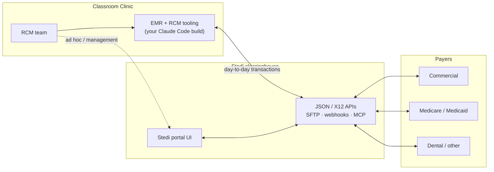
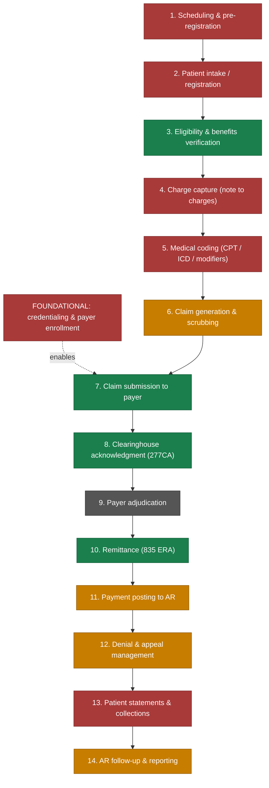
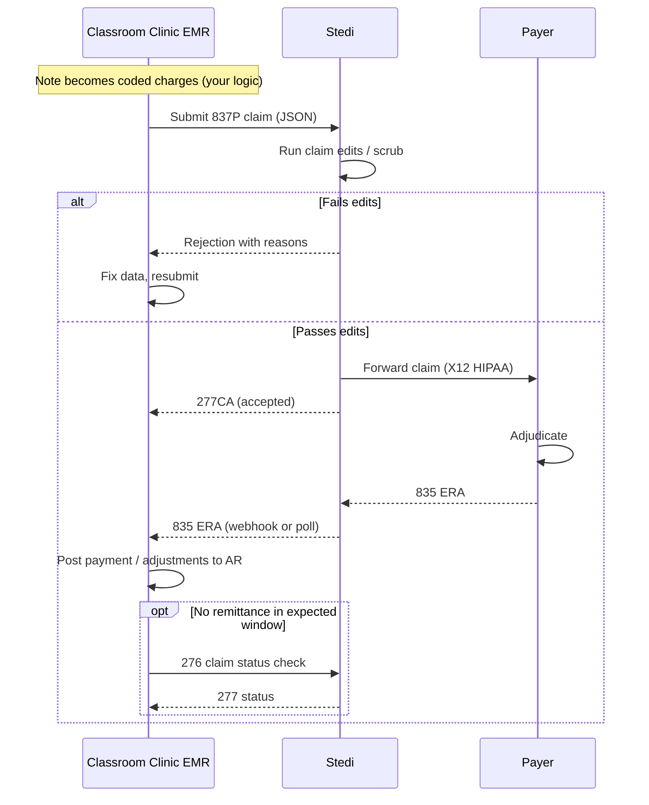
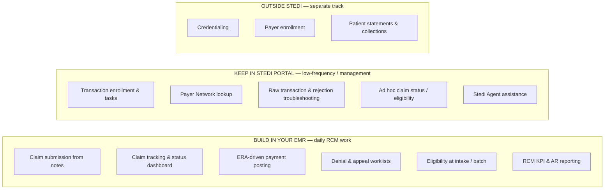

# Stedi for Revenue Cycle Management

### A top-down overview for the Classroom Clinic RCM group

_Purpose: give you the forest, not the trees. This document explains what Stedi actually is, where it sits in the revenue cycle, which parts of your RCM operation it can cover, which parts it cannot, and how that maps onto your plan to extend the EMR with Claude Code while keeping some management work in the Stedi portal._

---

## 1. The one-paragraph version

Stedi is a modern, API-first **healthcare clearinghouse**. It is the pipe between your practice and your payers: you send it eligibility checks and claims, it routes them to the right payer, and it returns the payer's responses (acknowledgments, claim status, and remittance) in clean JSON. It is not a billing system, not a coding engine, and not a credentialing service. It replaces the EDI transaction layer of RCM (the 270/271, 837, 277, 276/277, 835 exchanges) and gives you a portal and APIs on top. Everything upstream of a claim (turning a clinical note into coded charges) and everything downstream of a remittance (posting to your ledger, patient statements, collections) stays your responsibility, in your EMR. See the [Stedi developer docs](https://www.stedi.com/docs/healthcare) and [About Stedi](https://www.stedi.com/docs/providers/providers-about-stedi).

---

## 2. Where Stedi sits in your world

You are effectively building the "vendor software" in Stedi's model, since your EMR will talk to Stedi's API on the backend and your RCM team will work primarily inside your own interface. Stedi describes this exact pattern (an EHR building eligibility and claims directly into its own UI) in its [integrated accounts overview](https://www.stedi.com/docs/healthcare/integrated-account-overview).

Stedi is HIPAA, SOC 2 Type II, and HITRUST certified and will sign a BAA, which matters for this architecture. Those attestations are on the [Stedi Trust Center](https://trust.stedi.com/) and referenced from the [pricing page](https://www.stedi.com/pricing).

---

## 3. The enrollment trap: three different things, only one of which Stedi does

This is the single most important thing to get right, and it directly corrects a common assumption (including the one in your brief that credentialing "happens in their portal"). There are three distinct processes, and Stedi only handles the last one. This is laid out in Stedi's [credentialing and enrollment](https://www.stedi.com/docs/healthcare/credentialing-and-enrollment) page.

|Process|What it is|Typical timeline|Who does it|
|---|---|---|---|
|**Credentialing**|Validating a provider's qualifications (licensure, education, board certs, malpractice history) so they can join payer networks|90 to 180 days|**Not Stedi.** Direct with each payer, or a service like [Assured](https://www.withassured.com/), [Medallion](https://medallion.co/), or [Verifiable](https://verifiable.com/)|
|**Payer enrollment**|Registering a credentialed provider with a specific payer's plans, contracts, and reimbursement rates|60 to 120 days|**Not Stedi.** Direct with each payer (often bundled with credentialing)|
|**Transaction enrollment**|Registering a provider to exchange specific EDI transactions (claims, ERAs, eligibility) with a payer _through Stedi_|2 to 6 weeks|**Stedi**, via the [Enrollments API](https://www.stedi.com/docs/healthcare/api-reference/post-enrollment-create-enrollment) or the portal|

Key operational facts about transaction enrollment:

- It is **always required for 835 ERAs**, because a payer can only route ERAs to one clearinghouse at a time. Enrolling ERAs in Stedi overrides your prior clearinghouse's routing.
- It is **only sometimes required** for claims and eligibility, depending on the payer. Check the [Payer Network](https://www.stedi.com/healthcare/network) per payer per transaction type.
- It is **clearinghouse-specific**: if you migrate from another clearinghouse, you re-enroll through Stedi even for payers you were already live with elsewhere.

**Takeaway for your portal-vs-EMR split:** credentialing and payer enrollment are not a Stedi decision at all, they need a separate track (a credentialing vendor or in-house team). Transaction enrollment is genuinely a good candidate to keep in the Stedi portal, at least initially, because it is low-frequency, form-and-document heavy, and Stedi manages the back-and-forth with the payer for you. More on this in Section 8.

---

## 4. Stedi's capability catalog

Here is the full menu, grouped. Everything below is something Stedi actually does today.

```mermaid
flowchart TD
    S["Stedi capabilities"]
    S --> E["Eligibility &amp; Benefits"]
    S --> C["Claims processing"]
    S --> EN["Enrollment"]
    S --> PL["Platform &amp; tooling"]

    E --> E1["Real-time eligibility 270/271"]
    E --> E2["Batch eligibility"]
    E --> E3["Insurance discovery<br/>(find coverage from demographics)"]
    E --> E4["MBI lookup (Medicare ID)"]
    E --> E5["Coordination of benefits (primacy)"]

    C --> C1["Claim submission<br/>837P · 837I · 837D"]
    C --> C2["Claim edits &amp; scrubbing"]
    C --> C3["277CA acknowledgments"]
    C --> C4["Real-time claim status 276/277"]
    C --> C5["835 ERA retrieval"]
    C --> C6["Resubmit / cancel claims"]
    C --> C7["Claim attachments 275"]
    C --> C8["Paper claims (print &amp; mail)"]
    C --> C9["Workers' comp &amp; auto claims"]

    EN --> EN1["Transaction enrollment ONLY<br/>(not credentialing / payer enrollment)"]

    PL --> PL1["Payer Network directory"]
    PL --> PL2["Webhooks &amp; event destinations"]
    PL --> PL3["MCP server + Stedi Agent (AI)"]
    PL --> PL4["Portal UI, claims/eligibility views"]
    PL --> PL5["PDFs: CMS-1500, ERA, eligibility"]
```

### Eligibility and benefits

- **Real-time eligibility checks (270/271)** verify a patient's coverage with a known payer and return full benefits (copays, deductibles, out-of-pocket max). [Overview](https://www.stedi.com/docs/healthcare/eligibility-workflows-overview).
- **Batch eligibility** refreshes many patients at once. [Batch checks](https://www.stedi.com/docs/healthcare/batch-refresh-eligibility-checks).
- **Insurance discovery** finds active coverage from demographics alone when you do not know the payer or the patient cannot provide a card. It runs 13 to 16 eligibility checks under the hood, can take up to 120 seconds, and is meant as a backup, not your primary verification method. [Insurance discovery](https://www.stedi.com/docs/healthcare/insurance-discovery).
- **MBI lookup** finds a Medicare patient's Beneficiary Identifier from demographics. [MBI lookup](https://www.stedi.com/docs/healthcare/mbi-lookup).
- **Coordination of benefits (COB)** determines which of multiple plans pays first. [COB](https://www.stedi.com/docs/healthcare/coordination-of-benefits).

### Claims processing

- **Claim submission** in JSON or X12 for [professional (837P)](https://www.stedi.com/docs/healthcare/submit-professional-claims), [institutional (837I)](https://www.stedi.com/docs/healthcare/submit-institutional-claims), and [dental (837D)](https://www.stedi.com/docs/healthcare/submit-dental-claims), plus [workers' comp and auto](https://www.stedi.com/docs/healthcare/submit-workers-comp-auto-liability-claims). You send JSON, Stedi translates to X12 HIPAA. [Submission overview](https://www.stedi.com/docs/healthcare/intro-to-claim-submission).
- **Claim edits and repairs**: before forwarding, Stedi scrubs claims against a growing library of edits and returns rejections in real time so you can fix and resubmit. [Edits and repairs](https://www.stedi.com/docs/healthcare/claim-edits-and-repairs).
- **277CA acknowledgments** tell you whether a claim was accepted or rejected at each hop. [Acknowledgments overview](https://www.stedi.com/docs/healthcare/claim-responses-overview).
- **Real-time claim status (276/277)** checks where an accepted claim is in adjudication. [Check claim status](https://www.stedi.com/docs/healthcare/check-claim-status).
- **835 Electronic Remittance Advice** returns payment and adjustment/denial detail once the payer adjudicates. [ERAs](https://www.stedi.com/docs/healthcare/receive-claim-responses).
- **Resubmit or cancel** rejected or incorrect claims. [Resubmit / cancel](https://www.stedi.com/docs/healthcare/resubmit-cancel-claims).
- **Claim attachments (275)** for medical records, treatment plans, etc. [Attachments](https://www.stedi.com/docs/healthcare/submit-claim-attachments).
- **Paper claims**: for payers without electronic support, Stedi prints and mails CMS-1500 / UB-04. [Paper claims](https://www.stedi.com/docs/healthcare/submit-paper-claims).

### Platform and tooling

- **Payer Network** directory, searchable and programmatic, with per-payer enrollment requirements. [Payer Network](https://www.stedi.com/healthcare/network).
- **Webhooks / event destinations** to get pushed events for new 277CAs and 835s instead of polling. [Webhooks](https://www.stedi.com/docs/healthcare/configure-webhooks).
- **MCP server and Stedi Agent** for AI-driven workflows and troubleshooting, and it explicitly works with Claude Code. [MCP server](https://www.stedi.com/docs/healthcare/mcp-server), [Build with AI](https://www.stedi.com/docs/healthcare/build-with-ai).
- **Portal views and PDFs**: claims view, eligibility views, and generated CMS-1500 / ERA / eligibility PDFs. [Claims view](https://www.stedi.com/docs/healthcare/claims-view).

---

## 5. The revenue cycle, stage by stage, with Stedi's coverage

This is the centerpiece. The standard RCM cycle has roughly 14 stages. Below, each is colored by how much Stedi covers it.

**Legend:** 🟩 **Green = Stedi covers it**  |  🟧 **Orange = Stedi covers the data layer, you build the workflow**  |  🟥 **Red = not Stedi, needs your EMR or another vendor**  |  ⬛ **Gray = payer side**

### The same thing as a decision table

|#|RCM stage|Stedi coverage|What Stedi gives you|What you still need|
|---|---|---|---|---|
|0|Credentialing & payer enrollment|❌ None|Nothing (out of scope)|Credentialing vendor or in-house team|
|1|Scheduling & pre-registration|❌ None|Nothing|EMR scheduling|
|2|Patient intake / registration|❌ None|Nothing directly, but stages 3 feed it|EMR intake forms|
|3|Eligibility & benefits verification|✅ Full|270/271, batch, insurance discovery, MBI, COB|EMR UI to trigger and display results|
|4|Charge capture (note to charges)|❌ None|Nothing|EMR logic to turn encounters/notes into billable charges|
|5|Medical coding (CPT / ICD / modifiers)|❌ None|Nothing (edits catch some errors later)|Coder or EMR coding logic / coding engine|
|6|Claim generation & scrubbing|🟧 Partial|Claim edits, real-time rejection feedback|EMR builds the 837 payload from your data|
|7|Claim submission to payer|✅ Full|837P/I/D submission and routing|EMR to call the API|
|8|Clearinghouse acknowledgment|✅ Full|277CA accept/reject at each stage|EMR to ingest and display|
|9|Payer adjudication|⬛ Payer|(Stedi relays only)|Nothing you can build|
|10|Remittance (835 ERA)|✅ Full (retrieval)|835 ERA in JSON via webhook/poll|EMR to interpret it|
|11|Payment posting to AR|🟧 Partial|The 835 data|EMR logic to post payments/adjustments to your ledger|
|12|Denial & appeal management|🟧 Partial|Denial reason codes, claim status, resubmit/cancel|EMR worklists, appeal tracking, root-cause analytics|
|13|Patient statements & collections|❌ None|Nothing|Patient billing / statements / payments solution|
|14|AR follow-up & reporting|🟧 Partial|Operational claims/eligibility views|EMR dashboards, KPI/AR analytics|

**How to read this:** the green stages are where Stedi flat-out replaces what a legacy clearinghouse did. The orange stages are the interesting ones for your build: Stedi hands you clean, structured data (rejections, denials, remittance), but the _workflow and business logic_ around that data is exactly what you will build in the EMR with Claude Code. The red stages are genuinely out of scope and need either EMR features you build or separate vendors.

---

## 6. What a claim actually does, end to end

This is the technical loop your EMR will automate. It is the same loop whether you use the JSON API, X12, or SFTP; JSON is the recommended path for a modern build.

Reference implementation steps are documented in the [claims processing overview](https://www.stedi.com/docs/healthcare/claims-processing-workflows-overview#example-api-implementation).

---

## 7. Your architecture: EMR + Claude Code + Stedi

Your concept is sound and aligns with how Stedi expects modern builders to work. A few grounding facts for the build:

- **Claims and eligibility are JSON in, JSON out.** Stedi translates JSON to X12 HIPAA and back, so your team never has to hand-write X12. [Submission overview](https://www.stedi.com/docs/healthcare/intro-to-claim-submission).
- **Build against test mode first.** Free sandbox accounts and test API keys let you develop with mock eligibility responses and test claims (submit to test payer ID `STEDI` to get test ERAs in minutes) without touching PHI or real payers. This is ideal for a Claude Code loop. [Build with AI](https://www.stedi.com/docs/healthcare/build-with-ai), [Test claims workflow](https://www.stedi.com/docs/healthcare/test-claims-workflow).
- **Feed Claude Code the AI-friendly docs.** Stedi publishes [`llms-full.txt`](https://www.stedi.com/docs/llms-full.txt) (complete docs in one file), an [`llms.txt` index](https://www.stedi.com/docs/llms.txt), and [OpenAPI specs on GitHub](https://github.com/Stedi/openApi). Point your agent config (for example a Claude skill or `CLAUDE.md`) at these so the context persists across sessions.
- **Use events, not just polling.** Configure [webhooks / event destinations](https://www.stedi.com/docs/healthcare/configure-webhooks) so your EMR is notified when new 277CAs and 835s land, rather than polling on a timer.
- **Consider the MCP server for AI-assisted RCM features.** Stedi's [MCP server](https://www.stedi.com/docs/healthcare/mcp-server) is aimed at exactly your use case (RCM workflow agents that validate coverage), and it works with Claude Code. Useful if you want in-product AI helpers for your RCM team, distinct from using Claude Code to build the integration.
- **BAA before production PHI.** Sandbox/test work needs no PHI, but sign the [BAA](https://legal.stedi.com/legal/baa-4a521009) before any real patient data flows.

---

## 8. Portal vs EMR: a concrete recommendation

Your instinct (keep management-type work in the portal, put daily work in the EMR) is right. Here is the refined split, with the credentialing correction folded in.

### Rationale, item by item

**Keep in the Stedi portal (at least at first):**

- **Transaction enrollment.** Form-heavy, document-heavy, low-volume, and Stedi drives the payer back-and-forth. The portal already handles enrollment tasks and PDF documents well. You can move this into the EMR later via the free [Enrollments API](https://www.stedi.com/docs/healthcare/api-reference/post-enrollment-create-enrollment) if volume justifies it, but there is no rush.
- **Payer Network lookup.** Great as a reference tool; no reason to rebuild it.
- **Troubleshooting and raw transaction inspection.** When a claim behaves strangely, the portal shows the raw X12 and full response detail that you probably will not surface in your own UI.
- **Ad hoc checks and Stedi Agent.** A convenient fallback for one-off eligibility or claim-status lookups and AI-assisted error recovery.

**Build in the EMR (the daily grind for your RCM team):**

- Claim submission straight from encounter notes, claim tracking, ERA-driven posting, denial worklists, eligibility at intake, and reporting. This is your core value: a single interface where RCM staff live all day, backed by Stedi transactions.

**Route outside Stedi entirely:**

- **Credentialing and payer enrollment** to a dedicated service or in-house team.
- **Patient statements and collections** to a patient-billing/payments solution, since Stedi is payer-facing only.

**One nuance on reporting:** Stedi's [claims view](https://www.stedi.com/docs/healthcare/claims-view) and eligibility views are operational (per-claim timelines, filters, statuses), not analytical RCM reporting (days-in-AR, denial rate by payer, net collection rate). Treat the portal views as a safety net and build your real reporting in the EMR off the transaction data you ingest.

---

## 9. Pricing at a glance

Stedi is pay-as-you-go with **no monthly minimum, no per-provider fees, and no per-payer fees**. Per-unit prices drop as monthly volume grows. Full detail and an estimator are on the [pricing page](https://www.stedi.com/pricing). Representative rates (highest to lowest tier):

|Transaction|Price range per unit|Notes|
|---|---|---|
|Eligibility check (270/271)|$0.30 → $0.08|Real-time and batch|
|Claim submission (837P/I/D)|$0.30 → $0.10|Per claim submitted|
|835 ERA|$0.20 → $0.08|Per adjudicated claim|
|Real-time claim status (276/277)|$0.30 → $0.08|On demand|
|Insurance discovery|$1.50 → $0.65|Runs many eligibility checks internally|
|Coordination of benefits|$1.00 → $0.40||
|MBI lookup|$1.00 → $0.40||
|Claim attachment (275)|$0.75 flat||
|Paper claim|$1.00 first page + $0.20/page|Stedi prints and mails|
|PDFs (CMS-1500, ERA, eligibility)|$0.05 each||
|277CA acknowledgments|Free||
|Transaction enrollment API|Free||
|Stedi Agent + MCP server|Included||

Failed requests that return 4xx/5xx (for example, an unsupported payer) are **not billed**. A small number of payers charge their own fees, passed through at cost. See [billing](https://www.stedi.com/docs/healthcare/billing).

---

## 10. The gap list: what you still need beyond Stedi

Keep this visible so nobody assumes Stedi covers it:

1. **Credentialing** and **payer enrollment** (separate vendor or team).
2. **Charge capture and coding**: turning a clinical note into correct CPT/ICD/modifiers and billable charges. This is the heart of your EMR build and the biggest source of denials, so it deserves the most attention.
3. **837 payload construction**: Stedi validates and transmits, but your EMR has to assemble a complete, correct claim from patient, provider, encounter, and coding data.
4. **Payment posting logic**: mapping 835 adjustment/denial codes onto your AR and contractual-adjustment rules.
5. **Denial management workflow**: worklists, assignment, appeal letters, and root-cause reporting.
6. **Patient responsibility billing**: statements, patient payments, and collections.
7. **RCM analytics**: days-in-AR, clean-claim rate, denial rate by payer/reason, net collection rate.
8. **Prior authorization**: Stedi surfaces auth/referral info inside eligibility responses, but electronic prior-auth submission (278) is not part of the catalog reviewed here; treat auth intake as a separate workflow and confirm current support with Stedi if you need it.

---

## 11. Suggested phasing

1. **Prove the loop in sandbox.** Stand up a Stedi sandbox account, generate test keys, and use Claude Code with `llms-full.txt` + the OpenAPI specs to build eligibility check → claim submit → 277CA → 835 against test payers. No PHI, no BAA needed yet.
2. **Wire real-time eligibility into intake first.** It is the lowest-risk, highest-daily-value transaction and gives your team an immediate win.
3. **Sign the BAA, upgrade to production, and start transaction enrollment** (in the portal) for your top payers, prioritizing ERA enrollment since it is always required.
4. **Go live on professional claim submission** for one or two payers, then expand as enrollments complete.
5. **Build ERA ingestion and posting**, then layer denial worklists and reporting on top of the data you are now collecting.
6. **Revisit the portal-vs-EMR line** once volume is known: move transaction enrollment into the EMR via API only if the manual portal process becomes a bottleneck.

---

## 12. Reference links

- [Stedi developer docs (home)](https://www.stedi.com/docs/healthcare)
- [Provider docs (home)](https://www.stedi.com/docs/providers) · [About Stedi](https://www.stedi.com/docs/providers/providers-about-stedi)
- [Docs index for LLMs (llms.txt)](https://www.stedi.com/docs/llms.txt) 
-  [Full docs (llms-full.txt)](https://www.stedi.com/docs/llms-full.txt) 
-  [OpenAPI specs](https://github.com/Stedi/openApi)
- [Credentialing and enrollment](https://www.stedi.com/docs/healthcare/credentialing-and-enrollment) 
-  [Transaction enrollment overview](https://www.stedi.com/docs/healthcare/transaction-enrollment)
- [Eligibility overview](https://www.stedi.com/docs/healthcare/eligibility-workflows-overview) 
-  [Insurance discovery](https://www.stedi.com/docs/healthcare/insurance-discovery) 
-  [Coordination of benefits](https://www.stedi.com/docs/healthcare/coordination-of-benefits)
- [Claims processing overview](https://www.stedi.com/docs/healthcare/claims-processing-workflows-overview) · [Claim submission intro](https://www.stedi.com/docs/healthcare/intro-to-claim-submission) · [Edits and repairs](https://www.stedi.com/docs/healthcare/claim-edits-and-repairs)
- [Acknowledgments and ERAs](https://www.stedi.com/docs/healthcare/claim-responses-overview) · [Check claim status](https://www.stedi.com/docs/healthcare/check-claim-status) · [Claims view](https://www.stedi.com/docs/healthcare/claims-view)
- [Build with AI](https://www.stedi.com/docs/healthcare/build-with-ai) 
-  [MCP server](https://www.stedi.com/docs/healthcare/mcp-server) 
-  [Webhooks](https://www.stedi.com/docs/healthcare/configure-webhooks)
- [Integrated accounts](https://www.stedi.com/docs/healthcare/integrated-account-overview) 
-  [Payer Network](https://www.stedi.com/healthcare/network) 
-  [Pricing](https://www.stedi.com/pricing) 
-  [Trust Center](https://trust.stedi.com/)

_Prepared from Stedi's public documentation. Pricing and payer-specific requirements change, so confirm current figures on the linked pages before committing._