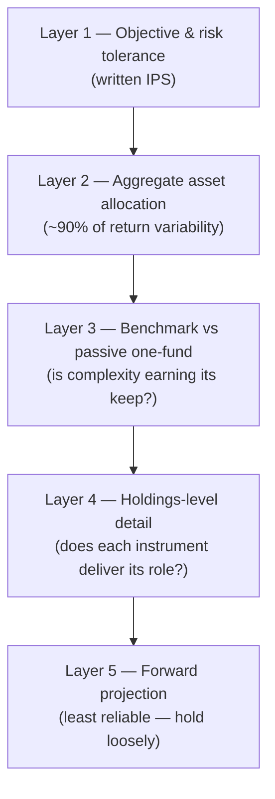

The working document for thinking about our portfolio: what we're trying to accomplish, what we're considering, how to analyze it in a way that's actually trustworthy, and what best practice says about managing it. Grew out of [[old-portfolio-analysis-report]] (May 2026), which reached useful directional conclusions but documented serious flaws in its own methodology — this note is about doing better.

## What we're trying to do

**Determine a good portfolio for building wealth over the next 5-10 years.** Concretely:

- The main vehicle is the Traditional IRA (currently the legacy six-holding allocation, with the "Consensus core" shift recommended but the decision not finalized). A separate nest-egg account handles 6-18 month money — it's a liquidity bucket, not part of the risk portfolio, and stays out of the allocation math.
- **The accounts are held at Wealthfront.** That makes Wealthfront's default risk-score portfolio the *practical* "do nothing" alternative — the one-fund benchmark in this document should be read as "Wealthfront's default tier at our risk score" first, VT/target-date second. Any custom allocation has to justify itself against simply turning their automation back on.
- "Good" means: a portfolio we can hold through a bad year without selling, that doesn't quietly bet everything on one macro outcome, and that we'd expect to beat or roughly match a passive one-fund alternative after accounting for the effort.
- The 5-10 year horizon matters. It's long enough that equity should dominate, but short enough that a bad decade is a real possibility — rolling 10-year US equity returns were negative for starts in 1999-2000. That argues for real bond/TIPS ballast and against optimizing purely for the median outcome.
- We have views we want expressed (dollar weakness, inflation persistence, some single-name conviction). The open design question is not *whether* those views are allowed, but how much of the portfolio they're allowed to steer — see the core-satellite approach below.

## Open questions to consider

- **What happens at the end of the 5-10 years?** If the money rolls into retirement holdings, the true horizon is longer and more equity is justified; if it gets spent or redeployed, the last 2-3 years need a glide-down plan. Risk tolerance (the "would I sell at -30%?" number) is still unwritten.
- **Would a one-fund passive benchmark (VT or a target-date fund) beat our custom allocation?** The old framework never included this comparison ([[old-portfolio-analysis-report#8.9 No Passive Benchmark]]). Every future analysis should answer it first.
- **How much macro view should the portfolio express at all?** The 2025 portfolio was a macro bet (inflation, weak dollar, weak consumer) implemented through instruments that didn't deliver it. Is the lesson "express the view better" or "stop making macro bets"?
- **How do we separate a bad thesis from bad instruments?** XLP and VNQ failed as defensive/inflation hedges even though the macro view was partly right. What's the test for whether an instrument actually delivers its intended role?
- **What decision rules prevent constant repositioning?** The old report warned against re-optimizing on every model run. What rebalancing/review policy do we pre-commit to?
- **How much complexity is the analysis itself worth?** The scenario simulator produced two-decimal precision on top of guessed inputs. When is a simpler check (backtest, correlation matrix) more honest than a richer model?
- **Are the "consensus" scenario probabilities worth anchoring on?** Institutional recession forecasts run bearish for reputational reasons, and near-term probabilities were applied to 10-year horizons. What base rates should replace them?
- **What Wealthfront risk score is our true equivalent, and does our custom allocation actually beat that tier?** If it doesn't, the do-nothing alternative (turning their automation back on) wins by default.
- **What belongs in the IRA vs elsewhere?** The nest egg allocation was flagged as a poor use of tax-advantaged space. Asset-location deserves its own pass.

## Where we are now

The May 2026 analysis concluded (robustly, despite the model flaws):

- The legacy portfolio (XLP 25 / VEA 23 / VNQ 20 / VWO 15 / GLDM 15 / VWOB 2) was defensively miscalibrated — the dollar hedge and gold worked, the "defensive" equity and REITs did not.
- Recommended shift: "Consensus core" — VEA 22 / GLDM 18 / SCHP 18 / SCHD 18 / VWO 10 / BND 8 / GOOGL 6.
- The *direction* (add TIPS, add real bond ballast, drop sector bets, add non-tech US equity) is trustworthy; the *rankings* between candidate portfolios are within model noise.

Full detail, scenario tables, and the simulator spec live in [[old-portfolio-analysis-report]].

## How to think about portfolio analysis

The order of operations matters more than any individual technique. Analysis effort should flow top-down, because that's how much each layer affects the outcome:

- **Layer 1 gets written down as an IPS — an Investment Policy Statement.** A one-page document recording goals, horizon, risk tolerance, target allocation with acceptable bands, the chosen benchmark, and the rules under which the strategy may change (life events, not market events — with a cooling-off period). It's a commitment device: every later review checks *compliance with the policy* instead of re-opening the whole question, which is what keeps analysis from turning into tinkering. ([Bogleheads IPS guide](https://www.bogleheads.org/wiki/Investment_policy_statement))
- **Layer 1-2 is where the decision lives.** The stock/bond/alternatives split explains ~90% of how the portfolio behaves over time. Two candidate portfolios with the same aggregate split (as Conservative and Consensus Core roughly were) will perform near-identically — agonizing between them is analysis theater.
- **Analysis can tell us risk character, not returns.** Backtests, correlations, and crisis replays reliably describe how the portfolio *behaves* — drawdown depth, recovery time, whether holdings actually diversify, whether an instrument delivers its intended role (the XLP/VNQ failure was detectable this way). No analysis reliably tells us which portfolio will return most over 5-10 years; rankings built on forecast returns are noise, per the old report's own Section 8.
- **Every holding must pass the role test.** One sentence: what is this position supposed to do, and in which scenario does it prove it? If the sentence can't be written, that's the finding. If it can, it's checkable later — which is what the decision journal is for.
- **Risk first, return second.** At a 5-10 year horizon the dominant failure modes are (a) a drawdown deep enough that we sell at the bottom, and (b) a bad sequence with no ballast to rebalance from. Analyze for survivability across scenarios, then let returns be what they are.
- **Model humility is a feature.** The old simulator's flaws weren't implementation bugs — they're inherent to forecast-based optimization. Prefer methods that consume *known facts* (historical returns, crisis outcomes, correlations) over methods that consume *beliefs* (scenario probabilities, expected returns). When beliefs are unavoidable, label them as beliefs.

## Macro-economic situations to consider

The backdrop as of mid-2026 (detail in [[old-portfolio-analysis-report#3. Macro Backdrop and Consensus Views]]): the Iran war oil shock, institutional recession odds at 30-45%, OECD/IMF inflation forecasts of 4%+, an unresolved AI-bubble question, a dollar down ~9% in 2025, and gold near all-time highs.

The situations worth keeping in view, and what each one rewards:

| Situation | What it looks like | What holds up |
|---|---|---|
| Status quo / soft landing | Tech-led growth continues, inflation moderates | Broad US equity, growth; ballast drags |
| Recession | Growth contracts, Fed cuts, equity falls broadly | Core bonds (BND), duration, short Treasuries |
| Stagflation | Inflation persists while growth stalls | TIPS, gold; nominal bonds and equity both hurt |
| Tech/AI bust | Concentrated mega-cap drawdown, rest of market survives | Non-tech equity (dividend/value), international, gold |
| AI boom / reflation | Productivity gains broaden, upside surprise | Broad equity, tech; being under-invested is the risk |
| Dollar decline (secular) | Multi-year USD weakness | Unhedged international (VEA/VWO), gold |

How to use this table — the discipline matters more than the scenarios:

- **Scenarios define what the portfolio must survive, not what to optimize for.** The goal is an allocation with no scenario that ruins it, not the allocation that wins the scenario we currently believe in. That was the 2025 mistake: the portfolio was optimized for stagflation-plus-weak-dollar and had nothing for the scenarios that actually paid.
- **Base rates over forecasts.** Markets rise in ~3 of 4 years; recessions occur in ~10-15% of years; recessions are almost never successfully forecast in advance ([IMF WP/18/39](https://www.imf.org/-/media/files/publications/wp/2018/wp1839.pdf)). Near-term institutional probabilities (the 30-45%) must not be projected onto years 2-10, and institutional pessimism carries its own reputational bias.
- **The scenarios overlap.** Recession + tech bust + stagflation are historically correlated, not independent draws — summing their probabilities double-counts "some kind of bad year."
- **Upside scenarios are risks too.** The asymmetric cost of being defensive in a boom is real (~76% of the market's best days cluster in bear markets and early recoveries). A portfolio built only against the bottom four rows of the table quietly fails in the top row — which is the most common row.

## Consensus best practice: the top 3 ways to manage this type of portfolio

From the research (Bogleheads, Vanguard, Morningstar), the recognized approaches for a self-directed, ETF-based, tax-advantaged wealth-building portfolio, ordered by simplicity:

### Approach 1 — One-fund solution (target-date or VT + chill)

Put the whole IRA in a single Vanguard Target Retirement fund (or VT plus a bond fund at a fixed ratio). ~0.08% cost, automatic rebalancing, automatic glide path. The evidence for it is behavioral, not analytical: allocation-fund investors show the smallest gap between fund returns and actually-realized investor returns (~0.4%/yr vs ~1.1%/yr average) because there's nothing to tinker with. **Role for us:** even if we don't adopt it, this is the benchmark every other approach must beat — it's the "would doing nothing be better?" test.

### Approach 2 — Three-fund portfolio + written IPS (the Bogleheads standard)

Total US stock + total international stock + total bond (e.g., VTI/VXUS/BND) at IPS-specified weights, rebalanced only when 5/25 bands are breached. Captures essentially all available diversification at ~0.05% blended cost, reduces the entire ongoing decision surface to two ratios (stock/bond, US/international). **Role for us:** the honest default if we conclude our macro views aren't worth expressing. Also the skeleton inside approach 3.

### Approach 3 — Core-satellite: passive core + capped conviction sleeve

80-90% of the portfolio in the approach-2 skeleton (plus TIPS in the bond share); 10-20% in a *satellite* sleeve that expresses deliberate views — gold, extra international as a dollar hedge, a single-name position — where each satellite position carries a journal entry with a falsification condition and an expiry date, and the sleeve's cumulative P&L vs the benchmark is tallied explicitly. **Role for us: this is the likely landing spot.** It's the sanctioned version of what we've been doing, with the crucial difference that the views are capped — being wrong for five years costs a few percent, not the portfolio. The old "Consensus core" is roughly this already if you squint (VEA+VWO+SCHD+SCHP+BND as core, GLDM+GOOGL+extra-international as satellite); restating it explicitly in core/satellite terms would make the bet sizes visible and reviewable.

What consensus rules out for this portfolio type: tactical reallocation on macro forecasts (professional tactical funds lagged 60/40 by 2-4 pts/yr), sector bets as pseudo-defense (the XLP lesson), and complexity beyond ~7 holdings.

## The Wealthfront benchmark

Since the accounts are at Wealthfront, their default risk-tier ("Classic") portfolio is our concrete do-nothing alternative. Public data on it, pulled 2026-07-18:

### Performance by risk score

Wealthfront publishes actual-client composite returns per risk score at [wealthfront.com/historical-performance](https://www.wealthfront.com/historical-performance) — net of the 0.25% advisory fee and fund expenses, pre-tax, taxable and tax-advantaged reported separately. **Tax-advantaged (IRA) composites**, annualized, periods ending 2026-07-16:

| Risk score | 1-yr | 3-yr | 5-yr | 10-yr |
|---|---|---|---|---|
| 2 | 10.4% | 9.2% | 3.4% | 5.7% |
| 4 (~60/40) | 13.0% | 11.1% | 4.7% | 7.1% |
| 6 | 15.4% | 12.8% | 5.9% | 8.1% |
| 8 | 18.0% | 14.6% | 7.3% | 9.2% |
| 10 | 20.1% | 15.8% | 8.0% | 9.5% |

Taxable composites run ~1-2 pts higher at the same score over recent windows (different bond mix and inception dates). Use matched trailing windows only — the "since inception" numbers aren't comparable across scores because each composite has its own start date.

### What the tiers hold

From the [risk-score explainer](https://www.wealthfront.com/blog/ask-wealthfront-risk-score-explainer/) and the current taxable Classic model (July 2024 allocation):

| Asset class (ETF) | Risk 4 | Risk 6 | Risk 8 | Risk 10 |
|---|---|---|---|---|
| US stocks (VTI) | 42% | 45% | 45% | 45% |
| Foreign developed (VEA) | 8% | 13% | 18% | 22% |
| Emerging markets (VWO) | 4% | 11% | 16% | 19% |
| Dividend growth (VIG) | 0% | 0% | 3% | 11% |
| US corporate bonds (LQD) | 31% | 21% | 12% | 2% |
| TIPS (SCHP) | 15% | 10% | 6% | 1% |

Stock/bond split: risk 4 → 54/46, risk 6 → 69/31, risk 8 → 82/18, risk 10 → 97/3. IRA versions differ — no munis, and they add EM bonds and REITs per the [methodology whitepaper](https://research.wealthfront.com/whitepapers/investment-methodology/). Allocations come from Black-Litterman mean-variance optimization and get revised periodically (last major revision Nov 2024).

### Third-party context

- Condor Capital's [Robo Report](https://www.condorcapital.com/the-robo-report/) (continuation of Backend Benchmarking) tracks real Wealthfront risk-4 accounts vs a normalized benchmark: roughly **benchmark ±0.6%/yr** over 5-8 years, modestly lagging over the last 1-3 (as of 2026-03-31). Mid-pack among robos — Fidelity Go won their overall 2025 ranking.
- Morningstar's 2025 robo landscape ranked Wealthfront **5th** (behind Vanguard, Fidelity, Schwab, Betterment): praised low cost and fund quality, dinged for aggressive portfolios and allowing up to 10% crypto.

### What this means for us

- **The tiers are basically approach 2 (three-fund-plus) run by robot**: VTI/VEA/VWO/VIG equity plus corporate bonds and TIPS, rebalanced automatically, 0.25%/yr. No gold, no single names, no macro tilts. That means our custom portfolio's *entire* justification rests on the satellite pieces — the gold sleeve, the heavier TIPS, GOOGL, the extra international. The complexity test becomes concrete and checkable: did our allocation beat the matched Wealthfront tier over the same window?
- **Comparison caveats:** composites span multiple allocation regimes, exclude direct-indexing accounts, and are time-weighted — good enough for honest benchmarking on trailing windows, not for precision claims.
- **Open question feeding the IPS:** which risk score is our equivalent? The old legacy portfolio (~78% equity-like + 15% gold) sits near risk 7-8 by equity share but with a very different composition; "Consensus core" (~56% equity, 18% gold, 26% bonds/TIPS) is nearer risk 4-5. Pinning this down is required before any fair comparison.

## Top analysis methods to use

## Top analysis methods to use

From researching standard practice (Bogleheads, Vanguard research, Morningstar, Kitces, CFA Institute), these are the 4-5 methods that best fit our case — a ~7-holding macro-tilted IRA coming off a scenario-simulator analysis with known flaws. Roughly in order of application:

### 1. Write the IPS, then analyze the aggregate allocation — not the seven tickers

An [Investment Policy Statement](https://www.bogleheads.org/wiki/Investment_policy_statement) (one page: goals, horizon, risk tolerance, target allocation with bands, rules for when change is allowed) comes *before* any quantitative work. Then collapse the holdings into asset-class buckets and analyze the blended allocation, because the stock/bond/alternatives split explains ~90% of a portfolio's return variability over time (Brinson 1986; [Ibbotson & Kaplan 2000](https://blogs.cfainstitute.org/investor/2012/02/16/setting-the-record-straight-on-asset-allocation/)) — which fund fills each slot is second-order. This directly answers "which portfolio is best": two candidates with the same aggregate split will behave near-identically, so most of the Conservative-vs-Consensus-Core agonizing was cosmetic. Test each holding: if its role can't be stated in one IPS sentence, that *is* the analysis result.

### 2. Benchmark against the passive one-fund alternative — always

Pre-designate an investable benchmark matching intended risk (VT, or a Vanguard Target Retirement fund for our year) and record portfolio-vs-benchmark at every review, before any narrative about why. Every deliberate deviation (gold, TIPS tilt, GOOGL) gets its cumulative P&L vs the benchmark tallied explicitly, so the cost of macro views is visible instead of vibes-based. Judge over 3-5 year windows minimum. This closes the biggest hole in the old framework ([[old-portfolio-analysis-report#8.9 No Passive Benchmark]]). ([Morningstar on benchmark choice](https://www.morningstar.com/portfolios/finding-best-benchmark-your-portfolio))

### 3. Historical backtest + crisis replay instead of invented scenarios

Backtest the actual weights on [Portfolio Visualizer](https://www.portfoliovisualizer.com/backtest-portfolio) (free): CAGR, max drawdown, Sharpe/Sortino, and especially *rolling* 5-10yr returns to kill start-date bias. Then stress-test by replaying real crises against current weights — restrict the backtest window to Nov 2007–Feb 2009, Jan–Oct 2022 (the one that breaks stock/bond assumptions), 2000-02 — and convert the loss to dollars. Crisis returns are known facts and a weighted sum; no guessed scenario probabilities needed. The two questions that matter: *would I have sold?* and *does time-to-recovery fit the horizon?* Key pitfall: iterating weights until the backtest wins is an overfitting machine — set the allocation from principles first, backtest once.

### 4. Correlation and overlap analysis — test whether diversification is real

A monthly-return correlation matrix ([PV Asset Correlations](https://www.portfoliovisualizer.com/asset-correlations)) plus fund-overlap checks ([ETF Research Center](https://www.etfrc.com/funds/overlap.php)). Rule of thumb: pairwise correlation persistently >0.8-0.9 or overlap >30% means the pair adds little. The old analysis already flagged this (VEA/VWO ~0.7, GLDM/SCHP ~0.4) but never acted on it. Also the "worth the complexity" test: if the 7-fund blend tracks a three-fund portfolio at >0.95 correlation, the extra holdings are line items, not diversification. Caveat: equity-equity correlations converge toward 1 in crises — calm-period matrices overstate crisis protection, which is why method 3 complements this one.

### 5. If projecting forward at all: Monte Carlo with block bootstrapping, not independent draws

The old simulator's core flaw ([[old-portfolio-analysis-report#8.1 Independent Annual Sampling]]) has a standard fix: sample multi-year *blocks* of actual history (preserves persistence, regimes, fat tails) rather than independent yearly draws. [Portfolio Visualizer's Monte Carlo](https://www.portfoliovisualizer.com/monte-carlo-simulation) does circular block bootstrap for free; complement with a pure historical-sequence replay (cFIREsim/FICalc style — every actual start year, no sampling assumptions) to bracket the answer. Research finds naive i.i.d. simulation is *optimistic* in the left tail — exactly where it matters ([Kitces](https://www.kitces.com/blog/monte-carlo-analysis-risk-fat-tails-vs-safe-withdrawal-rates-rolling-historical-returns/)). Look at percentile paths and failure magnitude, not a headline success %.

## Process guardrails

The research was blunt that process beats analysis — behavior costs the average fund investor ~1.1%/yr ([Morningstar Mind the Gap](https://www.morningstar.com/funds/investors-still-need-mind-gap-their-funds-returns)), and tactical macro-timing funds run by professionals lagged plain 60/40 by 2-4 pts/yr ([Morningstar on TAA](https://www.morningstar.com/funds/tactical-asset-allocation-dont-try-this-home)). Candidate rules to adopt:

- **Rebalancing:** check on fixed dates (Jan/Jul), act only when Swedroe's 5/25 bands are breached (5 absolute pts for allocations ≥20%, 25% relative below that). Tax-free inside the IRA, so enforce strictly. Direct new contributions to underweight assets first.
- **Cooling-off clause:** no strategy change takes effect until 30-90 days after it's written down and still endorsed. The antidote to repositioning after every model run.
- **Decision journal:** every non-trivial action gets a note — thesis, expected outcome and by when, falsification condition. Grade on process at review time; "up but for the wrong reason" logs as luck.
- **Macro sleeve cap:** if a macro view must be expressed, quarantine it to 5-10% of the portfolio with a journaled expiry ("if X hasn't happened by date, unwind"). Base rates are brutal: recessions are almost never forecast in advance ([IMF WP/18/39](https://www.imf.org/-/media/files/publications/wp/2018/wp1839.pdf)), and ~76% of the market's best days happen during bear markets or early recovery — when a bearish thesis has you out.
- **Position cap:** write "max 7 holdings" (or fewer) into the IPS; adding one requires removing one.

## Lessons from the old methodology

Carried forward from [[old-portfolio-analysis-report#8. Critical Assessment of the Methodology]] so we don't repeat them:

- Independent yearly scenario draws overstate tails; real markets have persistence and mean reversion.
- Near-term (12-month) probabilities must not be applied to multi-year horizons — use unconditional base rates beyond year 1-2.
- Point-estimate scenario returns hide within-scenario variance; recessions range from -3% to -37% equity years.
- Overlapping scenarios (recession + tech burst + stagflation) double-count bearish weight.
- No correlation modeling → portfolios look more diversified than they are (VEA/VWO ~0.7, GLDM/SCHP ~0.4).
- Always include the passive benchmark. A framework that can't say "or just buy VT" is optimizing at the wrong level.
- Clean UI and precise numbers create unearned confidence. Label belief-weighting as belief-weighting.
