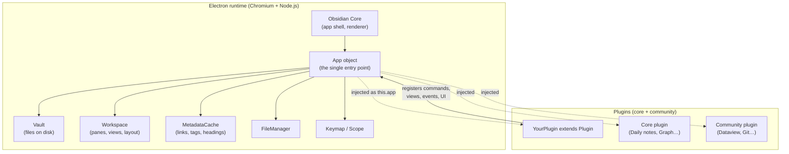
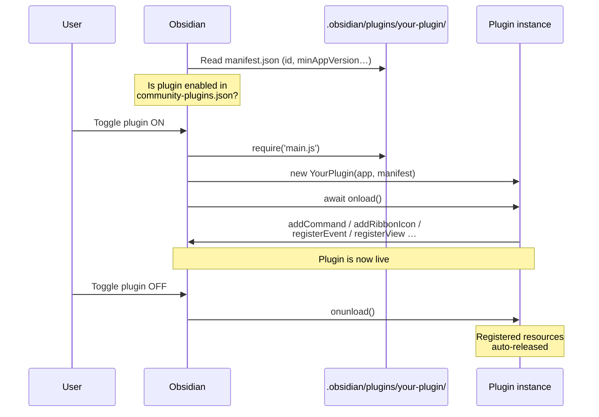
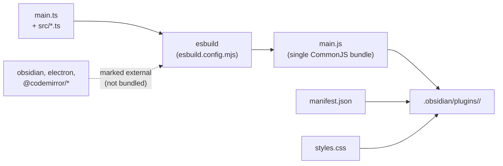
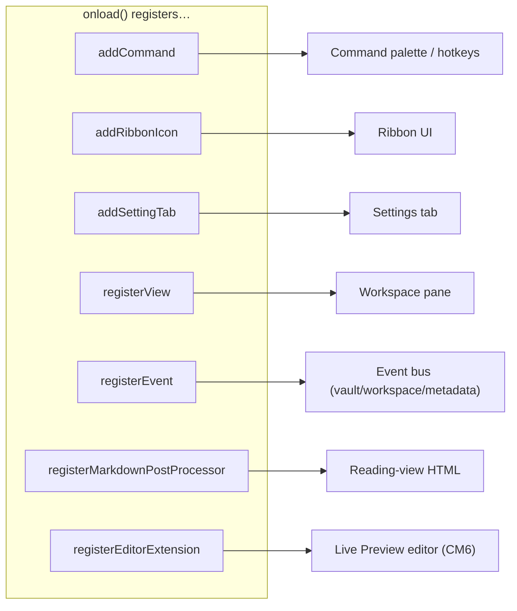
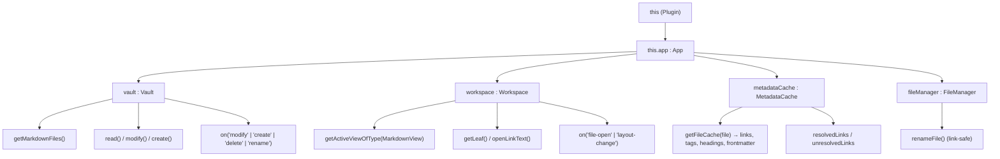
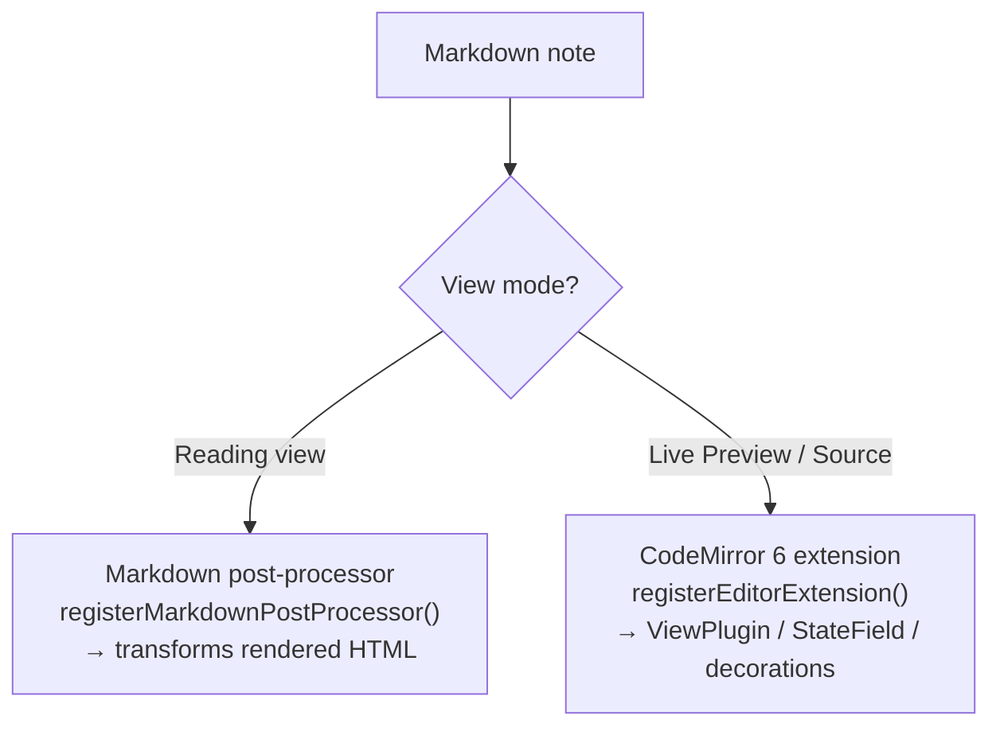
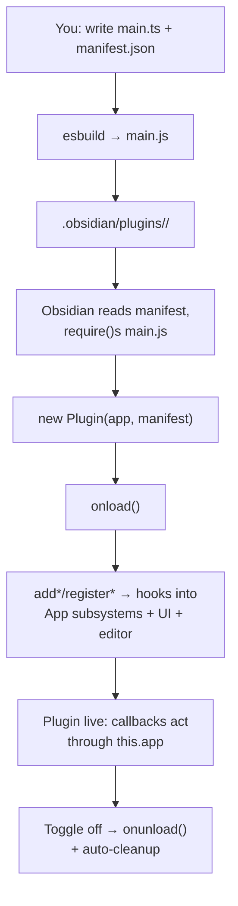

A top-down map of how Obsidian plugins are built, loaded, and wired into the app. Obsidian is an Electron app; plugins are just JavaScript that Obsidian `require()`s at runtime and hands an `App` object to. Everything below flows from that one fact.

## The 30,000-foot view

Obsidian's core is deliberately small. Almost every user-facing feature — even the ones that ship in the box ("core plugins") — is built on the **same public plugin API** that third-party plugins use. A plugin is a class that extends `Plugin`, gets instantiated once, and registers capabilities (commands, UI, event handlers, editor behavior) against the running app.



> [!note] Mental model
> Think of `Plugin` as a **lifecycle + registration surface**, and `App` as the **capability surface**. Your plugin's job in `onload()` is to reach through `this.app` to read/modify vault state, and to call `this.addX(...)` / `this.registerX(...)` to plug new behavior into the running app.

## How Obsidian finds and loads a plugin

Plugins live inside the vault, under `.obsidian/plugins/<plugin-id>/`. Each plugin folder needs three files at runtime:

| File | Purpose | Committed to repo? |
|------|---------|--------------------|
| `manifest.json` | Metadata Obsidian reads to list/version the plugin | Yes (source) |
| `main.js` | The bundled, runnable plugin code | Build artifact |
| `styles.css` | Optional plugin styles, auto-loaded | Yes (optional) |
| `data.json` | Runtime-created settings store (`loadData`/`saveData`) | No |



> [!warning] `.obsidian/` is off-limits in this vault
> Per the vault rules, don't hand-edit anything under `.obsidian/`. The loading mechanics above are described so you understand *how* Obsidian works — not as an invitation to poke at plugin state directly.

## The manifest

`manifest.json` is the contract between your plugin and Obsidian. Obsidian reads it *before* running any code, to decide whether the plugin is even compatible.

```json
{
  "id": "my-example-plugin",
  "name": "My Example Plugin",
  "version": "1.0.0",
  "minAppVersion": "1.5.0",
  "description": "Does something useful in the vault.",
  "author": "Your Name",
  "authorUrl": "https://example.com",
  "fundingUrl": "https://buymeacoffee.com/you",
  "isDesktopOnly": false
}
```

**Required:** `id`, `name`, `version`, `minAppVersion`, `description`, `author`, `isDesktopOnly`.
**Optional:** `authorUrl`, `fundingUrl`.

Key constraints (from the [manifest reference](https://docs.obsidian.md/Reference/Manifest)):
- `id` — lowercase letters and hyphens only; it names the plugin folder and prefixes every command.
- `version` — strict [SemVer](https://semver.org/) `x.y.z`.
- `minAppVersion` — Obsidian silently refuses to load the plugin on older app versions.
- `isDesktopOnly: true` — set this the moment you touch Node.js or Electron APIs; it hides the plugin on mobile.

A sibling `versions.json` (at the repo root, not shipped in the plugin folder) maps each plugin version to the `minAppVersion` it needs, so old app versions can install a compatible older release.

## The build pipeline: `main.ts` → `main.js`

You write TypeScript; Obsidian runs a single bundled `main.js`. The [sample plugin](https://github.com/obsidianmd/obsidian-sample-plugin) uses **esbuild** to do this.



- The `obsidian` package (and `electron`, CodeMirror modules, Node builtins) are declared **external** — Obsidian provides them at runtime, so bundling them would be wrong and bloated.
- `npm run dev` runs esbuild in watch mode: edit `.ts`, it rebuilds `main.js`. Pair it with the [Hot-Reload plugin](https://github.com/pjeby/hot-reload) so Obsidian re-loads the plugin automatically instead of you toggling it off/on.
- `npm run build` runs a type-check (`tsc --noEmit`) then a production bundle.

## The `Plugin` class and its lifecycle

Every plugin is a default-exported class extending `Plugin`. Two lifecycle hooks matter:

```ts
import { Plugin } from 'obsidian';

export default class ExamplePlugin extends Plugin {
  async onload() {
    // Runs when the plugin is enabled. Configure everything here.
    console.log('loading plugin');
  }

  async onunload() {
    // Runs when the plugin is disabled. Release resources here.
    console.log('unloading plugin');
  }
}
```

- **`onload()`** — the constructor of your feature set. Register commands, UI, events, views, editor extensions, load saved settings.
- **`onunload()`** — teardown. Critically, **most cleanup is automatic** if you used the `register*` / `add*` helpers (see below); you only manually clean up things you created outside those helpers.

> [!tip] The golden rule of cleanup
> Prefer `this.registerEvent(...)`, `this.registerDomEvent(...)`, `this.registerInterval(...)` over raw `on()` / `addEventListener` / `setInterval`. Anything registered through the plugin is auto-detached on unload, which is how you avoid leaking listeners and degrading Obsidian after your plugin is disabled.

## Extension points: what a plugin can register

These are the methods on `Plugin` you call from `onload()`. This table is the practical heart of the architecture — it's the full menu of "hooks."

| Method | What it plugs into | Auto-cleaned on unload |
|--------|--------------------|------------------------|
| `addCommand()` | Command palette + hotkeys (auto-prefixed with plugin id) | Yes |
| `addRibbonIcon()` | Left sidebar ribbon button | Yes |
| `addStatusBarItem()` | Bottom status bar (desktop only) | Yes |
| `addSettingTab()` | Settings → your plugin's config screen | Yes |
| `registerView()` | Custom pane/view types in the workspace | Yes |
| `registerEvent()` | Vault / Workspace / MetadataCache events | Yes |
| `registerDomEvent()` | Raw DOM event listeners | Yes |
| `registerInterval()` | `setInterval` timers | Yes |
| `registerMarkdownPostProcessor()` | Transform rendered HTML in **Reading** view | Yes |
| `registerMarkdownCodeBlockProcessor()` | Render custom ```` ```lang ```` fenced blocks | Yes |
| `registerEditorExtension()` | CodeMirror 6 behavior in **Live Preview / Source** | Yes |
| `registerObsidianProtocolHandler()` | `obsidian://` deep links | Yes |
| `loadData()` / `saveData()` | Persist settings to `data.json` | n/a |



## The `App` object and core subsystems

`this.app` is the single gateway to everything. Obsidian injects it into every plugin. Its main properties ([App reference](https://docs.obsidian.md/Reference/TypeScript+API/App)):

| Property | Subsystem | You use it to… |
|----------|-----------|----------------|
| `app.vault` | **Vault** — files & folders on disk | read/create/modify/delete notes, list files, watch file events |
| `app.workspace` | **Workspace** — panes, leaves, layout | open files, get the active view/editor, add views, react to layout changes |
| `app.metadataCache` | **MetadataCache** — parsed note metadata | look up links, backlinks, tags, headings, frontmatter without re-parsing |
| `app.fileManager` | **FileManager** | high-level file ops that keep links intact (e.g. rename with link-updates) |
| `app.keymap` | **Keymap** | key binding context |
| `app.scope` | **Scope** | scoped hotkey handling |



> [!tip] Vault vs. FileManager
> Use `app.vault` for raw file I/O. Use `app.fileManager.renameFile()` (not `vault.rename`) when a rename must update inbound `[[wikilinks]]` — this is the API-level equivalent of the vault rule "never `mv` a note."

### The event bus

Subsystems emit events; you subscribe via `registerEvent` so they detach automatically:

```ts
this.registerEvent(
  this.app.vault.on('modify', (file) => {
    console.log(`${file.path} changed`);
  })
);

this.registerEvent(
  this.app.workspace.on('file-open', (file) => {
    if (file) new Notice(`Opened ${file.basename}`);
  })
);
```

## Data persistence

Settings persist to `data.json` inside the plugin folder via two async methods:

```ts
interface MyPluginSettings {
  greeting: string;
}
const DEFAULT_SETTINGS: MyPluginSettings = { greeting: 'Hello' };

export default class MyPlugin extends Plugin {
  settings: MyPluginSettings;

  async onload() {
    await this.loadSettings();
    this.addSettingTab(new MySettingTab(this.app, this));
  }

  async loadSettings() {
    // Merge saved data over defaults so new keys get defaults.
    this.settings = Object.assign({}, DEFAULT_SETTINGS, await this.loadData());
  }

  async saveSettings() {
    await this.saveData(this.settings);
  }
}
```

`loadData()` returns the parsed `data.json` (or `null`); `saveData()` serializes and writes it. Merging over `DEFAULT_SETTINGS` is the standard idiom so upgrades don't lose new fields.

## Editor extensions (Live Preview) vs. post-processors (Reading view)

Obsidian has **two rendering paths**, and which hook you use depends on which one you're changing.



- **Reading view** renders Markdown to static HTML — hook it with `registerMarkdownPostProcessor()` (walk/replace DOM nodes) or `registerMarkdownCodeBlockProcessor()` for custom fenced blocks.
- **Live Preview & Source mode** are literally a **CodeMirror 6** instance. An "Obsidian editor extension *is* a CM6 extension." You register an array of CM6 extensions:

```ts
onload() {
  this.registerEditorExtension([examplePlugin, exampleField]);
}
```

The two most common CM6 primitives:
- **`ViewPlugin`** — reacts to the viewport/editor and produces **decorations** (styling, widgets) for what's visible. Good for rendering.
- **`StateField`** — holds custom state in the editor's immutable state, updated through transactions. Good for data that must survive edits and undo.

See [Editor extensions](https://docs.obsidian.md/Plugins/Editor/Editor+extensions) and the upstream [CodeMirror 6 system guide](https://codemirror.net/docs/guide/) for the ViewPlugin/StateField/decoration model.

## A complete annotated plugin

Putting the pieces together — this is the shape almost every plugin follows:

```ts
import {
  App, Editor, MarkdownView, Notice, Plugin,
  PluginSettingTab, Setting,
} from 'obsidian';

interface MyPluginSettings { greeting: string; }
const DEFAULT_SETTINGS: MyPluginSettings = { greeting: 'Hello, world!' };

export default class MyPlugin extends Plugin {
  settings: MyPluginSettings;

  async onload() {
    // 1. Load persisted settings.
    await this.loadSettings();

    // 2. Ribbon button.
    this.addRibbonIcon('dice', 'Greet', () => {
      new Notice(this.settings.greeting);
    });

    // 3. Command (palette + assignable hotkey), auto-prefixed by plugin id.
    this.addCommand({
      id: 'insert-greeting',
      name: 'Insert greeting at cursor',
      editorCallback: (editor: Editor, view: MarkdownView) => {
        editor.replaceSelection(this.settings.greeting);
      },
    });

    // 4. Status bar (desktop only).
    this.addStatusBarItem().setText('MyPlugin ready');

    // 5. React to vault events — auto-detached on unload.
    this.registerEvent(
      this.app.vault.on('create', (file) =>
        console.log('created', file.path)),
    );

    // 6. Settings UI.
    this.addSettingTab(new MySettingTab(this.app, this));
  }

  onunload() {
    // Nothing manual needed: every add*/register* above is auto-cleaned.
  }

  async loadSettings() {
    this.settings = Object.assign({}, DEFAULT_SETTINGS, await this.loadData());
  }
  async saveSettings() { await this.saveData(this.settings); }
}

class MySettingTab extends PluginSettingTab {
  constructor(app: App, private plugin: MyPlugin) { super(app, plugin); }

  display(): void {
    const { containerEl } = this;
    containerEl.empty();
    new Setting(containerEl)
      .setName('Greeting')
      .setDesc('Text inserted by the command and ribbon.')
      .addText((text) =>
        text
          .setValue(this.plugin.settings.greeting)
          .onChange(async (value) => {
            this.plugin.settings.greeting = value;
            await this.plugin.saveSettings();
          }),
      );
  }
}
```

Trace the data flow: Obsidian loads `main.js` → constructs `MyPlugin` with the injected `App` → awaits `onload()` → the `add*`/`register*` calls wire the plugin into the command palette, ribbon, status bar, event bus, and settings screen → user interactions fire the callbacks, which read `this.settings` and reach through `this.app` to act on the vault.

## How it all hooks together (summary)



The whole architecture is three ideas stacked:
1. **Packaging** — a manifest + a bundled `main.js` in a known folder.
2. **Lifecycle** — one class, `onload`/`onunload`, with helper-managed cleanup.
3. **Capability** — `this.app` to read/modify state, `this.registerX()` to add behavior.

## Key references

- [Obsidian Developer Docs — home](https://docs.obsidian.md/)
- [Anatomy of a plugin](https://docs.obsidian.md/Plugins/Getting+started/Anatomy+of+a+plugin)
- [Build a plugin (tutorial)](https://docs.obsidian.md/Plugins/Getting+started/Build+a+plugin)
- [Development workflow](https://docs.obsidian.md/Plugins/Getting+started/Development+workflow)
- [`Plugin` class API](https://docs.obsidian.md/Reference/TypeScript+API/Plugin)
- [`App` class API](https://docs.obsidian.md/Reference/TypeScript+API/App)
- [Manifest reference](https://docs.obsidian.md/Reference/Manifest)
- [Editor extensions (CodeMirror 6)](https://docs.obsidian.md/Plugins/Editor/Editor+extensions)
- [Vault API](https://docs.obsidian.md/Reference/TypeScript+API/Vault) · [Workspace API](https://docs.obsidian.md/Reference/TypeScript+API/Workspace) · [MetadataCache API](https://docs.obsidian.md/Reference/TypeScript+API/MetadataCache)
- [Sample plugin (GitHub)](https://github.com/obsidianmd/obsidian-sample-plugin) · [Hot-Reload plugin](https://github.com/pjeby/hot-reload)
- [CodeMirror 6 system guide](https://codemirror.net/docs/guide/)
